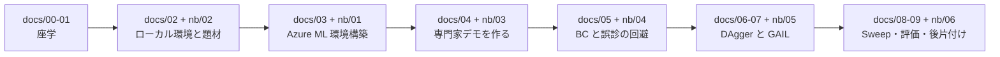

# Azure Machine Learning で学ぶ 模倣学習ハンズオン

**「上手なやり方を見せて真似させる」模倣学習（Imitation Learning）を、Azure Machine Learning 上で
再現可能な形で実行・比較する**ためのハンズオンテキストです。

| 項目 | 前提 |
|---|---|
| 想定読者 | **初級者のソフトウェア エンジニア** |
| Python | **読める**（書けなくても構いません） |
| 機械学習の知識 | **不要** |
| 強化学習の知識 | **不要** |
| Azure の知識 | **不要**（環境構築から手順化しています） |
| GPU | **不要**（CPU のみで完結します） |

---

## ⚠ 最初に読んでください

### 1. 課金事故の防止

> **Azure のコンピューティング リソースは、起動している間ずっと課金されます。**
>
> - コンピューティング クラスターは **`min_instances=0`** で作成します。ジョブが無い間はノード数が 0 になり、**コンピューティングの課金が止まります。**
> - **ただし、ストレージ アカウント・Key Vault・Container Registry などワークスペース付属リソースの課金は続きます。**
>   完全に止めるには**リソース グループごと削除**します。
> - **終わったら必ず [docs/09_評価・コスト・後片付け.md](docs/09_評価・コスト・後片付け.md) の 9.4 を実施してください。**
> - **実際の金額は Microsoft Cost Management で必ず確認してください。**
>
> 出典（Microsoft 公式）: [Azure Machine Learning のコストの管理と最適化](https://learn.microsoft.com/azure/machine-learning/how-to-manage-optimize-cost?view=azureml-api-2)

### 2. 検証状況（**正直な記載**）

| 項目 | 状況 |
|---|---|
| **ローカル実行**（Windows 10 / Python 3.10 / CPU） | ✅ **検証済み**。本テキストの数値はすべてここでの実測値です |
| **Azure ML 上でのジョブ実行** | ⚠ **未検証**。**所要時間・費用・出力例は一切記載していません** |
| macOS / Linux のセットアップ スクリプト | ⚠ **未検証**（構文確認のみ） |

> **Azure に関する記述は、すべて Microsoft 公式ドキュメントに基づく手順の説明です。**
> 出典は [docs/A3_出典一覧.md](docs/A3_出典一覧.md) にまとめています。

### 3. 資格情報の取り扱い

ノートブックには **`SUBSCRIPTION_ID = "<SUBSCRIPTION_ID>"`** のようなプレースホルダーが書かれています。

> ⚠ **自分の値に書き換えたノートブックを、そのままコミットしないでください。**
> **出力セルも消してからコミットしてください**（ワークスペース識別子の混入と差分肥大を防ぐため）。

---

## 1. このハンズオンで到達する状態

1. **模倣学習が何をする技術か**を、報酬設計との違いを含めて説明できる
2. Azure ML の**ワークスペース・コンピューティング・環境を自分で作れる**
3. 専門家デモを作り、**`uri_folder` のデータ資産として登録できる**
4. **BC / DAgger / GAIL** を Azure ML のジョブとして実行できる
5. **比較実験で交絡を作らない設計**（学習量をそろえる）ができる
6. **「差がある」と「差を検出できなかった」を区別できる
7. **乱数シードが本当に固定されているかを確かめられる**
8. **評価が壊れている状態（可変ホライズン）に気づける**
9. 費用を確認し、**リソースを確実に片づけられる**

### このハンズオンで「やらないこと」

| やらないこと | 理由 |
|---|---|
| **Azure 上での実行検証** | 本テキストの構築時に検証したのはローカル実行だけです |
| **モデルのデプロイ / 推論エンドポイント** | 目的は「実験を回して比較すること」です。デプロイは題材の理解に寄与しません |
| **GAIL や DAgger を成功させること** | この題材では**どちらも成功率 0.00** でした。**失敗を正しく記録すること**が目的です |
| **失敗の原因を特定すること** | 仮説を**仮説として書く**ところまでです |
| **AIRL の実行** | 公開ベンチマークで最も不安定な手法であり、初級者向けの題材では学びが増えません |
| **実機ロボットとの接続** | 範囲外です |

---

## 2. ⚠ 先に伝えておきます

本ハンズオンで実行する手法は、**どれも「教科書どおり」にはなりません。**

| よくある説明 | この題材での実測（ローカル / 2026-08-18） |
|---|---|
| 「BC はデモが多いほど強い」 | **更新回数をそろえたら、デモ 50 / 200 / 800 で差を検出できなかった**（3 条件とも成功率 **0.233**） |
| 「同じシードなら同じ結果になる」 | **`imitation` の `rng` だけでは再現しなかった。** `torch` を含めて固定して初めて一致した |
| 「DAgger は BC より強い」 | **BC を大きく下回った**（**0.00** 対 0.233）。公開ベンチマークとは順位が逆 |
| 「GAIL は少ないデモで学習できる」 | **学習の開始を確認できなかった**（100,000 ステップで **0.00**） |

> **これは失敗ではありません。**
> **「論文やベンチマークの結果が、自分の課題でそのまま再現するとは限らない」**ことこそ、
> 本ハンズオンで最も持ち帰ってほしい教訓です。
>
> 実測値の一次記録は [調査レポート_模倣学習.md](調査レポート_模倣学習.md) の **4.4.3** にあります。

---

## 3. 学習の流れ



| # | ステップ | 読むテキスト | 動かすノートブック |
|---|---|---|---|
| 1 | 全体像と前提を知る | [docs/00_はじめに.md](docs/00_はじめに.md) | — |
| 2 | 模倣学習の基礎を押さえる | [docs/01_模倣学習の基礎.md](docs/01_模倣学習の基礎.md) | — |
| 3 | ローカル環境を作る | [docs/02_環境を準備する.md](docs/02_環境を準備する.md) | — |
| 4 | **題材を自分の目で確認する**（Azure 不要・課金なし） | [docs/01 の 1.5](docs/01_模倣学習の基礎.md) | [notebooks/02_explore_env.ipynb](notebooks/02_explore_env.ipynb) |
| 5 | Azure ML 環境を構築し、疎通確認する | [docs/03_AzureML環境構築.md](docs/03_AzureML環境構築.md) | [notebooks/01_setup_azureml.ipynb](notebooks/01_setup_azureml.ipynb) |
| 6 | 専門家デモを作り、データ資産にする | [docs/04_専門家デモを作る.md](docs/04_専門家デモを作る.md) | [notebooks/03_collect_demos_job.ipynb](notebooks/03_collect_demos_job.ipynb) |
| 7 | **BC を動かし、誤診を回避する** | [docs/05_BCを動かす.md](docs/05_BCを動かす.md) | [notebooks/04_bc_job.ipynb](notebooks/04_bc_job.ipynb) |
| 8 | DAgger を試す | [docs/06_DAggerを試す.md](docs/06_DAggerを試す.md) | [notebooks/05_dagger_gail_job.ipynb](notebooks/05_dagger_gail_job.ipynb) |
| 9 | **GAIL と評価の落とし穴** | [docs/07_GAILと評価の落とし穴.md](docs/07_GAILと評価の落とし穴.md) | 同上 |
| 10 | Sweep で改善する | [docs/08_Sweepで改善する.md](docs/08_Sweepで改善する.md) | [notebooks/06_sweep_compare_cleanup.ipynb](notebooks/06_sweep_compare_cleanup.ipynb) |
| 11 | **評価・コスト・後片付け** | [docs/09_評価・コスト・後片付け.md](docs/09_評価・コスト・後片付け.md) | 同上 |
| — | 症状から逆引き | [docs/A1_トラブルシューティング.md](docs/A1_トラブルシューティング.md) | — |
| — | OSS ライセンス | [docs/A2_OSSライセンス一覧.md](docs/A2_OSSライセンス一覧.md) | — |
| — | 出典 | [docs/A3_出典一覧.md](docs/A3_出典一覧.md) | — |
| — | 用語 | [docs/A4_用語集.md](docs/A4_用語集.md) | — |

各章は次の共通構造です。

1. **なぜそうするのか** → 2. **何をするのか** → 3. **どうなれば成功か** → 4. **⚠ うまくいかないときは**

---

## 4. 題材と技術選定

### 題材: ロボットのピックアンドプレース（`PandaPickAndPlace-v3`）

**Franka Emika Panda ロボットのアームで、テーブル上の立方体をつかみ、指定された位置まで運ぶ**タスクです。
[9.ReinforcementLearning](../9.ReinforcementLearning/README.md) と**同じ題材**なので、
「報酬を設計する」と「お手本を見せる」の 2 つのアプローチを直接比べられます。

| 項目 | 値（実測） |
|---|---|
| 行動 | `Box(-1, 1, (4,))`（手先の xyz 変位 ＋ グリッパー開閉） |
| 観測（素） | `Dict(achieved_goal: 3, desired_goal: 3, observation: 19)` |
| **観測（平坦化後）** | **25 次元** |
| 報酬 | 各ステップ、目標に到達していなければ **-1** |
| 3D モデル | `pybullet_data/franka_panda/panda.urdf`（**Apache-2.0**） |

### ⚠ そのままでは使えません — 固定ホライズン化します

**素の環境は「成功した瞬間にエピソードが終わる」ため、GAIL の評価が成立しません。**

| 環境 | 専門家 5 エピソードの長さ | リターン | GAIL の評価 |
|---|---|---|---|
| `PandaPickAndPlace-v3`（素） | **12, 8, 13, 10, 12**（可変） | -11, -7, -12, -9, -11 | **成立しない** |
| **`il/PandaPickAndPlace-v0`**（本ハンズオン） | **50, 50, 50, 50, 50**（固定） | **-11, -7, -12, -9, -11** | 成立する |

**「エピソードが短い＝成功」という情報が、終了条件そのものから漏れている**ためです。
`seals` の `AbsorbAfterDoneWrapper` で 50 ステップに固定しても、**リターンは完全に一致します。**
理由の詳細は [docs/01 の 1.5](docs/01_模倣学習の基礎.md) と [docs/07 の 7.3](docs/07_GAILと評価の落とし穴.md) にあります。

### 専門家は「学習済みモデル」ではなく「スクリプト」です

[src/scripted_expert.py](src/scripted_expert.py) に、**手続きとして書かれた制御則**を専門家として使います。

| 利点 | 内容 |
|---|---|
| **デモ収集が速い** | 専門家を学習させる時間がゼロ |
| **成功率が安定** | 実測で **1.00**（20 エピソード） |
| **DAgger に必要な「問い合わせ」が自然にできる** | `imitation` の `NonTrainablePolicy` を継承した方策として扱える |
| **中身が読める** | 「専門家が何をしているか」をコードで確認できる |

### 技術選定

| レイヤ | 採用 | 理由 |
|---|---|---|
| 実験基盤 | **Azure Machine Learning（SDK v2）** | Command Job・Sweep Job・MLflow が揃っている |
| 実験追跡 | **MLflow** | **学習スクリプトから `azureml.*` を排除するため。** Azure ML の推奨（[docs/02 の 2.1](docs/02_環境を準備する.md)） |
| 模倣学習 | **imitation 1.0.1** | BC / DAgger / GAIL / AIRL を実装。MIT |
| RL バックエンド | **Stable-Baselines3 2.2.1** | `imitation` が `~=2.2.1` で要求。MIT |
| 環境 API | **Gymnasium 0.29.1** | `reset` / `step` の現行標準。MIT |
| ロボット環境 | **panda-gym 3.0.7** | 9 章と同じ題材。MIT |
| 物理エンジン | **PyBullet 3.2.5** | `panda-gym` の依存。**zlib ライセンス** |
| 固定ホライズン化 | **seals 0.2.1** | `imitation` の必須依存に含まれ、**追加導入ゼロ**。MIT |

ライセンスの詳細は [docs/A2_OSSライセンス一覧.md](docs/A2_OSSライセンス一覧.md) を参照してください。

> ⚠ **`azureml-mlflow` 1.60.0 は OSS ライセンスではありません**（`Other/Proprietary License`）。
> **`pygame` は LGPL** です（`gymnasium[classic-control]` の依存として入ります）。
> **`pybullet_data` には CC BY-SA 3.0 のデータが同梱されています**（本ハンズオンでは使用しません）。
> 詳細は A2 の 2. と 3. にあります。

---

## 5. ファイル構成

```
10.ImitationLearning/
├── README.md                        ← いまここ
├── 調査レポート_模倣学習.md           … 全設計判断の根拠（出典付き）
├── setup/                           【最初に実行する】ローカル環境の構築
│   ├── setup.ps1                    … Windows 用（PowerShell 7 以降）
│   ├── setup.sh                     … macOS / Linux 用（⚠ 未検証）
│   ├── environment-local.yml        … ローカル用 conda 環境の定義
│   └── verify_env.py                … 導入結果の自動検証
├── docs/                            【読む】概念・判断基準・手順・トラブルシューティング
│   ├── 00_はじめに.md
│   ├── 01_模倣学習の基礎.md
│   ├── 02_環境を準備する.md
│   ├── 03_AzureML環境構築.md
│   ├── 04_専門家デモを作る.md
│   ├── 05_BCを動かす.md
│   ├── 06_DAggerを試す.md
│   ├── 07_GAILと評価の落とし穴.md
│   ├── 08_Sweepで改善する.md
│   ├── 09_評価・コスト・後片付け.md
│   ├── A1_トラブルシューティング.md   … 実際に遭遇したエラーだけを記載
│   ├── A2_OSSライセンス一覧.md
│   ├── A3_出典一覧.md
│   └── A4_用語集.md
├── notebooks/                       【動かす】実行可能セル
│   ├── 01_setup_azureml.ipynb
│   ├── 02_explore_env.ipynb         … ⭐ Azure 不要・課金なし
│   ├── 03_collect_demos_job.ipynb
│   ├── 04_bc_job.ipynb
│   ├── 05_dagger_gail_job.ipynb
│   └── 06_sweep_compare_cleanup.ipynb
└── src/                             【ジョブが実行する】学習コード
    ├── pick_place_env.py             … 環境の生成と**固定ホライズン化**
    ├── scripted_expert.py            … **スクリプト専門家**（手続きとして書いた制御則）
    ├── collect_demos.py              … 専門家デモの収集と基準値の保存
    ├── train_il.py                   … BC / DAgger / GAIL の学習
    ├── il_common.py                  … 共通ヘルパー（`set_seed` / `evaluate` など）
    ├── conda.yaml                   … Azure ML カスタム環境の定義
    └── NOTICE.md                    … 第三者 OSS の著作権表示
```

### `docs/` と `notebooks/` の使い分け

| | `docs/`（Markdown） | `notebooks/`（Jupyter） |
|---|---|---|
| 目的 | **理解する・判断する** | **動かす・記録する** |
| 初回学習時 | **こちらを主に読む** | 指示された箇所を実行する |
| 復習・自習時 | 参照用 | **こちらを主に動かす** |

---

## 6. はじめかた

### 6.1 ローカル環境を作る

**Windows（PowerShell 7 以降）**

```powershell
cd 10.ImitationLearning\setup
pwsh -NoProfile -File .\setup.ps1
```

**macOS / Linux**（⚠ 未検証）

```bash
cd 10.ImitationLearning/setup
bash setup.sh
```

**手動で作る場合**

```bash
cd 10.ImitationLearning/setup
conda env create --file environment-local.yml
conda run -n il-panda python verify_env.py
```

`verify_env.py` が **`OK:`** を表示すれば成功です。詳細は [docs/02_環境を準備する.md](docs/02_環境を準備する.md) にあります。

### 6.2 Azure にサインインする

```bash
az login
```

> **ノートブックの中でもサインインできます。** `az login` は必須ではありません
> （[notebooks/01_setup_azureml.ipynb](notebooks/01_setup_azureml.ipynb) の 2.）。

### 6.3 読み進める

**[docs/00_はじめに.md](docs/00_はじめに.md) から順に読んでください。**

---

## 7. 関連する章

| 章 | 内容 | 関係 |
|---|---|---|
| [9.ReinforcementLearning](../9.ReinforcementLearning/README.md) | **強化学習**のハンズオン（panda-gym / SAC + HER） | **報酬関数を設計する**アプローチ。本章はその設計を回避するアプローチです |

**両方を読むと、「報酬を設計する」と「お手本を見せる」という 2 つの選択肢を比較できます。**

---

## 8. ライセンス

本リポジトリのライセンスは [../LICENSE](../LICENSE) を参照してください。

本ハンズオンが利用する第三者 OSS の著作権表示は [src/NOTICE.md](src/NOTICE.md)、
ライセンスの確認結果は [docs/A2_OSSライセンス一覧.md](docs/A2_OSSライセンス一覧.md) にあります。

> ⚠ **A2 は法的助言ではありません。**
> 実際の利用可否・再配布条件は、ご所属の組織の OSS ポリシーおよび法務部門の判断に従ってください。
