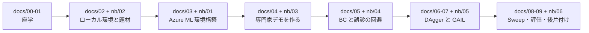

# 00. はじめに

[← A4. 用語集](A4_用語集.md) ｜ [01. 模倣学習の基礎 →](01_模倣学習の基礎.md)

---

> **このページを最初に読んでください。**
> 本ハンズオンが**何をするのか / 何をしないのか / 何を前提にするのか**を明確にします。

---

## 0.1 このハンズオンで到達する状態

終わったとき、あなたは次のことが**できる**ようになっています。

1. **模倣学習が何をする技術か**を、報酬設計との違いを含めて説明できる
2. Azure Machine Learning の**ワークスペース・コンピューティング・環境を自分で作れる**
3. 専門家デモを作り、**`uri_folder` のデータ資産として登録できる**
4. **BC / DAgger / GAIL** を Azure ML のジョブとして実行できる
5. **比較実験で交絡を作らない設計**（学習量をそろえる）ができる
6. **「差がある」と「差を検出できなかった」を区別できる
7. **乱数シードが本当に固定されているかを確かめられる**
8. **評価が壊れている状態（可変ホライズン）に気づける**
9. Sweep Job で探索し、**主要メトリックの設計が結果を左右する**ことを説明できる
10. **費用を確認し、リソースを確実に片づけられる**

---

## 0.2 このハンズオンで「やらないこと」

以下は **完了条件に含みません。** 最初に明示しておきます。

| やらないこと | 理由 |
|---|---|
| **Azure 上での実行検証** | 本ハンズオンの構築時に検証したのは**ローカル実行だけ**です。**Azure ジョブの所要時間・費用・出力例は一切記載していません** |
| **モデルのデプロイ / 推論エンドポイント** | 本ハンズオンの目的は「実験を回して比較すること」です。デプロイは題材の理解に寄与しません |
| **GAIL や DAgger を成功させること** | この題材では**どちらも成功率 0.00 でした**（[06 章](06_DAggerを試す.md) / [07 章](07_GAILと評価の落とし穴.md)）。**失敗を正しく記録すること**が目的です |
| **失敗の原因を特定すること** | 本ハンズオンは**仮説を仮説として書くところまで**です（[06 章 6.7](06_DAggerを試す.md)） |
| **実機ロボットとの接続** | 範囲外です |
| **AIRL の実行** | 公開ベンチマークで最も不安定な手法であり、初級者向けの題材では学びが増えません（[07 章 7.8](07_GAILと評価の落とし穴.md)） |
| **信頼区間（rliable / IQM）による厳密な評価** | 依存パッケージを増やさないため、**平均と標準偏差で代替**しています（[05 章 5.6](05_BCを動かす.md)） |

> [!IMPORTANT]
> **「うまく学習しなかった」という結果も、条件と根拠が記録されていれば立派な成果です。**
> 本ハンズオンは、その**記録の仕方**を重視します。

---

## 0.3 前提知識の下限

| 項目 | 前提 |
|---|---|
| **Python** | **読める**（書けなくても構いません。ノートブックのセルを実行できれば進めます） |
| **コマンドライン** | **コピー＆ペーストで実行できる** |
| **機械学習の知識** | **不要**。必要なことは本文で説明します |
| **強化学習の知識** | **不要**。PPO は「お手本を作る道具」としてしか使いません |
| **Azure の知識** | **不要**。環境構築から手順化しています |

分からない言葉が出てきたら、**[A4. 用語集](A4_用語集.md)** を参照してください。

### 必要な環境

| 項目 | 内容 |
|---|---|
| **Azure サブスクリプション** | ワークスペースを作れる権限が必要です |
| **PC** | Windows / macOS / Linux。**GPU は不要**です |
| ディスク空き容量 | 数 GB（PyTorch を含むため） |

> ⚠ **macOS / Linux のセットアップ スクリプトは未検証です。**
> 本ハンズオンは **Windows 10 でのみ**検証しています（[02 章 2.4](02_環境を準備する.md)）。

---

## 0.4 学習の流れ

---

## 0.5 章とノートブックの対応

| # | ステップ | 読むテキスト | 動かすノートブック |
|---|---|---|---|
| 1 | 全体像と前提を知る | **00_はじめに.md**（いまここ） | — |
| 2 | 模倣学習の基礎を押さえる | [01_模倣学習の基礎.md](01_模倣学習の基礎.md) | — |
| 3 | ローカル環境を作る | [02_環境を準備する.md](02_環境を準備する.md) | — |
| 4 | **題材を自分の目で確認する**（Azure 不要） | [01 章 1.5](01_模倣学習の基礎.md) | [02_explore_env.ipynb](../notebooks/02_explore_env.ipynb) |
| 5 | Azure ML 環境を構築し、疎通確認する | [03_AzureML環境構築.md](03_AzureML環境構築.md) | [01_setup_azureml.ipynb](../notebooks/01_setup_azureml.ipynb) |
| 6 | 専門家デモを作り、データ資産にする | [04_専門家デモを作る.md](04_専門家デモを作る.md) | [03_collect_demos_job.ipynb](../notebooks/03_collect_demos_job.ipynb) |
| 7 | **BC を動かし、誤診を回避する** | [05_BCを動かす.md](05_BCを動かす.md) | [04_bc_job.ipynb](../notebooks/04_bc_job.ipynb) |
| 8 | DAgger を試す | [06_DAggerを試す.md](06_DAggerを試す.md) | [05_dagger_gail_job.ipynb](../notebooks/05_dagger_gail_job.ipynb) |
| 9 | **GAIL と評価の落とし穴** | [07_GAILと評価の落とし穴.md](07_GAILと評価の落とし穴.md) | 同上 |
| 10 | Sweep で改善する | [08_Sweepで改善する.md](08_Sweepで改善する.md) | [06_sweep_compare_cleanup.ipynb](../notebooks/06_sweep_compare_cleanup.ipynb) |
| 11 | **評価・コスト・後片付け** | [09_評価・コスト・後片付け.md](09_評価・コスト・後片付け.md) | 同上 |
| — | 症状から逆引き | [A1_トラブルシューティング.md](A1_トラブルシューティング.md) | — |
| — | ライセンス | [A2_OSSライセンス一覧.md](A2_OSSライセンス一覧.md) | — |
| — | 出典 | [A3_出典一覧.md](A3_出典一覧.md) | — |
| — | 用語 | [A4_用語集.md](A4_用語集.md) | — |

> **[02_explore_env.ipynb](../notebooks/02_explore_env.ipynb) は Azure を使いません。**
> Azure の準備が整う前に実行して構いません。**課金も発生しません。**

---

## 0.6 各章の共通構造

すべての章は次の順序で書かれています。

1. **なぜそうするのか**（目的と背景）
2. **何をするのか**（手順）
3. **どうなれば成功か**（期待される結果）
4. **⚠ うまくいかないときは**（対処）

> **手順だけ知りたい場合**は「何をするのか」の見出しに飛んでください。
> ただし **[05 章](05_BCを動かす.md) と [07 章](07_GAILと評価の落とし穴.md) は「なぜ」が本体**です。飛ばさないでください。

---

## 0.7 ⚠ 課金について（最初に読んでください）

> **Azure のコンピューティング リソースは、起動している間ずっと課金されます。**
>
> - コンピューティング クラスターは **`min_instances=0`** で作成します。
>   **ジョブが無い間はノード数が 0 になり、コンピューティングの課金が止まります。**
> - **ただし、ストレージ アカウント・Key Vault・Container Registry などワークスペース付属リソースの課金は続きます。**
>   完全に止めるには**リソース グループごと削除**します。
> - **ハンズオンが終わったら、必ず [09_評価・コスト・後片付け.md](09_評価・コスト・後片付け.md) の 9.4 を実施してください。**
> - **実際の金額は Microsoft Cost Management で必ず確認してください。**
>   本ハンズオンは Azure 上で実行検証していないため、**金額の目安を記載していません。**
>
> 出典（Microsoft 公式）: [Azure Machine Learning のコストの管理と最適化](https://learn.microsoft.com/azure/machine-learning/how-to-manage-optimize-cost?view=azureml-api-2)

### GPU は不要です

本ハンズオンの題材（ロボットのピックアンドプレイス）は、観測が 25 個の数値、行動が 4 つの連続値で、
ニューラルネットワークも小さいため、**GPU を付けても速くなりません。CPU のみで完結します。**

> ⚠ **ただし、物理シミュレーション（PyBullet）の分だけ CPU は使います。**
> ローカル実測では、BC 1 本が 128〜203 秒、GAIL 1 本が 489 秒でした（[09 章 9.3](09_評価・コスト・後片付け.md)）。

---

## 0.8 ⚠ 先に伝えておきます

本ハンズオンで実行する 3 つの手法は、**どれも「教科書どおり」にはなりません。**

| よくある説明 | この題材での実測（ローカル / 2026-08-18） |
|---|---|
| 「BC はデモが多いほど強い」 | **更新回数をそろえたら、デモ 50 / 200 / 800 で差を検出できなかった**（3 条件とも成功率 0.233） |
| 「同じシードなら同じ結果になる」 | **`imitation` の `rng` だけでは再現しなかった。** `torch` を含めて固定して初めて一致した |
| 「DAgger は BC より強い」 | **BC を大きく下回った**（成功率 0.00 対 0.233）。公開ベンチマークとは順位が逆 |
| 「GAIL は少ないデモで学習できる」 | **学習の開始を確認できなかった**（100,000 ステップで成功率 0.00） |

> [!IMPORTANT]
> **これは失敗ではありません。**
> **「論文やベンチマークの結果が、自分の課題でそのまま再現するとは限らない」**ことこそ、
> 本ハンズオンで最も持ち帰ってほしい教訓です。
>
> 実測値の詳細と根拠は [../調査レポート_模倣学習.md](../調査レポート_模倣学習.md) の **4.4.3** にあります。

> ⚠ **この表を「手法の優劣」として引用しないでください。**
> **1 つの環境・限られた計算量・調整していないハイパーパラメーター**での結果です。

---

[← A4. 用語集](A4_用語集.md) ｜ [01. 模倣学習の基礎 →](01_模倣学習の基礎.md)
