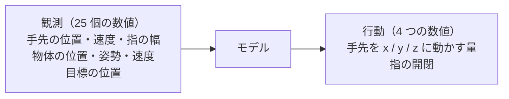
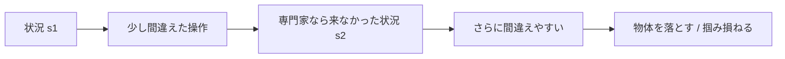
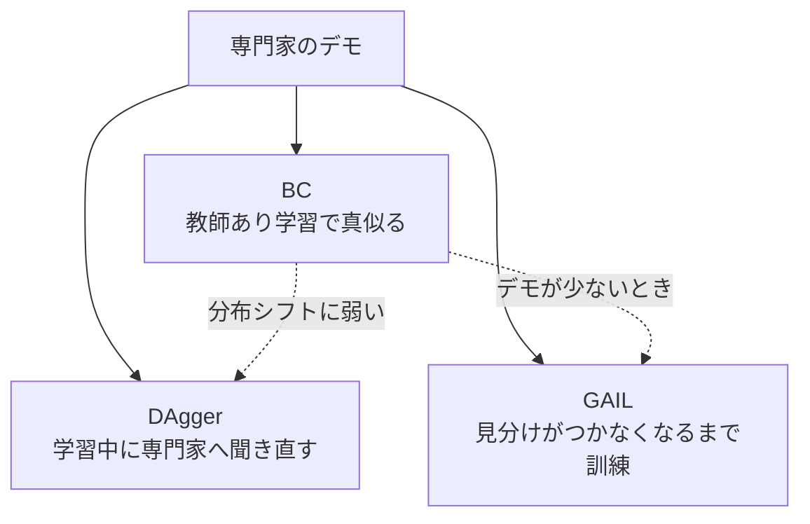
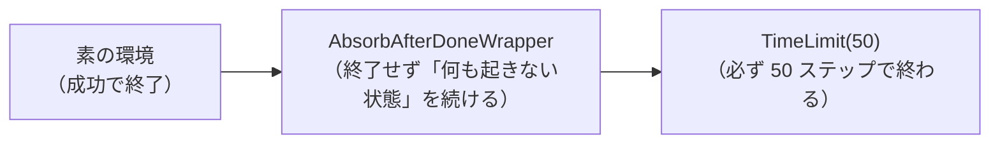

# 01. 模倣学習の基礎

[← 00. はじめに](00_はじめに.md) ｜ [02. 環境を準備する →](02_環境を準備する.md)

---

> **この章の目的**
> 模倣学習が「何をする技術か」と、「どこで失敗しやすいか」を理解します。
> **機械学習や強化学習の知識は前提にしません。** 分からない言葉は [A4. 用語集](A4_用語集.md) を参照してください。
> **コードは実行しません。** 読むだけの章です。

---

## 1.1 模倣学習とは

**模倣学習**（Imitation Learning）は、**上手なやり方を見せて、同じ振る舞いを学習させる**技術です。

> "Often, it is easier for a teacher to demonstrate a desired behavior rather than attempt to manually engineer it. This process of learning from demonstrations, and the study of algorithms to do so, is called imitation learning."
>
> 出典（参考情報・学術論文）: Osa, Pajarinen, Neumann, Bagnell, Abbeel, Peters, *An Algorithmic Perspective on Imitation Learning*, arXiv:1811.06711
> https://arxiv.org/abs/1811.06711

### なぜ「ルールを書く」のではだめなのか

ロボットの作業は、状況が無数にあります。
**「こういうときはこうする」というルールを人間が書き切ることができません。**

### なぜ「強化学習」ではだめなのか

強化学習は「良い行動には高い点、悪い行動には低い点」という**報酬関数**を人間が設計します。
しかし現実の問題では、**この点数の付け方を決めること自体が難しい**のです。

> "programming their behaviors manually or defining their behavior through reward functions (as done in reinforcement learning (RL)) has become exceedingly difficult."
>
> 出典（参考情報・学術論文）: Zare, Kebria, Khosravi, Nahavandi, *A Survey of Imitation Learning*, arXiv:2309.02473
> https://arxiv.org/abs/2309.02473

**模倣学習は、この「点数の設計」を回避します。** 代わりに必要なのは、**お手本**です。

> **同じ題材で強化学習を扱っているのが [9.ReinforcementLearning](../../9.ReinforcementLearning/README.md) です。**
> あちらは**報酬を設計する**アプローチ、こちらは**お手本を見せる**アプローチです。

---

## 1.2 一番単純な方法「BC」は、教師あり学習そのもの

**BC**（Behavior Cloning / 行動クローニング）は、模倣学習の最も単純な方法です。

| やること | 普通の機械学習でいうと |
|---|---|
| 専門家の記録を集める | 学習データを集める |
| 「この状況では、この操作」を覚えさせる | **回帰問題を解く** |



つまり **BC は「教師あり学習」です。** 新しい理論を覚える必要はありません。

> ⚠ **本ハンズオンの BC は「分類」ではなく「回帰」です。**
> 「左に押す / 右に押す」のような**選択肢**ではなく、**連続した数値を 4 つ**出力するためです。
> 教科書で「BC は分類問題」と説明されている場合、それは行動が離散的な題材の話です。

---

## 1.3 ⚠ ただし、普通の教師あり学習とは決定的に違う点がある

普通の分類・回帰では、**モデルの予測が次の入力を変えることはありません。**

**模倣学習は違います。**



自分の出力が次の入力を決めるため、**小さな誤差がどんどん積み上がります。**
これを **分布シフト**（distribution shift）と呼びます。

> "**This is not true in imitation learning as the learned policy influences the future test inputs (states) upon which it will be tested. We show that this leads to compounding errors and a regret bound that grows quadratically in the time horizon of the task.**"
>
> 出典（参考情報・学術論文）: Ross & Bagnell, *Efficient Reductions for Imitation Learning*, AISTATS 2010, PMLR 9:661-668
> https://proceedings.mlr.press/v9/ross10a.html

**ロボット操作は、この問題が非常に出やすい題材です。**
掴む位置が数ミリずれただけで物体を落とし、**専門家が一度も訪れない状況**に入ってしまいます。

---

## 1.4 手法の地図

本ハンズオンで扱うのは 3 つだけです。



| 手法 | 環境を動かせる必要 | 専門家に聞き直せる必要 | 出典 |
|---|---|---|---|
| **BC** | 不要 | 不要 | — |
| **DAgger** | 必要 | **必要** | Ross, Gordon, Bagnell, arXiv:1011.0686 |
| **GAIL** | 必要 | 不要 | Ho & Ermon, arXiv:1606.03476 |

- DAgger: https://arxiv.org/abs/1011.0686
- GAIL: https://arxiv.org/abs/1606.03476

---

## 1.5 ⚠ 題材をそのまま使ってはいけない（固定ホライズン化）

本ハンズオンの題材は **Panda ロボットのピックアンドプレース**（`PandaPickAndPlace-v3`）です。
ただし **素のままでは使いません。**

### 素の環境は「成功した瞬間に終わる」

`panda-gym` のソースには、次のように書かれています。

```python
# An episode is terminated iff the agent has reached the target
terminated = bool(self.task.is_success(observation["achieved_goal"], self.task.get_goal()))
truncated = False
info = {"is_success": terminated}
```

> 出典（参考情報・OSS 公式ソース）: https://github.com/qgallouedec/panda-gym/blob/master/panda_gym/envs/core.py

つまり **「エピソードが短い＝成功した」という情報が、終了条件そのものから漏れています。**

### なぜそれが問題なのか

`imitation` の公式ドキュメントは、これを強い言葉で警告しています。

> "**Variable Horizon Environments Considered Harmful**"
>
> "termination conditions must be carefully hand-designed for each environment. **Their inclusion therefore provides a significant source of information about the reward. Evaluating reward and imitation learning algorithms in variable-horizon environments can therefore be deeply misleading.**"
>
> "Indeed, Figure 5 of Kostrikov et al (2021) shows that **GAIL is able to reach a third of expert performance even without seeing any expert demonstrations.**"
>
> 出典（参考情報・OSS 公式ドキュメント）: https://imitation.readthedocs.io/en/latest/main-concepts/variable_horizon.html

**デモを 1 本も見ていない GAIL が、専門家の 3 分の 1 の成績を出せてしまう** ——
これが「評価が壊れている」という意味です。

### どう直すのか

`imitation` の姉妹プロジェクト **seals** が、同じ問題を持つ `MountainCar` に対して行っている構成をそのまま使います。



> 出典（参考情報・OSS 公式ソース）: https://github.com/HumanCompatibleAI/seals/blob/master/src/seals/classic_control.py

本ハンズオンでは [src/pick_place_env.py](../src/pick_place_env.py) がこれを行い、
**`il/PandaPickAndPlace-v0`** という環境 ID で登録しています。

### 実測で確かめられます

**同じスクリプト専門家**を、素の環境と固定ホライズン化した環境で動かした結果です（ローカル実測 / 2026-08-18）。

| 環境 | エピソード長 | リターン |
|---|---|---|
| 素の `PandaPickAndPlace-v3` | **12, 8, 13, 10, 12**（可変） | -11, -7, -12, -9, -11 |
| **`il/PandaPickAndPlace-v0`** | **50, 50, 50, 50, 50**（固定） | -11, -7, -12, -9, -11 |

> **リターンは完全に一致しています。** 成功後の報酬を 0 にしているため、
> **「成功が速いほど 0 に近い」という成績の意味は変わりません。**
> 変わったのは「エピソード長から成功が読み取れなくなった」ことだけです。

> ⚠ **この体験は [07 章](07_GAILと評価の落とし穴.md) で実際に行います。**
> 素の環境で GAIL を起動すると、`imitation` が**エラーを出して止めます**。

---

## 1.6 成績のはかり方

### 成功率

評価したエピソードのうち、**一度でも物体を目標へ運べた割合**です。
ロボットの作業では、これが最も直感的な指標です。

### リターン

1 エピソードで得た報酬の合計です。報酬は **成功していれば 0 / していなければ -1**（疎な報酬）。
エピソードは必ず 50 ステップなので、

- **-50** = 一度も成功しなかった
- **-11** = 11 ステップ目で成功した

**0 に近いほど「速く成功した」**という意味になります。

### 正規化リターン

「-24 点」と言われても、それが良いのか分かりません。
そこで **「ランダムなら 0、専門家なら 1」** になるよう変換します。

$$
\text{normalized\_return} = \frac{\text{方策のリターン} - \text{ランダムのリターン}}{\text{専門家のリターン} - \text{ランダムのリターン}}
$$

この考え方は `imitation` のベンチマークと同じです。

> "The scores are normalized based on the performance of a random agent as the baseline and the expert as the maximum possible score"
>
> 出典（参考情報・OSS 公式ドキュメント）: https://imitation.readthedocs.io/en/latest/main-concepts/benchmark_summary.html

### ⚠ 1 回の結果で比較しない

学習には乱数が使われるため、**同じ設定でも実行するたびに結果が変わります。**
本ハンズオンでは、重要な比較は **3 つのシード**で実行します。

**評価回数も重要です。** 本ハンズオンの専門家は
**20 エピソードの評価では成功率 1.00、50 エピソードでは 0.94** でした（ローカル実測）。
**評価回数を書かない成功率には意味がありません。**

---

## この章のまとめ

- 模倣学習は、**報酬の設計を回避して、お手本から学ぶ**技術
- **BC は教師あり学習そのもの。** ただし本題材では**分類ではなく回帰**
- **自分の出力が次の入力を変える**ため、誤差が積み上がる（分布シフト）
- **素のピックアンドプレースは成功した瞬間に終わる**ので、**固定ホライズン化してから使う**
- 成績は **成功率**と**リターン**の両方で見る。**評価回数とシード数を必ず書く**

---

[← 00. はじめに](00_はじめに.md) ｜ [02. 環境を準備する →](02_環境を準備する.md)
