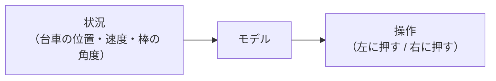
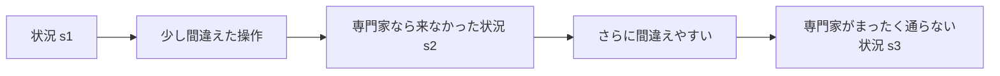
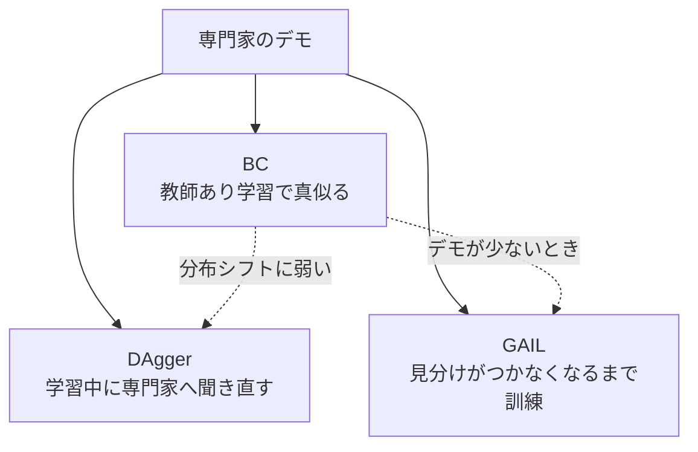

# 01. 模倣学習の基礎

[← 00. はじめに](00_はじめに.md) ｜ [02. 環境を準備する →](02_環境を準備する.md)

---

> **この章の目的**
> 模倣学習が「何をする技術か」と、「どこで失敗しやすいか」を理解します。
> **機械学習や強化学習の知識は前提にしません。** 分からない言葉は [A4. 用語集](A4_用語集.md) を参照してください。
> **コードは実行しません。** 読むだけの章です。

---

## 1.1 模倣学習とは

**模倣学習**（Imitation Learning）は、**上手な人（専門家）のやり方を見せて、同じ振る舞いを学習させる**技術です。

> "Often, it is easier for a teacher to demonstrate a desired behavior rather than attempt to manually engineer it. This process of learning from demonstrations, and the study of algorithms to do so, is called imitation learning."
>
> 出典（参考情報・学術論文）: Osa, Pajarinen, Neumann, Bagnell, Abbeel, Peters, *An Algorithmic Perspective on Imitation Learning*, arXiv:1811.06711
> https://arxiv.org/abs/1811.06711

### なぜ「ルールを書く」のではだめなのか

自動運転やロボット操作のように、状況が無数にある問題では、
**「こういうときはこうする」というルールを人間が書き切ることができません。**

### なぜ「強化学習」ではだめなのか

強化学習は「良い行動には高い点、悪い行動には低い点」という**報酬関数**を人間が設計します。
しかし現実の問題では、**この点数の付け方を決めること自体が難しい**のです。

> "programming their behaviors manually or defining their behavior through reward functions (as done in reinforcement learning (RL)) has become exceedingly difficult."
>
> 出典（参考情報・学術論文）: Zare, Kebria, Khosravi, Nahavandi, *A Survey of Imitation Learning*, arXiv:2309.02473
> https://arxiv.org/abs/2309.02473

**模倣学習は、この「点数の設計」を回避します。** 代わりに必要なのは、**お手本**です。

---

## 1.2 一番単純な方法「BC」は、教師あり学習そのもの

**BC**（Behavior Cloning / 行動クローニング）は、模倣学習の最も単純な方法です。

| やること | 普通の機械学習でいうと |
|---|---|
| 専門家の記録を集める | 学習データを集める |
| 「この状況では、この操作」を覚えさせる | **分類問題を解く** |

つまり **BC は、画像分類やスパム判定と同じ「教師あり学習」です。**
新しい理論を覚える必要はありません。

> **これが、模倣学習が初級者にとって強化学習より入りやすい理由です。**

---

## 1.3 ⚠ ただし、普通の教師あり学習とは決定的に違う点がある

普通の分類問題では、**モデルの予測が次の入力を変えることはありません。**
猫の画像を犬と間違えても、次に来る画像は変わりません。

**模倣学習は違います。**

自分の出力が次の入力を決めるため、**小さな誤差がどんどん積み上がります。**
これを **分布シフト**（distribution shift）と呼びます。

この現象には理論的な裏づけがあります。

> "**This is not true in imitation learning as the learned policy influences the future test inputs (states) upon which it will be tested. We show that this leads to compounding errors and a regret bound that grows quadratically in the time horizon of the task.**"
>
> 出典（参考情報・学術論文）: Ross & Bagnell, *Efficient Reductions for Imitation Learning*, AISTATS 2010, PMLR 9:661-668
> https://proceedings.mlr.press/v9/ross10a.html

**1 ステップあたりの間違いが同じでも、エピソードが長いほど性能の落ち方は二次で悪化する**ということです。

---

## 1.4 手法の地図

本ハンズオンで扱うのは 3 つだけです。

| 手法 | 環境と動かせるか | 専門家に聞き直せる必要 | 出典 |
|---|---|---|---|
| **BC** | 不要 | 不要 | — |
| **DAgger** | 必要 | **必要** | Ross, Gordon, Bagnell, arXiv:1011.0686 |
| **GAIL** | 必要 | 不要 | Ho & Ermon, arXiv:1606.03476 |

- DAgger: https://arxiv.org/abs/1011.0686
- GAIL: https://arxiv.org/abs/1606.03476

---

## 1.5 なぜ `seals/CartPole-v0` を使うのか

本ハンズオンの題材は **「棒を倒さないように台車を左右に動かす」** という古典的な問題です。
ただし、素の `CartPole-v1` ではなく **`seals/CartPole-v0`** を使います。

### 理由: エピソードの長さが変わると、評価が意味を失う

`imitation` ライブラリの公式ドキュメントは、次のように強く警告しています。

> "**Variable Horizon Environments Considered Harmful**"
>
> "termination conditions must be carefully hand-designed for each environment. **Their inclusion therefore provides a significant source of information about the reward. Evaluating reward and imitation learning algorithms in variable-horizon environments can therefore be deeply misleading.**"
>
> 出典（参考情報・OSS 公式ドキュメント）: https://imitation.readthedocs.io/en/latest/main-concepts/variable_horizon.html

**「棒が倒れたら終わり」という終了条件そのものが、「棒を倒すな」という答えを漏らしている**のです。
これでは「学習できた」のか「答えを教えてもらった」のか区別がつきません。

### 実測で確かめられます

ランダムに操作したときのエピソード長（[02 章](02_環境を準備する.md)で自分で確認できます）:

| 環境 | エピソード長 |
|---|---|
| `seals/CartPole-v0` | **500, 500, 500**（常に固定） |
| `CartPole-v1` | 17, 18, 24（失敗すると即終了） |

`seals` は、この問題を避けるために**エピソード長を固定した版**を提供しています。

> `imitation` は、可変ホライズン環境で GAIL / AIRL を学習しようとすると**既定でエラーを出して止まります**。
> これは [07 章](07_GAILと評価の落とし穴.md) で実際に体験します。

---

## 1.6 成績のはかり方

### リターン

1 エピソードで得た報酬の合計です。`seals/CartPole-v0` では**最大 500** です。

### 正規化リターン

「500 点満点で 400 点」と言われても、それが良いのか分かりません。
そこで **「ランダムなら 0、専門家なら 1」** になるよう変換します。

$$
\text{normalized\_return} = \frac{\text{方策のリターン} - \text{ランダムのリターン}}{\text{専門家のリターン} - \text{ランダムのリターン}}
$$

この考え方は `imitation` のベンチマークと同じです。

> "The scores are normalized based on the performance of a random agent as the baseline and the expert as the maximum possible score"
>
> 出典（参考情報・OSS 公式ドキュメント）: https://imitation.readthedocs.io/en/latest/main-concepts/benchmark_summary.html

### ⚠ 1 回の結果で比較しない

学習には乱数が使われるため、**同じ設定でも実行するたびに結果が変わります。**
本ハンズオンでは、重要な比較は **3 つのシード**で実行します。

---

## 1.7 ⚠ 先に伝えておきます: この題材では「教科書どおり」になりません

本ハンズオンの構築時に実際に測った結果、次のことが分かっています。

| よくある説明 | この題材での実測 |
|---|---|
| 「BC はデモが少ないと失敗する」 | **デモ 3 件でも成功しました**（正規化リターン 0.989） |
| 「DAgger は BC より強い」 | **差は出ませんでした** |
| 「GAIL は少ないデモで学習できる」 | **学習しませんでした**（リターンが 336 → 8 に悪化） |

> **これは失敗ではありません。**
> 「論文やベンチマークの結果が、自分の課題でそのまま再現するとは限らない」ことこそ、
> 本ハンズオンで最も持ち帰ってほしい教訓です。
>
> 実測値の詳細と根拠は [../調査レポート_模倣学習.md](../調査レポート_模倣学習.md) の 4.4.2 にあります。

---

## この章のまとめ

- 模倣学習は、**報酬の設計を回避して、お手本から学ぶ**技術
- **BC は教師あり学習そのもの**。難しい理論は不要
- ただし **自分の出力が次の入力を変える**ため、誤差が積み上がる（分布シフト）
- 評価が意味を持つように、**エピソード長が固定の環境**を使う
- 成績は **正規化リターン**ではかり、**複数シード**で比較する

---

[← 00. はじめに](00_はじめに.md) ｜ [02. 環境を準備する →](02_環境を準備する.md)
