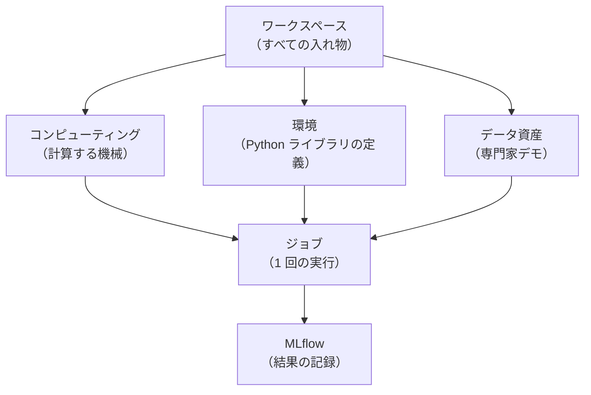

# 03. Azure ML 環境構築

[← 02. 環境を準備する](02_環境を準備する.md) ｜ [04. 専門家デモを作る →](04_専門家デモを作る.md)

---

> **この章の目的**
> Azure Machine Learning の**ワークスペース・コンピューティング・環境**を作り、
> **ジョブが 1 本通ること**を確認します。
> 対応するノートブック: [notebooks/01_setup_azureml.ipynb](../notebooks/01_setup_azureml.ipynb)

> [!WARNING]
> **本章の手順は Azure 上で実行検証していません。**
> 本ハンズオンの構築時に検証したのは**ローカル実行だけ**です。
> そのため本章には **Azure ジョブの所要時間・費用・出力例を一切記載していません。**
> 手順は Microsoft の公式ドキュメントに従って書いていますが、**あなたの環境で確認しながら進めてください。**

---

## 3.1 Azure ML の構成要素

Azure ML を初めて触ると、名前が多くて混乱します。**本ハンズオンで使うのは 5 つだけ**です。



| 要素 | 何か | 本ハンズオンでの中身 |
|---|---|---|
| **ワークスペース** | 実験・データ・記録がすべて入る箱 | 1 つだけ作ります |
| **コンピューティング クラスター** | 学習を実行する計算機の集まり | CPU のみ。**`min_instances=0`** |
| **環境**（Environment） | ジョブを動かす Python 環境の定義 | [src/conda.yaml](../src/conda.yaml) |
| **データ資産** | バージョン付きのデータ | 専門家デモ（[04 章](04_専門家デモを作る.md)で作ります） |
| **ジョブ** | 1 回の実行 | Command Job / Sweep Job |

> 出典（Microsoft 公式）: [Azure Machine Learning とは（リソースとアセット）](https://learn.microsoft.com/azure/machine-learning/concept-azure-machine-learning-v2?view=azureml-api-2)

**MLflow** は Azure ML の外側の仕組み（OSS）ですが、**Azure ML はこれを標準の記録先として使います。**
本ハンズオンの学習スクリプトが `azureml.*` を一切 import していないのは、そのためです（[02 章 2.1](02_環境を準備する.md)）。

---

## 3.2 ワークスペースを作る

### なぜそうするのか

**ワークスペースが無いと、ジョブも記録も置き場所がありません。** 最初に作ります。

### 何をするのか

Azure Portal から作るのが最も簡単です。

1. [Azure Portal](https://portal.azure.com/) で **［リソースの作成］→「Azure Machine Learning」** を検索
2. **リソース グループ**を新規作成する（例: `rg-il-workshop-<yourname>`）
   → **後片付けのとき、このリソース グループごと削除すれば確実に止まります**（[09 章](09_評価・コスト・後片付け.md)）
3. **ワークスペース名**とリージョンを指定して作成

> 出典（Microsoft 公式）: [ワークスペースの管理](https://learn.microsoft.com/azure/machine-learning/how-to-manage-workspace?view=azureml-api-2)

> ⚠ **ワークスペースを作ると、ストレージ アカウント・Key Vault・Application Insights・Container Registry が一緒に作られます。**
> **これらには少額の課金が継続します。** ワークスペースだけ消しても残ることがあるため、
> **リソース グループごと作り、リソース グループごと消す**のが最も確実です。

### どうなれば成功か

[Azure ML studio](https://ml.azure.com) にサインインし、作成したワークスペースが開けること。
右上のワークスペース名をクリックすると、**サブスクリプション ID・リソース グループ・ワークスペース名**が表示されます。
**この 3 つを [notebooks/01_setup_azureml.ipynb](../notebooks/01_setup_azureml.ipynb) に入力します。**

### ⚠ うまくいかないときは

| 症状 | 原因と対処 |
|---|---|
| リソースを作成できない | サブスクリプションに対する権限が不足しています。**共同作成者（Contributor）以上**が必要です |
| 目的のリージョンが選べない | サブスクリプションでそのリージョンが利用できません。別のリージョンを選んでください |

---

## 3.3 コンピューティング クラスターを作る

### なぜそうするのか

**ジョブを動かす計算機が必要です。** 選択肢は主に 2 つあります。

| 種類 | 特徴 | 本ハンズオン |
|---|---|---|
| コンピューティング **インスタンス** | 1 人用の開発マシン。**起動している間ずっと課金** | 使いません |
| コンピューティング **クラスター** | ジョブのときだけノードが立つ。**`min_instances=0` なら待機中は課金されない** | **こちらを使います** |

> 出典（Microsoft 公式）: [Azure Machine Learning コンピューティング クラスターの作成](https://learn.microsoft.com/azure/machine-learning/how-to-create-attach-compute-cluster?view=azureml-api-2)

### 何をするのか

[notebooks/01_setup_azureml.ipynb](../notebooks/01_setup_azureml.ipynb) の **3.** のセルを実行します。

| パラメーター | 値 | 意味 |
|---|---|---|
| **`min_instances`** | **`0`** | **ジョブが無い間はノード数 0 → コンピューティングの課金が止まる** |
| `max_instances` | `4` | 並列実行できるジョブ数の上限。**vCPU クォータを超えないこと** |
| `idle_time_before_scale_down` | `120` | アイドル 120 秒でノードを解放する |
| `size` | `Standard_DS3_v2` | CPU 4 コア。**GPU は不要です** |

> **なぜ GPU が不要なのか**: 本ハンズオンの題材は、観測が 25 個の数値だけで、
> ニューラルネットワークも小さいためです。**GPU を付けても速くなりません。**

### どうなれば成功か

ノートブックが `min_instances: 0` と表示すること。
studio の［コンピューティング］→［コンピューティング クラスター］にも表示されます。

### ⚠ うまくいかないときは

| 症状 | 原因と対処 |
|---|---|
| クォータ超過のエラー | サブスクリプションの vCPU クォータが不足しています。`COMPUTE_SIZE` を小さくするか、`MAX_INSTANCES` を減らしてください |
| そのリージョンで VM サイズが使えない | studio の［コンピューティング］→［作成］で、選択できるサイズを確認してください |

---

## 3.4 カスタム環境を作る

### なぜそうするのか

ジョブは **`imitation` / `stable-baselines3` / `panda-gym` / `pybullet` が入った Python 環境**でしか動きません。
Azure ML では、この環境を **「Environment」というリソースとして登録**します。

> [!IMPORTANT]
> **最重要**: Azure ML は **conda 定義から新しい環境を作り、その中でジョブを実行します。**
> **ベース Docker イメージに入っている Python パッケージは使えません。**
> 必要なものは**すべて [src/conda.yaml](../src/conda.yaml) に書く**必要があります。
>
> 出典（Microsoft 公式）: [CLI と SDK (v2) を使った環境の管理](https://learn.microsoft.com/azure/machine-learning/how-to-manage-environments-v2?view=azureml-api-2)

### 何をするのか

[notebooks/01_setup_azureml.ipynb](../notebooks/01_setup_azureml.ipynb) の **4.** のセルを実行します。
[src/conda.yaml](../src/conda.yaml) がそのまま環境の定義になります。

`conda.yaml` のバージョンは、**すべて実際に導入して動作を確認した値**です。

| パッケージ | バージョン | 固定した理由 |
|---|---|---|
| `imitation` | 1.0.1 | BC / DAgger / GAIL の実装本体 |
| `stable-baselines3` | **2.2.1** | **`imitation` が `~=2.2.1` で要求**（PEP 440 で `2.2.*` の意味） |
| `gymnasium[classic-control]` | 0.29.1 | `imitation` が extra ごと要求する |
| `seals` | 0.2.1 | **固定ホライズン化に使う `AbsorbAfterDoneWrapper`** の提供元 |
| `panda-gym` | 3.0.7 | Panda ロボットのピックアンドプレース。`pybullet` を引き込む |
| `numpy` | **1.26.4** | **`panda-gym` が `numpy<2` を要求**（出典: https://github.com/qgallouedec/panda-gym/blob/master/setup.py ） |
| `scipy` | 1.15.2 | `panda-gym` の依存 |

> ⚠ **`pybullet` の入手先がローカルと違います。**
> Azure ML のコンピューティングは Linux なので、PyPI の manylinux ホイールを `panda-gym` の依存として pip が導入します。
> 一方 **Windows / macOS にはホイールが無い**ため、ローカルは conda-forge から入れます（[02 章 2.3](02_環境を準備する.md)）。
> 出典: https://pypi.org/project/pybullet/#files

> ⚠ **9 章（強化学習）とは環境を共有できません。**
> 9 章は `stable-baselines3==2.4.1` を使いますが、`imitation` 1.0.1 は 2.2.x を要求するためです。

### どうなれば成功か

ノートブックが `作成した環境: il-pickplace-env:1` のように表示すること。
**イメージの構築は最初のジョブ投入時に行われます。** studio の［環境］→［ビルド ログ］で進捗を確認できます。

### ⚠ うまくいかないときは

| 症状 | 原因と対処 |
|---|---|
| イメージのビルドが依存解決で失敗する | `conda.yaml` は **Windows で解決した組み合わせ**です。Linux で解決できない場合は、ビルド ログのエラー行を読み、該当パッケージのバージョン指定を緩めてください |
| `ResourceNotFound: il-pickplace-env` | 環境を作成する前にジョブを投入しています。**4. のセルを先に実行**してください |

---

## 3.5 MLflow の追跡 URI を設定する

### なぜそうするのか

**ジョブの中では自動設定されますが、手元の PC から記録を「読む」ときは明示設定が必要**です。

> 出典（Microsoft 公式）: [Azure Machine Learning 用に MLflow を構成する](https://learn.microsoft.com/azure/machine-learning/how-to-use-mlflow-configure-tracking?view=azureml-api-2)
> 「**Azure コンピューティング インフラストラクチャを使用する場合、追跡 URI を構成する必要はありません。自動的に設定されるようになっています。**」
> 「**ただし、Azure Machine Learning の外部で作業する場合は、ワークスペースを指すように MLflow を構成する必要があります。**」

これを設定しないと、[02 章](02_環境を準備する.md) で見たように **カレント フォルダーに `mlflow.db` と `mlruns/` が作られます**
（[A1 の 3-4](A1_トラブルシューティング.md)）。

### 何をするのか

[notebooks/01_setup_azureml.ipynb](../notebooks/01_setup_azureml.ipynb) の **5.** のセルを実行します。

```python
tracking_uri = ml_client.workspaces.get(WORKSPACE_NAME).mlflow_tracking_uri
mlflow.set_tracking_uri(tracking_uri)
```

> ⚠ **Private Link を有効にしたワークスペースでは URI の形式が異なります。**
> 公式ドキュメントは「この場合、追跡 URI を取得するには、Azure Machine Learning SDK for Python または
> Azure Machine Learning CLI v2 を使用する必要があります」と警告しています。
> **文字列を手で組み立てないでください。**（出典: 同上）

### ⚠ 認証でつまずきやすい点

`azureml-mlflow` プラグインは、**MLClient とは別に**「環境変数 → マネージド ID → Azure CLI → Azure PowerShell → 対話型ブラウザー」の順で認証します。
**ノートブックで既にサインインしていても、もう一度サインインを求められることがあります。**（出典: 同上）

---

## 3.6 疎通確認をする

### なぜそうするのか

**ここまでの設定がどれか 1 つでも間違っていると、この先すべてのジョブが失敗します。**
先に「最小の 1 本」を通しておけば、あとで失敗したときに**原因の切り分けが一気に楽になります。**

### 何をするのか

[notebooks/01_setup_azureml.ipynb](../notebooks/01_setup_azureml.ipynb) の **6.** のセルを実行します。
このジョブは **新しいファイルを作らず**、[src/il_common.py](../src/il_common.py) を `python -c` から import するだけです。

確認できること:

1. `../src` がスナップショットとして送られる
2. `imitation` / `stable-baselines3` / `panda-gym` / `pybullet` が import できる
3. `il/PandaPickAndPlace-v0` の並列環境を生成できる
4. **MLflow にパラメーターとメトリックが記録される**

### どうなれば成功か

- ジョブのステータスが **`Completed`**
- ログに **`SMOKE TEST OK`**
- MLflow に `imitation_version` などのパラメーターと `obs_dim` / `n_actions` のメトリックが残る

> ⚠ `run.data.metrics` は、同じ名前のメトリックについて**最後の値しか返しません。**
> 学習曲線（全ステップの値）が必要な場合は `MlflowClient().get_metric_history()` を使ってください。
>
> 出典（Microsoft 公式）: [MLflow でのメトリック、パラメーター、ファイルのログ](https://learn.microsoft.com/azure/machine-learning/how-to-log-view-metrics?view=azureml-api-2)

### ⚠ うまくいかないときは

| 症状 | 対処 |
|---|---|
| ジョブが `Failed` | studio のジョブ詳細 →［出力とログ］→ `user_logs/std_log.txt` を読む |
| `ModuleNotFoundError` | [src/conda.yaml](../src/conda.yaml) に不足がある。**ベースイメージのパッケージは使えません**（3.4） |
| ずっと `Queued` のまま | クォータ不足か、`max_instances` を超える本数を投入しています |
| 認証を何度も求められる | MLflow プラグインが独自に認証するためです（3.5） |

---

## この章のまとめ

- Azure ML で使うのは **ワークスペース / コンピューティング / 環境 / データ資産 / ジョブ** の 5 つ
- クラスターは **`min_instances=0`**。ただし**付属リソースの課金は続く**
- 環境は **conda 定義から新規作成**される。**ベースイメージのパッケージは使えない**
- 手元の PC から MLflow を読むときは **追跡 URI の明示設定が必要**
- **疎通確認を先に 1 本通す**

---

[← 02. 環境を準備する](02_環境を準備する.md) ｜ [04. 専門家デモを作る →](04_専門家デモを作る.md)
