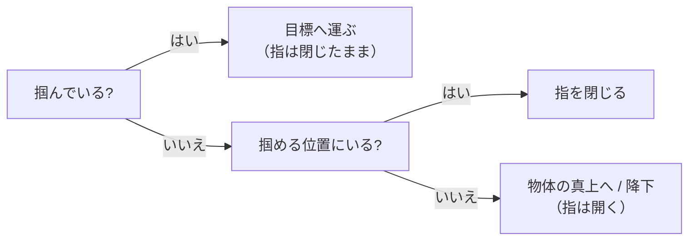
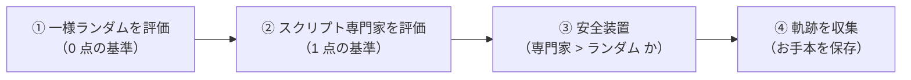

# 04. 専門家デモを作る

[← 03. Azure ML 環境構築](03_AzureML環境構築.md) ｜ [05. BC を動かす →](05_BCを動かす.md)

---

> **この章の目的**
> 模倣学習の**入力データ（お手本）**を作ります。
> 対応するノートブック: [notebooks/03_collect_demos_job.ipynb](../notebooks/03_collect_demos_job.ipynb)

> [!WARNING]
> **本章の Azure ジョブは Azure 上で実行検証していません。**
> 記載している数値は、**同じスクリプトをローカル（Windows 10 / Python 3.10 / CPU / 2026-08-18）で実行した実測値**です。

---

## 4.1 なぜ「専門家」が必要なのか

**模倣学習は、お手本が無いと 1 ステップも始まりません。**

| | 必要なもの |
|---|---|
| 強化学習 | **報酬関数**（人が設計する点数の付け方） |
| **模倣学習** | **専門家のデモ**（上手なやり方の記録） |

模倣学習は「点数の設計」を回避する代わりに、**お手本を用意する仕事**を引き受けます（[01 章 1.1](01_模倣学習の基礎.md)）。

---

## 4.2 本ハンズオンの専門家は「人が書いたプログラム」です

本ハンズオンの専門家は [src/scripted_expert.py](../src/scripted_expert.py) に**手続きとして書かれています**。
中身は、次の 4 つを現在の観測から判断するだけの単純な規則です。



### なぜ強化学習で専門家を作らないのか

9 章（強化学習）は、同じ `PandaPickAndPlace-v3` を **SAC + HER** で学習させています。
本ハンズオンがスクリプトを選んだ理由は次の 3 つです。

| 理由 | 内容 |
|---|---|
| **速い・安い** | 学習が不要なので、デモ収集ジョブが短時間で終わります |
| **毎回同じ** | 乱数に左右されないため、**専門家の質が実験ごとに変わりません** |
| **現実に近い** | 産業用ロボットの「ティーチング」は、まさに人が手順を書く作業です |

> ⚠ **「スクリプトが書けるなら、それを使えばよいのでは?」**
> そのとおりです。**手で書ける作業に模倣学習は要りません。**
> 本ハンズオンでスクリプトを使うのは、**「お手本から方策を作る手順」を学ぶため**です。
> 実務では、手で書けない作業（人間のデモ・遠隔操作の記録）が入力になります。

### ⚠ 専門家は「記憶を持たない」必要があります

[src/scripted_expert.py](../src/scripted_expert.py) は、**いまの観測だけ**から行動を決めます。
「いま何番目の手順か」といった内部状態を持っていません。

**これは意図的な設計です。** BC は「観測 → 行動」の対応を学ぶので、
**専門家が履歴に依存していると、BC は原理的に真似できません。**

> ⚠ **実際に踏んだ落とし穴**: 本ハンズオンの構築時、最初は「掴める位置か → 掴んでいるか」の順で判定していました。
> すると**運搬中に把持判定が外れてグリッパーを開き、物体を落とす**ため、成功率が **0.40** に留まりました。
> 判定を **「掴んでいるか → 掴める位置か → それ以外」**の順に変えたところ、成功率は **1.00** になりました。

---

## 4.3 2 つの成果物と、それぞれの用途

[src/collect_demos.py](../src/collect_demos.py) は、`--output-dir` に **2 つのファイル**を出力します。

| ファイル | 中身 | 使うところ |
|---|---|---|
| **`demos.npz`** | 専門家の軌跡（観測と行動の並び） | **BC / GAIL の入力** |
| **`scores.json`** | 一様ランダムと専門家の成績 | **正規化リターンの基準** |

### ⚠ 「専門家そのもの」はファイルではありません

[06 章](06_DAggerを試す.md) で扱う **DAgger は、学習の途中で専門家に問い合わせます。**
記録（`demos.npz`）だけでは足りず、**専門家本体**が必要です。

本ハンズオンでは **専門家がコード**（[src/scripted_expert.py](../src/scripted_expert.py)）なので、
**ジョブのスナップショット（`code="../src"`）に含まれて一緒に送られます。** 別ファイルにする必要がありません。

> 人間のデモを使う場合や、強化学習で専門家を作る場合は、**専門家の重みファイルを別途保存して配る**必要があります。

---

## 4.4 `collect_demos.py` の読み方



| 引数 | 既定値 | 意味 |
|---|---|---|
| `--env-id` | `il/PandaPickAndPlace-v0` | 固定ホライズン化した環境（[01 章 1.5](01_模倣学習の基礎.md)） |
| `--n-episodes` | `800` | 収集する軌跡の**下限**。8 並列で収集するため、実際はこれより多くなります。<br>**[05 章](05_BCを動かす.md) の比較実験でデモ 800 件の条件を使うため、既定を 800 にしています** |
| `--seed` | `0` | 再現性のため固定 |
| `--output-dir` | （必須） | 2 つの成果物の出力先 |

**評価はすべて 20 エピソードの平均**です（`N_EVAL_EPISODES = 20`）。環境は **8 並列**（`N_ENVS = 8`）で動かします。

---

## 4.5 ⚠ 専門家が弱いと、スクリプトはエラーで止まります

```python
if expert_mean <= random_mean:
    raise ValueError(
        f"専門家がランダム行動を上回っていません "
        f"(expert={expert_mean:.2f} <= random={random_mean:.2f})。"
        f" scripted_expert.py の制御パラメーターを確認してください。"
    )
```

### なぜ止めるのか

正規化リターンの式を思い出してください（[01 章 1.6](01_模倣学習の基礎.md)）。

$$
\text{normalized\_return} = \frac{\text{方策のリターン} - \text{ランダムのリターン}}{\text{専門家のリターン} - \text{ランダムのリターン}}
$$

**分母が 0 以下になると、この値は意味を失います。**
「専門家から学ぶ」という前提が崩れているのに、数値だけは出てしまう —— これが最も危険な失敗です。

---

## 4.6 Command Job として実行する

[notebooks/03_collect_demos_job.ipynb](../notebooks/03_collect_demos_job.ipynb) の **2.** のセルを実行します。

ジョブの出力は **`${{outputs.demos}}`** として受け取り、そのまま `--output-dir` に渡します。

> 出典（Microsoft 公式）: [ジョブでのデータへのアクセス](https://learn.microsoft.com/azure/machine-learning/how-to-read-write-data-v2?view=azureml-api-2)

---

## 4.7 `uri_folder` のデータ資産として登録する

2 つのファイルは**常にセットで使う**ため、フォルダーごと **`uri_folder` のデータ資産**として登録します。
以降のノートブックは `il-pickplace-demos@latest` と書くだけで参照できます。

```python
Input(type=AssetTypes.URI_FOLDER, path="azureml:il-pickplace-demos@latest")
```

> ⚠ **`scores.json` が実験の物差しです。** デモを取り直したら、**それ以前の結果とは比較できません**（[05 章 5.8](05_BCを動かす.md)）。

---

## 4.8 どうなれば成功か

### ローカルでの実測値（2026-08-18 / Windows 10 / CPU / 評価 20 エピソード）

| 方策 | 成功率 | 平均リターン | 標準偏差 |
|---|---|---|---|
| 一様ランダム | **0.00** | **-50.00** | 0.00 |
| **スクリプト専門家** | **1.00** | **-11.25** | 4.04 |

**シードを変えても専門家の成功率は変わりませんでした。**

| シード | 成功率 | 平均リターン |
|---|---|---|
| 0 | 1.00 | -11.25 ± 4.04 |
| 1 | 1.00 | -11.40 ± 4.60 |
| 2 | 1.00 | -13.95 ± 11.17 |

**50 エピソードで評価した場合は成功率 0.94**（平均リターン -13.22）でした。
**20 エピソードでは 1.00 に見えても、回数を増やすと失敗が現れます。** 評価回数は必ず書き添えてください。

### 収集の実測値

| 項目 | 値 |
|---|---|
| 800 エピソードの収集時間 | **33.22 秒**（8 並列 / ローカル CPU） |
| 収集した軌跡の平均リターン | **-12.505** |

> **Azure 上では同じ数値になりません。** 確認してほしいのは
> **「専門家の成功率がランダムより明確に高い」**ことです。

### ⚠ リターンの読み方

報酬は **成功していれば 0 / していなければ -1** です（疎な報酬）。
エピソードは必ず 50 ステップなので、

- **リターン -50** = 一度も成功しなかった
- **リターン -11** = **11 ステップ目で成功した**（そこから先は 0 点）

**0 に近いほど「速く成功した」**という意味になります。

---

## この章のまとめ

- 模倣学習は**お手本が先**。本ハンズオンでは**人が書いたスクリプト**を専門家にする
- **専門家は記憶を持ってはいけない**（BC が原理的に真似できなくなる）
- 成果物は 2 つ。**専門家本体はコードなのでジョブと一緒に送られる**
- **専門家がランダム以下ならスクリプトは止まる**（正規化リターンが無意味になるため）
- **リターンは「何ステップ目で成功したか」を表す**。0 に近いほど速い

---

[← 03. Azure ML 環境構築](03_AzureML環境構築.md) ｜ [05. BC を動かす →](05_BCを動かす.md)
