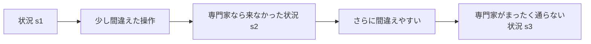
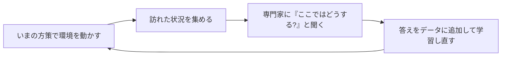

# 06. DAgger を試す

[← 05. BC を動かす](05_BCを動かす.md) ｜ [07. GAIL と評価の落とし穴 →](07_GAILと評価の落とし穴.md)

---

> **この章の目的**
> BC の理論的な弱点を補うはずの **DAgger** を動かし、
> **「教科書どおりにならなかった」結果を正しく扱う**練習をします。
> 対応するノートブック: [notebooks/05_dagger_gail_job.ipynb](../notebooks/05_dagger_gail_job.ipynb) の 1〜2

> [!WARNING]
> **本章の Azure ジョブは Azure 上で実行検証していません。**
> 記載している数値は、**同じスクリプトをローカル（Windows 10 / Python 3.10 / CPU / 2026-08-18）で実行した実測値**です。
> すべての数値は [調査レポート_模倣学習.md の 4.4.3](../調査レポート_模倣学習.md) に一次記録があります。

---

## 6.1 BC の理論的な弱点（復習）

[01 章 1.3](01_模倣学習の基礎.md) で見たとおり、模倣学習は普通の分類問題と決定的に違います。



**自分の出力が次の入力を決めるため、小さな誤差が積み上がります**（**分布シフト**）。

> "**This is not true in imitation learning as the learned policy influences the future test inputs (states) upon which it will be tested. We show that this leads to compounding errors and a regret bound that grows quadratically in the time horizon of the task.**"
>
> 出典（参考情報・学術論文）: Ross & Bagnell, *Efficient Reductions for Imitation Learning*, AISTATS 2010, PMLR 9:661-668
> https://proceedings.mlr.press/v9/ross10a.html

**専門家のデモには、専門家が通った状況しか入っていません。**
だから「自分がミスして迷い込んだ状況」の正解は、デモの中に存在しません。

### ⚠ ピックアンドプレースでは、この弱点がとりわけ深刻です

| 局面 | 専門家のデモに含まれるか |
|---|---|
| 物体に近づく | ✅ たくさん含まれる |
| つかむ | ✅ 含まれる |
| **つかみ損ねて手が空のまま上昇した状態** | ❌ **1 つも含まれない** |
| **運搬中に落としてしまった状態** | ❌ **1 つも含まれない** |

**スクリプト専門家は成功率 1.00 なので、失敗の記録が存在しません。**

---

## 6.2 DAgger の仕組み

**DAgger**（Dataset Aggregation）は、この穴を素直に埋めます。



**「自分がミスして迷い込んだ状況」についても、専門家の正解が手に入る**ため、
理論上は分布シフトに強くなります。

> 出典（参考情報・学術論文）: Ross, Gordon, Bagnell,
> *A Reduction of Imitation Learning and Structured Prediction to No-Regret Online Learning*, AISTATS 2011
> https://arxiv.org/abs/1011.0686

---

## 6.3 ⚠ DAgger には「専門家本体」が要ります

| 手法 | 必要なもの |
|---|---|
| **BC** | `demos.npz`（**記録だけ**） |
| **DAgger** | `demos.npz` ＋ **専門家そのもの**（学習中に何度も問い合わせる） |

本ハンズオンの専門家は **[src/scripted_expert.py](../src/scripted_expert.py) のコード**です。
`imitation` が用意している **`NonTrainablePolicy`**（手書き方策のための基底クラス）を継承しているため、
学習アルゴリズムからは普通の方策として扱えます。

```python
class ScriptedExpertPolicy(imitation_policies.NonTrainablePolicy):
    def _choose_action(self, obs):
        ...
```

> [!IMPORTANT]
> **専門家がコードなので、ジョブのスナップショット（`code="../src"`）に含めて送るだけで済みます。**
> モデル ファイルを別途 Azure へ持ち込む必要はありません。

> ⚠ **現実の問題では、ここが最大の障壁になります。**
> 「人間の専門家に、学習の途中で何千回も質問する」ことは通常できません。
> **DAgger が使えるのは、専門家がプログラムである場合か、人間に繰り返し聞ける体制がある場合だけ**です。

---

## 6.4 ⚠ 実験を設計する — DAgger と BC の「学習量」をそろえる

[05 章 5.3](05_BCを動かす.md) と同じ問題がここにもあります。**しかも今回は見えにくい形で現れます。**

`--dagger-timesteps` は **環境を動かすステップ数**であって、**勾配更新の回数ではありません。**

**`imitation` 1.0.1 のソースから読み取れる事実:**

| 事実 | 値 | 場所 |
|---|---|---|
| 1 ラウンドあたりの BC 学習エポック数（既定） | **`DEFAULT_N_EPOCHS = 4`** | `imitation/algorithms/dagger.py` |
| 1 ラウンドで最低限集めるエピソード数 | `rollout_round_min_episodes = 3` | 同上 |
| 1 ラウンドで最低限集めるステップ数 | `rollout_round_min_timesteps = 500` | 同上 |
| 専門家の行動を採用する確率 β | **`LinearBetaSchedule(15)`**（round 0 で 1、round 15 以降は 0） | 同上 |

**したがって `--dagger-timesteps 20000` を指定すると、実測で次のようになりました。**

| 指標 | 実測値 |
|---|---|
| ラウンド数 | **25** |
| **勾配更新の回数** | **32,500** |

**BC は 46,800 回でした。そろっていません。**
そこで **`n_epochs` を 6 に上げて 48,750 回**にした条件も実行します。

| 条件 | 更新回数 | BC との比 |
|---|---|---|
| DAgger（既定 `n_epochs=4`） | 32,500 | BC の **0.69 倍** |
| **DAgger（`n_epochs=6`）** | **48,750** | BC の **1.04 倍** |
| （参考）BC | 46,800 | 1.00 |

> [!IMPORTANT]
> **「DAgger が負けたのは学習量が少なかったからだ」という言い訳を、あらかじめ潰しておきます。**
> これをやらないと、結果を何とでも解釈できてしまいます。

---

## 6.5 実行方法

[src/train_il.py](../src/train_il.py) を `--algo dagger` で呼びます。

| 引数 | 既定値 | 意味 |
|---|---|---|
| `--algo dagger` | — | DAgger を選ぶ |
| `--dagger-timesteps` | `20000` | 環境を動かして専門家に聞き直す総ステップ数 |
| `--batch-size` | `32` | BC 部分のバッチ サイズ |
| `--seed` | `0` | 乱数の初期値 |

[notebooks/05_dagger_gail_job.ipynb](../notebooks/05_dagger_gail_job.ipynb) の **1.** のセルを、**3 シード**で実行します。

---

## 6.6 結果 — **DAgger は BC を下回りました**

### ローカル実測（評価 20 エピソード）

| 手法 | 更新回数 | seed 0 | seed 1 | seed 2 | **平均成功率** |
|---|---|---|---|---|---|
| **BC**（デモ 200） | 46,800 | 0.25 | 0.30 | 0.15 | **0.233** |
| DAgger（`n_epochs=4`） | 32,500 | 0.00 | — | — | **0.00** |
| **DAgger（`n_epochs=6`）** | **48,750** | **0.00** | **0.00** | **0.00** | **0.00** |
| （参考）スクリプト専門家 | — | 1.00 | 1.00 | 1.00 | **1.00** |
| （参考）一様ランダム | — | 0.00 | 0.00 | 0.00 | **0.00** |

**平均リターン**

| 手法 | seed 0 | seed 1 | seed 2 |
|---|---|---|---|
| BC（デモ 200） | -41.15 ± 15.50 | -37.95 ± 18.45 | -45.30 ± 11.99 |
| **DAgger（`n_epochs=6`）** | **-50.00 ± 0.00** | **-50.00 ± 0.00** | **-50.00 ± 0.00** |

**学習時間（ローカル / CPU）**

| 条件 | 更新回数 | 学習時間 |
|---|---|---|
| DAgger（`n_epochs=4`） | 32,500 | 267 秒 |
| DAgger（`n_epochs=6`） | 48,750 | 299〜336 秒 |
| （参考）BC（デモ 200） | 46,800 | 128〜156 秒 |

> [!WARNING]
> **標準偏差が 0.00 です。** 20 エピソードすべてで、1 度も成功しませんでした。
> **これは「わずかに劣る」ではなく「まったく解けていない」状態です。**

---

## 6.7 なぜこうなったのか — **確かなことと、仮説を分ける**

### 確かに言えること（実測にもとづく）

| 事実 | 根拠 |
|---|---|
| DAgger は **BC より 1.04 倍多く**更新しても 0.00 だった | 6.4 の更新回数、6.6 の結果 |
| **学習量不足では説明できない** | 32,500 でも 48,750 でも同じ 0.00 |
| **3 シードとも同じ**。偶然ではない | 6.6 |
| 同じ専門家・同じ環境で、**BC は 0.233 を出せている** | [05 章](05_BCを動かす.md) |
| DAgger のほうが **BC の 2 倍以上の時間**がかかった | 6.6 |

### ⚠ ここから先は **仮説（本ハンズオンでは検証していません）**

> [!IMPORTANT]
> **以下は「考えられる説明」であって、確かめた事実ではありません。**
> **読者が検証すべき候補**として挙げます。

| 仮説 | 考え方 | 確かめる方法（未実施） |
|---|---|---|
| **学習データが「失敗の途中」に偏った** | DAgger が集めるのは**いまの方策が訪れた状況**。方策が物体をつかめないうちは、「つかんで運んでいる状況」がデータにほとんど入らない | ラウンドごとに「物体を保持している状態」の割合を数える |
| **β が 0 になった後の悪循環** | `LinearBetaSchedule(15)` により **round 15 以降は専門家の行動が一切混ざらない**。25 ラウンド中 10 ラウンドが純粋な自己ロールアウト | `beta_schedule` を長くして再実行する |
| **環境ステップ数が足りない** | 20,000 ステップ = **400 エピソード**。1 エピソード 50 ステップの固定ホライズンでは多くない | `--dagger-timesteps` を桁で増やす |
| **BC 部分のハイパーパラメーターが未調整** | DAgger の内側は BC。[08 章](08_Sweepで改善する.md)の探索は BC 単独にしか適用していない | DAgger の内側の BC を Sweep する |

**書いてよいのは、確かに言えることだけです。**

---

## 6.8 ⚠ ベンチマークの数値を一般化してはいけない

`imitation` の公開ベンチマークでは、**DAgger が最高スコア**です。

| アルゴリズム | 正規化スコア Mean | 95% CI | IQM | 95% CI |
|---|---|---|---|---|
| **DAgger** | **0.995** | [0.987, 0.998] | **1.004** | [1.003, 1.008] |
| GAIL | 0.939 | [0.900, 0.944] | 0.957 | [0.965, 0.970] |
| BC | 0.932 | [0.922, 0.932] | 0.941 | [0.941, 0.949] |
| AIRL | 0.792 | [0.709, 0.792] | 0.918 | [0.871, 0.974] |

出典（参考情報・OSS 公式ドキュメント）: https://imitation.readthedocs.io/en/latest/main-concepts/benchmark_summary.html

> [!WARNING]
> **この数値の対象環境は `seals/Ant-v1`, `seals/HalfCheetah-v1`, `seals/Hopper-v1`, `seals/Swimmer-v1`, `seals/Walker2d-v1`
> の 5 つ、すなわち MuJoCo の連続制御タスクだけです。**
>
> **`imitation` は目標条件付きのロボット操作タスク（本章の題材のような環境）のベンチマーク結果を公開していません。**
> したがって **この順位関係を本章の題材に持ち込むことはできません。**

**本章の実測は、この順位と正反対（BC > DAgger）になりました。**
これは**ベンチマークが間違っているのではなく、条件が違う**ということです。

**数値には必ず「どこで測ったか」を添えてください。** これは実務でも同じです。

---

## 6.9 「効果が出なかった」も正当な結果です

本章で得られたのは、次の事実です。

> **`il/PandaPickAndPlace-v0`（固定ホライズン 50）において、
> 環境ステップ 20,000・勾配更新 48,750 回・シード 0/1/2 の条件で DAgger を実行したところ、
> 成功率は 3 シードとも 0.00 であり、勾配更新回数をほぼそろえた BC（46,800 回、平均 0.233）を下回った。
> 更新回数を 32,500 に減らした条件でも 0.00 であり、学習量不足では説明できない。**

**この記録には、次の 4 つがそろっています。**

| 要素 | 本章での内容 |
|---|---|
| **環境** | `il/PandaPickAndPlace-v0`（固定ホライズン 50） |
| **条件** | 環境ステップ 20,000 / 勾配更新 32,500 と 48,750 の 2 水準 / batch_size 32 |
| **シード** | 0 / 1 / 2（複数） |
| **解釈と限界** | 学習量不足では説明できない。**原因は特定できていない**（6.7 の仮説は未検証） |

> [!IMPORTANT]
> **「DAgger は効かない」と書いてはいけません。**
> **「この環境・この条件・この計算量では、BC を上回らなかった」**が正しい表現です。
>
> 実験の価値は「良い結果が出たか」ではなく、**「あとから誰かが検証できる形で残っているか」**で決まります。

---

## ⚠ うまくいかないときは

| 症状 | 対処 |
|---|---|
| `AssertionError` が `imitation/policies/base.py` で出る | 観測が `observation_space` の範囲外です（[A1 の 2-1](A1_トラブルシューティング.md)） |
| **同じ `--seed` なのに結果が変わる** | `set_seed()` が呼ばれていません（[A1 の 3-2](A1_トラブルシューティング.md)） |
| BC より大きく下回る | **本ハンズオンの実測でもそうなりました**（6.6）。異常ではありません |
| DAgger だけ極端に遅い | 環境を動かしながら学習するためです。**BC の 2 倍以上**かかりました（6.6） |
| ジョブが `Failed` | studio のジョブ詳細 →［出力とログ］→ `user_logs/std_log.txt` を読む |

---

## この章のまとめ

- BC の弱点は**分布シフト**。自分のミスで迷い込んだ状況の正解がデモに無い
- **DAgger は学習中に専門家へ聞き直して**それを埋める。だから**専門家本体が必要**
- 本ハンズオンの専門家は**コード**（`NonTrainablePolicy`）なので、スナップショットに同梱するだけでよい
- **`--dagger-timesteps` は更新回数ではない。** 実測して BC とそろえること（6.4）
- **この題材では DAgger の成功率は 0.00**。更新回数を BC の 1.04 倍にしても変わらなかった
- **原因は特定できていない。** 仮説（6.7）は仮説として書く
- **公開ベンチマークの順位（DAgger 最強）は MuJoCo での話。** 本題材に一般化してはいけない
- **「効果を確認できなかった」は、条件とシードが記録されていれば立派な成果**

---

[← 05. BC を動かす](05_BCを動かす.md) ｜ [07. GAIL と評価の落とし穴 →](07_GAILと評価の落とし穴.md)
