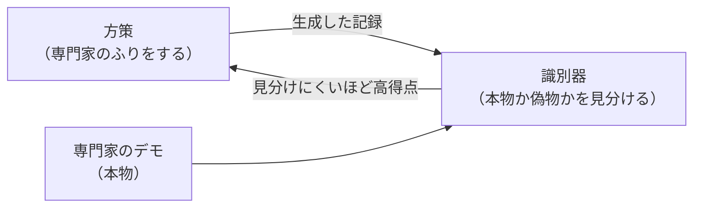

# 07. GAIL と評価の落とし穴

[← 06. DAgger を試す](06_DAggerを試す.md) ｜ [08. Sweep で改善する →](08_Sweepで改善する.md)

---

> **この章の目的**
> **可変ホライズン環境で報酬学習系の手法を評価してはいけない**理由を、**実際にエラーを起こして**理解します。
> そのうえで GAIL を実行し、**うまくいかない結果を正しく記録します。**
> 対応するノートブック: [notebooks/05_dagger_gail_job.ipynb](../notebooks/05_dagger_gail_job.ipynb) の 3〜5

> [!WARNING]
> **本章の Azure ジョブは Azure 上で実行検証していません。**
> 記載している数値は、**同じスクリプトをローカル（Windows / 2026-08-18）で実行した実測値**です。

> [!IMPORTANT]
> **本章は「GAIL の使い方」を教える章ではありません。**
> **「評価が壊れていることに気づく方法」**を教える章です。実務で最も価値のある知識です。

---

## 7.1 GAIL の考え方

**GAIL**（Generative Adversarial Imitation Learning）は、2 つのモデルを戦わせます。



**識別器が見分けられなくなったとき、方策は専門家と同じ振る舞いをしている**という理屈です。

> 出典（参考情報・学術論文）: Ho & Ermon, *Generative Adversarial Imitation Learning*, 2016
> https://arxiv.org/abs/1606.03476

**BC と違い、GAIL は環境を実際に動かす必要があります。** そのぶん時間がかかります。

---

## 7.2 ⚠ まず、素の環境で GAIL を起動してみる

[notebooks/05_dagger_gail_job.ipynb](../notebooks/05_dagger_gail_job.ipynb) の **3.** のセルを、**手元の PC で**実行します。
Azure は使いません。

使うのは **`il/PandaPickAndPlaceVariable-v0`** ——
[01 章 1.5](01_模倣学習の基礎.md) の**固定ホライズン化を行っていない**、素のピックアンドプレースです。

### 起きること

```text
ValueError: Episodes of different length detected: {16, 1, 50, 35}. Variable horizon
environments are discouraged -- termination conditions leak information about reward. See
https://imitation.readthedocs.io/en/latest/getting-started/variable-horizon.html for more
information. If you are SURE you want to run imitation on a variable horizon task, then
please pass in the flag: `allow_variable_horizon=True`.
```

**エラーで止まります。** ただし、**これはバグではなく、意図された安全装置です。**

> ⚠ **エラー中の集合 `{16, 1, 50, 35}` は実行ごとに変わります。**
> 本ハンズオンの実測では、スクリプト専門家のデモ 30 エピソードの長さが
> **1, 7, 8, 9, 10, 12, 13, 14, 15, 16, 17, 19, 20, 24, 29, 40, 50** の **17 種類**ありました。
>
> ⚠ **長さ 1 のエピソードがある**のは、初期配置の時点で物体がすでに目標位置の判定範囲内にあった場合です。

---

## 7.3 なぜ終了条件が「答え」を漏らすのか

[02 章のノートブック](../notebooks/02_explore_env.ipynb)で確認したとおり、
素の環境は **成功した瞬間にエピソードが終わります**。

```python
# An episode is terminated iff the agent has reached the target
terminated = bool(self.task.is_success(observation["achieved_goal"], self.task.get_goal()))
```

> 出典（参考情報・OSS 公式ソース）: https://github.com/qgallouedec/panda-gym/blob/master/panda_gym/envs/core.py

つまり **「エピソードが短い＝成功した」という情報が、終了条件そのものから漏れています。**

`imitation` の公式ドキュメントは、これを最も強い言葉で警告しています。

> "**Variable Horizon Environments Considered Harmful**"
>
> "termination conditions must be carefully hand-designed for each environment. **Their inclusion therefore provides a significant source of information about the reward. Evaluating reward and imitation learning algorithms in variable-horizon environments can therefore be deeply misleading.**"
>
> "Indeed, Figure 5 of Kostrikov et al (2021) shows that **GAIL is able to reach a third of expert performance even without seeing any expert demonstrations.**"
>
> "**Given the serious issues with evaluation and training in variable horizon tasks, `imitation` will by default throw an error if training AIRL, GAIL or DRLHP in variable horizon tasks.** ... **Note this check is not applied for BC or DAgger**, which operate on individual transitions (not episodes) and so cannot exploit the information leak."
>
> 出典（参考情報・OSS 公式ドキュメント）: https://imitation.readthedocs.io/en/latest/main-concepts/variable_horizon.html

**「デモを 1 本も見ていない GAIL が、専門家の 3 分の 1 の成績を出せる」**——
これが「評価が壊れている」という意味です。

### だから固定ホライズン化します

| 環境 | エピソード長（専門家・5 エピソード） | リターン | GAIL の評価 |
|---|---|---|---|
| `il/PandaPickAndPlaceVariable-v0` | **12, 8, 13, 10, 12**（可変） | -11, -7, -12, -9, -11 | **成立しない** |
| **`il/PandaPickAndPlace-v0`** | **50, 50, 50, 50, 50**（固定） | -11, -7, -12, -9, -11 | 成立する |

**リターンは完全に一致しています。** 失われたのは「エピソード長から成功が読める」という情報だけです。

> [!WARNING]
> **`allow_variable_horizon=True` で回避してはいけません。**
> エラーは消えますが、**評価が意味を失った状態のまま実験を続ける**ことになります。
>
> 公式ドキュメントは、このフラグが妥当な例として
> 「**終了条件が自明で（例: ロボットが転倒したか）、目標行動が複雑な場合**」を挙げ、
> そのうえで「**この抜け道の存在は当然、目立つように開示されるべきである**」と述べています。
> **ピックアンドプレースの終了条件は「成功したかどうか」そのもの**なので、これには当てはまりません。

> ⚠ **BC と DAgger にはこのチェックが適用されません。**
> 1 ステップ単位で学習するため、エピソード長の情報を利用できないからです（上記引用の最後）。
> **つまり「BC が動いたから GAIL も動く」とは限りません。**

---

## 7.4 ⚠ エラー メッセージ中の URL は実在しません

エラーは次の URL を案内します。

```text
https://imitation.readthedocs.io/en/latest/getting-started/variable-horizon.html
```

**このページは存在しません。** 実際に存在するのは次です。

**https://imitation.readthedocs.io/en/latest/main-concepts/variable_horizon.html**

`imitation` 1.0.1 のメッセージが古い URL を指したままになっています
（[A1 の 2-3](A1_トラブルシューティング.md) にも記載しています）。

> **エラー メッセージに書かれていることが常に正しいとは限りません。** これも実務で役立つ教訓です。

---

## 7.5 固定ホライズン環境で GAIL を実行する

固定ホライズンなら、GAIL は**エラーにならずに動きます。**

[notebooks/05_dagger_gail_job.ipynb](../notebooks/05_dagger_gail_job.ipynb) の **4.** のセルを実行します。
ハイパーパラメーターは [src/train_il.py](../src/train_il.py) に**公式チュートリアルと同じ値**で固定されています。

| 項目 | 値 |
|---|---|
| `demo_batch_size` | 1024 |
| `gen_replay_buffer_capacity` | 512 |
| `n_disc_updates_per_round` | 8 |
| PPO | `batch_size=64` / `ent_coef=0.0` / `learning_rate=0.0004` / `gamma=0.95` / `n_epochs=5` |
| デモ | 200 エピソード |
| `--gail-timesteps` | 100,000 |

### 結果（ローカル実測 / 2026-08-18 / 評価 20 エピソード）

| 段階 | 成功率 | 平均リターン | 標準偏差 |
|---|---|---|---|
| 学習前 | 0.00 | -50.00 | 0.00 |
| **学習後（100,000 steps / 489 秒）** | **0.00** | **-50.00** | **0.00** |
| （参考）スクリプト専門家 | 1.00 | -11.25 | 4.04 |
| （参考）BC の 3 シード平均 | 0.233 | -41.47 | — |
| （参考）BC の最良の 1 本 | 0.45 | -33.75 | 18.20 |

**GAIL は 100,000 ステップを回しても、一度も成功しませんでした。**

---

## 7.6 この結果をどう読むか

### ⚠ 「悪化した」のではなく「学習が始まっていない」

学習前も学習後も **-50.00 ± 0.00**、つまり **一度も成功していない**状態のままです。
これは「GAIL が方策を壊した」のではなく、**この計算量ではまだ何も起きていない**という読み方が適切です。

### 比較のための材料

| | 学習ステップ数 | 所要時間（ローカル CPU） |
|---|---|---|
| BC（デモ 200） | 勾配更新 46,800 回 | **128〜156 秒** |
| DAgger | 勾配更新 48,750 回 | 299〜336 秒 |
| **GAIL** | **環境ステップ 100,000** | **489 秒** |

**GAIL は BC の 3 倍以上の時間をかけて、成功率 0.00 でした。**

> ⚠ **本ハンズオンでは「もっと長く回せば学習するか」を検証していません。**
> したがって **「GAIL では学習できない」とは言えません。**

### 参考: 別の環境での公開情報

> `imitation` の GAIL チュートリアル（**環境は `seals/CartPole-v0`。本章の題材とは別です**）では、
> 掲載されている実行出力が **102.6 ± 24.1 → 49.76 ± 17.0** と、学習後に悪化しています。
>
> 出典（参考情報・OSS 公式ドキュメント）: https://imitation.readthedocs.io/en/latest/tutorials/3_train_gail.html

> `imitation` の公開ベンチマーク（**対象は `seals` の MuJoCo 連続制御 5 環境。panda-gym ではありません**）では、
> GAIL の正規化スコアは 0.939（Mean）で、BC の 0.932 と同水準です。
>
> 出典（参考情報・OSS 公式ドキュメント）: https://imitation.readthedocs.io/en/latest/main-concepts/benchmark_summary.html

**どちらも本章の題材とは別の環境です。数値をそのまま持ち込むことはできません。**

---

## 7.7 何を結論として書くべきか

> [!IMPORTANT]
> **書いてよい結論**
> 「`il/PandaPickAndPlace-v0`（固定ホライズン 50）で、公式チュートリアルと同じハイパーパラメーター・
> デモ 200 エピソード・100,000 環境ステップ・シード 0 で GAIL を実行したところ、
> 学習前後とも成功率 0.00（リターン -50.00 ± 0.00）で、**学習の開始を確認できなかった**。
> 同じ環境で BC は 3 シード平均 0.233（最良 0.45）に達している。」
>
> **書いてはいけない結論**
> 「GAIL は使えない」「GAIL は BC より弱い」「敵対的手法は実用にならない」

**1 つの環境・1 つの設定・1 つのシード・限られた計算量**の結果でしかありません。
**適用範囲を必ず添えてください。**

### 改善したい場合の方向性（本ハンズオンでは実施しません）

- 学習ステップ数を増やす（100,000 では足りない可能性）
- ハイパーパラメーターを変える（[08 章](08_Sweepで改善する.md) の Sweep で探索できます）
- シードを変えて複数回試す

---

## 7.8 AIRL は本ハンズオンの範囲外です

`imitation` には **AIRL** も実装されていますが、**本ハンズオンでは扱いません。**

| 理由 | 根拠 |
|---|---|
| **公開ベンチマークで最も不安定** | Mean 0.792（4 手法中最下位）。`seals/Walker2d-v1` では 0.461 ± 0.264 |
| GAIL ですら学習が始まらない題材で、さらに分散の大きい手法を足しても学びが増えない | 本章 7.5 の実測 |

出典（参考情報・OSS 公式ドキュメント）: https://imitation.readthedocs.io/en/latest/main-concepts/benchmark_summary.html

---

## ⚠ うまくいかないときは

| 症状 | 対処 |
|---|---|
| `ValueError: Episodes of different length detected` | **意図された安全装置です。** `il/PandaPickAndPlace-v0` を使ってください（7.3） |
| ジョブが長時間終わらない | GAIL は環境ステップを 100,000 回進めます。**BC より桁違いに時間がかかります** |
| 成功率が 0.00 のまま | **想定どおりです**（7.5）。7.7 の書き方で記録してください |
| その他 | [A1. トラブルシューティング](A1_トラブルシューティング.md) |

---

## この章のまとめ

- GAIL は**識別器と方策を戦わせる**手法。環境を動かす必要がある
- **可変ホライズン環境では終了条件が報酬情報を漏らす。** `imitation` は既定でエラーにする
- **`allow_variable_horizon=True` で回避しない。** 固定ホライズン化してから使う
- **エラー中の URL は実在しない。** 正しくは `main-concepts/variable_horizon.html`
- この題材・この計算量では **GAIL の学習開始を確認できなかった**（成功率 0.00）
- 結論には**必ず適用範囲（環境・設定・シード・計算量）を添える**

---

[← 06. DAgger を試す](06_DAggerを試す.md) ｜ [08. Sweep で改善する →](08_Sweepで改善する.md)
