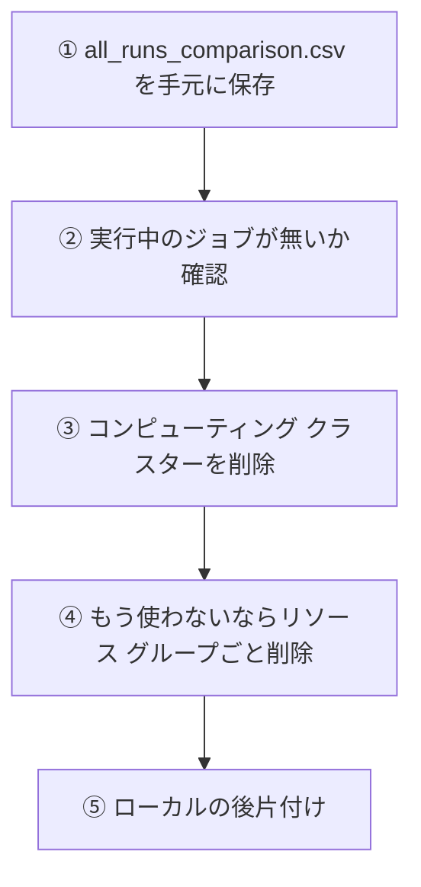

# 09. 評価・コスト・後片付け

[← 08. Sweep で改善する](08_Sweepで改善する.md) ｜ [A1. トラブルシューティング →](A1_トラブルシューティング.md)

---

> **この章の目的**
> 実験結果をまとめ、**費用を確認し、リソースを確実に片づけます。**
> 対応するノートブック: [notebooks/06_sweep_compare_cleanup.ipynb](../notebooks/06_sweep_compare_cleanup.ipynb) の 3〜5

> ## ⚠⚠ 後片付けは必須です
>
> **9.4 を実施しないと、ハンズオン終了後も課金が続きます。**
> **9.1 の CSV を手元に保存する前にリソースを削除すると、記録は復旧できません。**

---

## 9.1 すべての Run を 1 枚の表に集約する

### なぜそうするのか

**実験は、比較できる形で残って初めて価値を持ちます。**
studio の画面を 1 つずつ開いて見比べるのでは、条件の取り違えが必ず起きます。

### 何をするのか

[notebooks/06_sweep_compare_cleanup.ipynb](../notebooks/06_sweep_compare_cleanup.ipynb) の **3.** のセルを実行します。
`mlflow.search_runs()` で、本ハンズオンの 5 つの実験をまとめて取得します。

| 実験名 | 内容 |
|---|---|
| `il-setup-check` | 疎通確認（[03 章](03_AzureML環境構築.md)） |
| `il-demos` | 専門家デモの収集（[04 章](04_専門家デモを作る.md)） |
| `il-bc` | BC の 3 条件 × 3 シード（[05 章](05_BCを動かす.md)） |
| `il-dagger-gail` | DAgger と GAIL（[06 章](06_DAggerを試す.md) / [07 章](07_GAILと評価の落とし穴.md)） |
| `il-sweep` | Sweep Job（[08 章](08_Sweepで改善する.md)） |

> 出典（Microsoft 公式）: [MLflow を使用した実験と実行のクエリと比較](https://learn.microsoft.com/azure/machine-learning/how-to-track-experiments-mlflow?view=azureml-api-2)

> ⚠ **`search_runs` が返すメトリックは、各メトリックの「最後の値」です。**
> 学習曲線が必要な場合は `MlflowClient().get_metric_history(run_id, key)` を使ってください。

### どうなれば成功か

`all_runs_comparison.csv` が作られ、**手元に保存できていること。**

---

## 9.2 何を報告するか

**「成功率」や「平均リターン」だけを書いた報告は、ほぼ役に立ちません。**
次の 5 つをセットで書いてください。

| 項目 | 例（本ハンズオンのローカル実測より） |
|---|---|
| **環境** | `il/PandaPickAndPlace-v0`（`PandaPickAndPlace-v3` を固定ホライズン 50 に変換） |
| **条件** | BC / デモ 200 件 / 150 エポック / batch_size 32 / **勾配更新 46,800 回** |
| **成績** | 成功率 0.233、平均リターン -41.47、`normalized_return` 0.22 |
| **ばらつき** | 3 シードで 0.25 / 0.30 / 0.15（幅 0.15） |
| **限界と解釈** | 評価は 20 エピソードのみ。**この計算予算・この題材での結果であり、一般化できない** |

### ⚠ 書き方の良い例・悪い例

| | 例 |
|---|---|
| ❌ **悪い** | 「デモは 800 件が最良だった」 |
| ✅ **良い** | 「勾配更新を約 46,800 回にそろえてデモ数 50 / 200 / 800 を比較したところ、**3 条件とも 3 シード平均の成功率が 0.233 で一致**した。条件間の差（0.000）はシード間のばらつき（最大 0.35）に埋もれており、**デモ数の効果は検出できなかった**」 |
| ❌ **悪い** | 「DAgger は BC より弱い」 |
| ✅ **良い** | 「同環境で、勾配更新を BC の 1.04 倍（48,750 回）にそろえて DAgger を実行したところ、**3 シードとも成功率 0.00**（リターン -50.00 ± 0.00）だった。更新回数を 32,500 に減らしても 0.00 であり、**学習量不足では説明できない**。原因は特定できていない」 |
| ❌ **悪い** | 「GAIL は使えない」 |
| ✅ **良い** | 「同環境・公式チュートリアルと同一のハイパーパラメーター・100,000 環境ステップ・シード 0 で、**学習前後とも成功率 0.00**（リターン -50.00 ± 0.00）であり、**学習の開始を確認できなかった**。より長い学習で改善するかは検証していない」 |

> [!IMPORTANT]
> **数値には必ず「どこで測ったか」を添える。**
> 適用範囲の無い数値は、次に読む人を誤らせます（[06 章 6.8](06_DAggerを試す.md)）。

### 本ハンズオンで得られた結論（ローカル実測 / 2026-08-18）

| よくある説明 | この題材での実測 |
|---|---|
| 「BC はデモが多いほど強い」 | **更新回数をそろえたら、デモ数 50 / 200 / 800 で差を検出できなかった**（3 条件とも 0.233） |
| 「同じシードなら同じ結果になる」 | **`imitation` の `rng` だけでは再現しない。** `torch` を含めて固定して初めて一致した |
| 「DAgger は BC より強い」 | **BC を大きく下回った**（0.00 対 0.233）。公開ベンチマークとは順位が逆 |
| 「GAIL は少ないデモで学習できる」 | **学習の開始を確認できなかった**（100,000 ステップで成功率 0.00） |

**4 つとも「教科書どおりにならなかった」という結果です。**
**これが本ハンズオンで最も持ち帰ってほしい成果です。**

> **すべての数値の一次記録は [../調査レポート_模倣学習.md](../調査レポート_模倣学習.md) の 4.4.3 にあります。**

---

## 9.3 コストを確認する

> **本ハンズオンは具体的な金額を記載しません。**
> 価格はリージョン・VM サイズ・時期で変わり、**本ハンズオンは Azure 上で実行検証していない**ためです。

| 確認するもの | 場所 |
|---|---|
| **実際にかかった費用** | Azure Portal →［コスト管理］→［コスト分析］→ **タグ `project = il-workshop` でフィルター** |
| VM の時間単価 | [Azure Machine Learning 価格](https://azure.microsoft.com/pricing/details/machine-learning/) |
| 見積もり | [Azure 料金計算ツール](https://azure.microsoft.com/pricing/calculator/) |

> 出典（Microsoft 公式）: [Azure Machine Learning のコストの管理と最適化](https://learn.microsoft.com/azure/machine-learning/how-to-manage-optimize-cost?view=azureml-api-2)

### ⚠ どのジョブが重いのか（ローカル CPU での実測）

**金額は分かりませんが、「どのジョブに時間がかかるか」はローカルの実測から分かります。**
下表は **学習時間のみ**（評価とデモ収集は含みません）。

| ジョブ | 学習量 | 本数 | 1 本あたり | 合計 |
|---|---|---|---|---|
| **BC** | 勾配更新 約 46,800 回 | 9（3 条件 × 3 シード） | 128〜203 秒 | **約 1,340 秒** |
| **DAgger** | 勾配更新 48,750 回 | 3 | 299〜336 秒 | **約 949 秒** |
| **GAIL** | 環境ステップ 100,000 | 1 | 489 秒 | **489 秒** |

> [!IMPORTANT]
> **1 本あたりでは GAIL が最も重く、合計では BC（本数が多い）が最も重くなります。**
> **「1 本の長さ」と「本数」の両方を見てください。**

> ⚠ **本題材は物理シミュレーション（PyBullet）を伴います。**
> 観測 4 次元の古典的な題材と比べて、**1 ステップあたりの計算が重い**ことに注意してください。

### 費用を下げる打ち手

| 打ち手 | 効果 |
|---|---|
| **`min_instances=0`** | 待機中のノード課金が止まる（[03 章 3.3](03_AzureML環境構築.md)） |
| `idle_time_before_scale_down` を短くする | ジョブ終了後の解放が早くなる |
| **`max_total_trials` / `timeout`** | Sweep の上限を宣言する（[08 章 8.3](08_Sweepで改善する.md)） |
| **デモ収集を Sweep の外に出す** | 同じ収集の繰り返しを避ける（[08 章 8.5](08_Sweepで改善する.md)） |
| GAIL の `--gail-timesteps` を見直す | **1 本あたり最も長いジョブです**（[07 章 7.6](07_GAILと評価の落とし穴.md)） |
| **エポックごとの評価を減らす** | 1 回の評価で 20 エピソード × 50 ステップの物理演算が走ります（[08 章 8.4](08_Sweepで改善する.md)） |

---

## 9.4 ⚠ 後片付け（必須）

### 手順（上から順に）



### ① 成果物を保存する

**リソースを削除すると、MLflow の記録も成果物も復旧できません。**
[notebooks/06_sweep_compare_cleanup.ipynb](../notebooks/06_sweep_compare_cleanup.ipynb) の **3.** で作った
`all_runs_comparison.csv` を、**必ず手元に保存してください。**

### ② 実行中のジョブを確認する

ノートブックの **5-1.** で確認します。実行中のジョブがあれば、**課金が続いています。**

### ③ コンピューティング クラスターを削除する

**`min_instances=0` なら待機中のノード課金は止まりますが、クラスターの定義自体は残ります。**
継続して使う予定が無ければ削除してください（ノートブックの **5-2.**）。

### ④ リソース グループごと削除する（最も確実）

> ⚠⚠ **元に戻せません。① を完了してから実行してください。**

```powershell
az group delete --name <リソース グループ名> --yes --no-wait
```

> [!IMPORTANT]
> **`min_instances=0` にしても、コンピューティング以外の課金は続きます。**
> ワークスペースを作ると**ストレージ アカウント・Key Vault・Application Insights・Container Registry**が
> 一緒に作られ、これらには少額の課金が継続します。
> **完全に止めるには、リソース グループごと削除するのが最も確実です。**
> （[03 章 3.2](03_AzureML環境構築.md) でリソース グループを新規作成したのは、このためです。）

### ⑤ 残す場合の判断

| 判断 | 残すもの | 消すもの |
|---|---|---|
| 継続検証する | ワークスペース、環境、データ資産、MLflow の記録 | **コンピューティング クラスター**（同じ手順で作り直せます） |
| 記録だけ残す | ワークスペース（記録の保管庫） | コンピューティング一式 |
| すべて終了 | 手元に保存した CSV のみ | **リソース グループごと** |

---

## 9.5 ローカルの後片付け

### conda 環境

```powershell
conda env remove -n il-panda
```

> ⚠ **9 章（強化学習）の環境 `il-rl` とは別物です。** 消す環境の名前を確認してください。
> 本章が別環境を使う理由は [02 章 2.3](02_環境を準備する.md) にあります。

### MLflow がローカルに作ったもの

ノートブックやスクリプトをローカルで実行すると、**カレント フォルダーに `mlruns/` と `mlflow.db`** が
作られることがあります（[A1 の 3-4](A1_トラブルシューティング.md)）。

`.gitignore` で除外済みなのでコミットされませんが、不要なら削除して構いません。

```powershell
Remove-Item -Recurse -Force mlruns, mlflow.db -ErrorAction SilentlyContinue
```

### 手元に残るもの

| ファイル | 内容 |
|---|---|
| `notebooks/bc_results.csv` | BC の実験結果（[05 章](05_BCを動かす.md)） |
| `notebooks/all_runs_comparison.csv` | **全実験の比較表**（9.1） |

---

## 9.6 うまくいかなかった結果も成果です

本ハンズオンでは、**4 つの「教科書どおりにならなかった」結果**を得ました（9.2）。

> **強化学習も模倣学習も、「回してみないと分からない」領域です。**
> **「うまく学習しなかった」という結果も、条件と根拠が記録されていれば立派な成果**です。

**本ハンズオンが繰り返し伝えてきたのは、次の 5 点です。**

| # | 教訓 | 出てきた章 |
|---|---|---|
| 1 | **比較実験は 1 度に 1 つだけ変える。** 変えられないなら交絡を書き出す | [05 章 5.3](05_BCを動かす.md) / [06 章 6.4](06_DAggerを試す.md) |
| 2 | **1 シードの結果で比較しない。** 差はばらつきと比べて判断する | [05 章 5.5](05_BCを動かす.md) / [08 章 8.6](08_Sweepで改善する.md) |
| 3 | **乱数シードは「固定したつもり」になりやすい。** 再現するかを実際に確かめる | [A1 の 3-2](A1_トラブルシューティング.md) |
| 4 | **数値には必ず適用範囲（環境・設定・シード・計算量）を添える** | [06 章 6.8](06_DAggerを試す.md) / [07 章 7.7](07_GAILと評価の落とし穴.md) |
| 5 | **評価が壊れていないかを先に確認する**（可変ホライズン） | [07 章 7.3](07_GAILと評価の落とし穴.md) |

**この 5 点は、模倣学習に限らず、あらゆる機械学習の実験に当てはまります。**

---

## ✅ 最終チェックリスト（本ハンズオンの完了条件）

- [ ] Azure ML のワークスペース・コンピューティング・環境を自分で作れた（[03 章](03_AzureML環境構築.md)）
- [ ] 専門家デモを作り、**データ資産として登録できた**（[04 章](04_専門家デモを作る.md)）
- [ ] BC を動かし、**「差がある」と「差を検出できなかった」を区別できた**（[05 章](05_BCを動かす.md)）
- [ ] DAgger を動かし、**学習量をそろえたうえで比較できた**（[06 章](06_DAggerを試す.md)）
- [ ] **可変ホライズン環境で GAIL がエラーになることを自分で確認した**（[07 章](07_GAILと評価の落とし穴.md)）
- [ ] Sweep Job を実行し、**上限（`max_total_trials` / `timeout`）を設定した**（[08 章](08_Sweepで改善する.md)）
- [ ] **`all_runs_comparison.csv` を手元に保存した**（9.1）
- [ ] **Microsoft Cost Management で実際の費用を確認した**（9.3）
- [ ] **⚠ 後片付けを完了した**（9.4）
- [ ] ローカルの `il-panda` 環境と `mlruns/` を整理した（9.5）
- [ ] **サブスクリプション ID を書いたノートブックをコミットしていない**

---

**お疲れさまでした。**

- 症状から逆引きしたいとき → [A1. トラブルシューティング](A1_トラブルシューティング.md)
- ライセンスを確認したいとき → [A2. OSS ライセンス一覧](A2_OSSライセンス一覧.md)
- 出典をたどりたいとき → [A3. 出典一覧](A3_出典一覧.md)
- 用語を調べたいとき → [A4. 用語集](A4_用語集.md)

---

[← 08. Sweep で改善する](08_Sweepで改善する.md) ｜ [A1. トラブルシューティング →](A1_トラブルシューティング.md)
