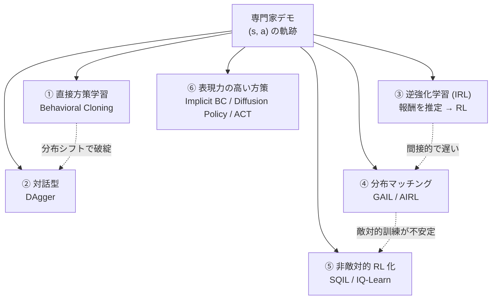

# 模倣学習（Imitation Learning）調査レポート

**目的**: Azure Machine Learning を使った**模倣学習ハンズオン／チュートリアル**を作成するための事前調査。
**調査日（全 URL の参照日）**: **2026-08-17**
**追加調査・実測日**: **2026-08-18**（題材を CartPole からロボットのピックアンドプレイスへ変更した際の実測。**§4.4.3 / §10.2**）

---

## 0. 本レポートの読み方（重要）

### 0.1 出典の原則

> **本レポートに記載した事実は、すべて下記のいずれかの一次情報を実際に取得して確認したものです。**
> 推測・伝聞は記載していません。確認できなかった事項は「**確認できませんでした**」と明記しています。

| 表記 | 意味 |
|---|---|
| **[MS-Learn]** | Microsoft 公式ドキュメント（Microsoft Learn） |
| **[OSS-Doc]** | **Microsoft 製ではありません。** 当該 OSS の公式ドキュメント／リポジトリ（その OSS の一次情報） |
| **[Paper]** | **Microsoft 製ではありません。** 学術論文（arXiv / PMLR / NeurIPS Proceedings の一次ページ） |
| **[License]** | **各リポジトリの LICENSE ファイル本文を直接取得して確認** |

### 0.2 免責

- ライセンスに関する記載は **LICENSE ファイル記載内容の要約であり、法的助言ではありません。**
- **実際の利用可否・再配布条件は、ご所属組織の OSS ポリシーおよび法務部門の判断に従ってください。**
- ライセンスは変更されます。**必ず記載の URL で最新内容を確認してください。**

---

## 1. エグゼクティブ サマリ

| 論点 | 調査結果 | 主な根拠 |
|---|---|---|
| **模倣学習は「教師あり学習で終わり」か** | **いいえ。** 学習した方策が将来の入力分布そのものを変えるため i.i.d. 仮定が崩れ、**誤差が時間ホライズンに対して二次（quadratic）で増大する**ことが理論的に示されている | [Paper] Ross & Bagnell 2010（§3.2） |
| **チュートリアルの第一候補ライブラリ** | **`imitation`**（HumanCompatibleAI, **MIT**）。BC / DAgger / GAIL / AIRL / MCE IRL / SQIL / 選好比較を単一 API で提供。Stable-Baselines3 上に構築 | [OSS-Doc][License]（§5.1） |
| **最大のリスク** | `imitation` の**最新リリースは GitHub 上の表示で約 2 年前**（v1.0.1）。一方で依存先の **SB3 は活発に更新（v2.9.0）され Python 3.10+ / PyTorch>=2.8 を要求**。**バージョン整合の実機検証が必須** | [OSS-Doc]（§5.1 / §7.1） |
| **評価設計で最も事故りやすい点** | **可変ホライズン環境（CartPole 等）で GAIL/AIRL を評価してはならない。** 終了条件そのものが報酬情報を漏洩させる。`imitation` は既定でエラーを送出する | [OSS-Doc] imitation「Limitations on Horizon Length」（§4.1） |
| **商用利用可能なパッケージ** | **直接指定するパッケージは MIT / Apache-2.0 / zlib で一通り構成できる**（§5 の表）。**⚠ ただし推移的依存にコピーレフト系が混入する**（`pygame` の LGPL、`pybullet_data` 同梱データの CC BY-SA 3.0） | [License]（§5 / §5.6） |
| **データセット／学習済み重みの扱い** | **コードのライセンスとデータ／重みのライセンスは別物。** 本レポートでは**コードのライセンスのみ**を検証した。データセットは個別確認が必須 | §5.6 |
| **Azure ML 側の対応** | 模倣学習は「オフラインのデータ資産 → 学習ジョブ → Sweep → MLflow 記録 → オンライン エンドポイント」という**標準的な Azure ML ワークフローにそのまま乗る** | [MS-Learn]（§6） |
| **Azure ML の第一者 RL/IL サービス** | **`azureml.contrib.train.rl` は「RL の廃止に使用されるユーティリティ」として文書化されている**（`warn_rl_is_deprecated`）。**新規に使ってはいけない** | [MS-Learn]（§6.4） |

---

## 2. 模倣学習とは何か

### 2.1 定義

模倣学習（Imitation Learning, IL）は、**専門家（エキスパート）のデモンストレーションから望ましい振る舞いを学習する**枠組みです。

> "As robots and other intelligent agents move from simple environments and problems to more complex, unstructured settings, manually programming their behavior has become increasingly challenging and expensive. Often, it is easier for a teacher to demonstrate a desired behavior rather than attempt to manually engineer it. This process of learning from demonstrations, and the study of algorithms to do so, is called imitation learning."
> — [Paper] Osa, Pajarinen, Neumann, Bagnell, Abbeel, Peters, *An Algorithmic Perspective on Imitation Learning*, arXiv:1811.06711（187 ページ / *Foundations and Trends in Robotics* 掲載 / DOI: 10.1561/2300000053）
> https://arxiv.org/abs/1811.06711

### 2.2 なぜ強化学習ではなく模倣学習なのか

強化学習（RL）は**報酬関数の設計**を前提としますが、実世界の非構造環境ではこれが困難です。

> "programming their behaviors manually or defining their behavior through reward functions (as done in reinforcement learning (RL)) has become exceedingly difficult. This is because such environments require a high degree of flexibility and adaptability, making it challenging to specify an optimal set of rules or reward signals that can account for all possible situations. In such environments, learning from an expert's behavior through imitation is often more appealing."
> — [Paper] Zare, Kebria, Khosravi, Nahavandi, *A Survey of Imitation Learning: Algorithms, Recent Developments, and Challenges*, arXiv:2309.02473（CC BY-SA 4.0 / 「This work has been submitted to the IEEE for possible publication」と明記）
> https://arxiv.org/abs/2309.02473

### 2.3 本リポジトリの [9.ReinforcementLearning](../9.ReinforcementLearning/README.md) との関係

| | 強化学習（9 章） | 模倣学習（本調査） |
|---|---|---|
| 学習信号 | **報酬関数**（設計が必要） | **デモンストレーション**（収集が必要） |
| 環境との相互作用 | **必須**（大量） | **BC は不要**／GAIL・AIRL・SQIL は必要 |
| 疎な報酬の問題 | 直撃する（9 章で HER を使う理由） | **報酬設計を回避できる**のが利点 |
| 主な失敗モード | 学習が進まない | **分布シフト（誤差の累積）** |

> **チュートリアル設計上の含意**: 9 章が「報酬設計の難しさ」を体験させる教材であったのに対し、模倣学習の教材は **「分布シフトの怖さ」と「デモデータの品質が支配的である」ことを体験させる**教材になります。

---

## 3. 手法の分類と主要論文

### 3.1 全体像



### 3.2 ① Behavioral Cloning（BC）と、その理論的限界

**BC は「観測 → 行動」の教師あり学習**です。歴史的な原点は 1988 年の ALVINN です。

- [Paper] Dean A. Pomerleau, *ALVINN: An Autonomous Land Vehicle in a Neural Network*, **Advances in Neural Information Processing Systems 1 (NIPS 1988)**
  https://proceedings.neurips.cc/paper_files/paper/1988/hash/812b4ba287f5ee0bc9d43bbf5bbe87fb-Abstract.html
  > "ALVINN (Autonomous Land Vehicle In a Neural Network) is a 3-layer back-propagation network designed for the task of road following."

- [Paper] Bojarski et al. (NVIDIA), *End to End Learning for Self-Driving Cars*, arXiv:1604.07316（2016）
  https://arxiv.org/abs/1604.07316
  > "We trained a convolutional neural network (CNN) to map raw pixels from a single front-facing camera directly to steering commands."

#### ⚠ BC の理論的限界（**チュートリアルの中核メッセージにすべき事実**）

- [Paper] Stephane Ross, Drew Bagnell, *Efficient Reductions for Imitation Learning*, **AISTATS 2010, PMLR 9:661-668**
  https://proceedings.mlr.press/v9/ross10a.html
  > "Imitation Learning ... is typically addressed as a standard supervised learning problem, where it is assumed the training and testing data are i.i.d.. **This is not true in imitation learning as the learned policy influences the future test inputs (states) upon which it will be tested. We show that this leads to compounding errors and a regret bound that grows quadratically in the time horizon of the task.**"

**つまり、1 ステップあたりの誤差率が同じでも、エピソードが長いほど性能劣化は二次で悪化します。** これが「分布シフト（covariate shift）」問題であり、以降のすべての手法の出発点です。

### 3.3 ② DAgger（Dataset Aggregation）

- [Paper] Stephane Ross, Geoffrey J. Gordon, J. Andrew Bagnell, *A Reduction of Imitation Learning and Structured Prediction to No-Regret Online Learning*, arXiv:1011.0686（**AISTATS 2011**）
  https://arxiv.org/abs/1011.0686
  > "Sequential prediction problems such as imitation learning, where future observations depend on previous predictions (actions), violate the common i.i.d. assumptions made in statistical learning. This leads to poor performance in theory and often in practice. ... we propose a new iterative algorithm, which trains a stationary deterministic policy, that can be seen as a no regret algorithm in an online learning setting."

**要点**: 学習中の方策で環境を動かし、**訪れた状態に対して専門家に正解行動を問い合わせて**データセットに追加していきます。

> ⚠ **チュートリアル設計上の制約**: DAgger は**学習中に専門家へ問い合わせられること（オンライン専門家）が前提**です。人間の専門家を用意できない場合、`imitation` は**合成専門家（学習済み RL 方策）**を使う例を提供しています（[OSS-Doc] `imitation` は "DAgger (with synthetic examples)" と明記）。
> https://imitation.readthedocs.io/en/latest/

### 3.4 ③ 逆強化学習（IRL）系

**報酬関数を先に推定し、その報酬で RL を回す**アプローチです。

- **MCE IRL（Maximum Causal Entropy IRL）**: `imitation` に `algorithms.mce_irl` として実装。**離散のみ対応**（README の対応表で Continuous が ❌）。
  [OSS-Doc] https://imitation.readthedocs.io/en/latest/algorithms/mce_irl.html
  （`imitation` ドキュメントは原論文として https://www.cs.cmu.edu/~bziebart/publications/maximum-causal-entropy.pdf をリンクしています）

- **AIRL（Adversarial Inverse Reinforcement Learning）**
  [Paper] Justin Fu, Katie Luo, Sergey Levine, arXiv:1710.11248（2017/2018）
  https://arxiv.org/abs/1710.11248
  > "we propose adverserial inverse reinforcement learning (AIRL), a practical and scalable inverse reinforcement learning algorithm based on an adversarial reward learning formulation. **We demonstrate that AIRL is able to recover reward functions that are robust to changes in dynamics**, enabling us to learn policies even under significant variation in the environment seen during training."

> **AIRL の実務価値**: 「**報酬関数そのものが成果物として残る**」点。ダイナミクスが変わっても転移できる、と論文が主張しています。方策だけが欲しいなら GAIL、報酬が欲しいなら AIRL、という使い分けになります。

### 3.5 ④ GAIL（敵対的分布マッチング）

- [Paper] Jonathan Ho, Stefano Ermon, *Generative Adversarial Imitation Learning*, arXiv:1606.03476（2016）
  https://arxiv.org/abs/1606.03476
  > "One approach is to recover the expert's cost function with inverse reinforcement learning, then extract a policy from that cost function with reinforcement learning. **This approach is indirect and can be slow.** We propose a new general framework for directly extracting a policy from data ... from which we derive a model-free imitation learning algorithm that obtains significant performance gains over existing model-free methods in imitating complex behaviors in large, high-dimensional environments."

#### ⚠ GAIL 系の既知のバイアス（**評価設計に直結**）

- [Paper] Kostrikov, Agrawal, Dwibedi, Levine, Tompson, *Discriminator-Actor-Critic: Addressing Sample Inefficiency and Reward Bias in Adversarial Imitation Learning*, arXiv:1809.02925
  https://arxiv.org/abs/1809.02925
  > "**The first problem is implicit bias present in the reward functions used in these algorithms.** While these biases might work well for some environments, they can also lead to sub-optimal behavior in others. Secondly, even though these algorithms can learn from few expert demonstrations, **they require a prohibitively large number of interactions with the environment**..."

### 3.6 ⑤ 敵対的訓練を避ける系統

- **SQIL（Soft Q Imitation Learning）**
  [Paper] Siddharth Reddy, Anca D. Dragan, Sergey Levine, arXiv:1905.11108（2019）
  https://arxiv.org/abs/1905.11108
  > "**We propose a simple alternative that still uses RL, but does not require learning a reward function.** ... we give the agent a constant reward of r=+1 for matching the demonstrated action in a demonstrated state, and a constant reward of r=0 for all other behavior. ... can be implemented with a handful of minor modifications to any standard Q-learning or off-policy actor-critic algorithm."

- **IQ-Learn（Inverse soft-Q Learning）**
  [Paper] Garg, Chakraborty, Cundy, Song, Geist, Ermon, arXiv:2106.12142（**NeurIPS 2021 Spotlight** / '21 MineRL BASALT Challenge 優勝と論文コメント欄に明記）
  https://arxiv.org/abs/2106.12142
  > "We introduce a method for dynamics-aware IL which **avoids adversarial training by learning a single Q-function, implicitly representing both reward and policy.** ... obtains state-of-the-art results in offline and online imitation learning settings, significantly outperforming existing methods both in the number of required environment interactions and scalability in high-dimensional spaces, **often by more than 3x**."

### 3.7 ⑥ 行動情報が無い場合（Observation only）

- [Paper] Faraz Torabi, Garrett Warnell, Peter Stone, *Behavioral Cloning from Observation*, arXiv:1805.01954（**IJCAI 2018**）
  https://arxiv.org/abs/1805.01954
  > "(1) that the learning is done from observation only (i.e., **without explicit action information**) ... we propose a two-phase, autonomous imitation learning technique called behavioral cloning from observation (BCO)"

> **実務上の重要性**: 動画しか無い（人間の作業ビデオ等）ケースがこれに該当します。

### 3.8 ⑦ 表現力の高い方策（マルチモーダル性への対応）

BC の実務的な失敗要因のひとつが「**専門家の行動が多峰性（同じ状況で複数の正解がある）なのに、MSE 回帰でその平均を学んでしまう**」ことです。

- **Implicit BC**
  [Paper] Florence, Lynch, Zeng, Ramirez, Wahid, Downs, Wong, Lee, Mordatch, Tompson, arXiv:2109.00137（2021）
  https://arxiv.org/abs/2109.00137
  > "**treating supervised policy learning with an implicit model generally performs better, on average, than commonly used explicit models** ... particularly with respect to approximating complex, potentially discontinuous and multi-valued (set-valued) functions. ... implicit behavioral cloning policies with energy-based models (EBM) often outperform common explicit (Mean Square Error, or Mixture Density) behavioral cloning policies"

- **Diffusion Policy**
  [Paper] Chi, Xu, Feng, Cousineau, Du, Burchfiel, Tedrake, Song, arXiv:2303.04137（RSS 2023 の拡張ジャーナル版）
  https://arxiv.org/abs/2303.04137
  > "We benchmark Diffusion Policy across **12 different tasks from 4 different robot manipulation benchmarks** and find that it consistently outperforms existing state-of-the-art robot learning methods with an **average improvement of 46.9%**. ... the diffusion formulation yields powerful advantages ... including **gracefully handling multimodal action distributions**, being suitable for high-dimensional action spaces, and exhibiting impressive training stability."

- **ACT（Action Chunking with Transformers）**
  [Paper] Tony Z. Zhao, Vikash Kumar, Sergey Levine, Chelsea Finn, *Learning Fine-Grained Bimanual Manipulation with Low-Cost Hardware*, arXiv:2304.13705（2023）
  https://arxiv.org/abs/2304.13705
  > "**errors in the policy can compound over time, and human demonstrations can be non-stationary.** To address these challenges, we develop a simple yet novel algorithm, Action Chunking with Transformers (ACT), which learns a generative model over action sequences. ACT allows the robot to learn 6 difficult tasks in the real world ... with **80-90% success, with only 10 minutes worth of demonstrations**."

### 3.9 ⑧ 系列モデリング／オフライン RL との接続

- [Paper] Chen, Lu, Rajeswaran, Lee, Grover, Laskin, Abbeel, Srinivas, Mordatch, *Decision Transformer: Reinforcement Learning via Sequence Modeling*, arXiv:2106.01345（2021）
  https://arxiv.org/abs/2106.01345
  > "we present Decision Transformer, an architecture that casts the problem of RL as conditional sequence modeling. ... **Decision Transformer matches or exceeds the performance of state-of-the-art model-free offline RL baselines** on Atari, OpenAI Gym, and Key-to-Door tasks."

### 3.10 ⑨ 大規模化（現在の潮流）

- [Paper] Open X-Embodiment Collaboration et al., *Open X-Embodiment: Robotic Learning Datasets and RT-X Models*, arXiv:2310.08864（CC BY 4.0）
  https://arxiv.org/abs/2310.08864
  > "We assemble a dataset from **22 different robots collected through a collaboration between 21 institutions, demonstrating 527 skills (160266 tasks).** We show that a high-capacity model trained on this data, which we call RT-X, exhibits positive transfer and improves the capabilities of multiple robots by leveraging experience from other platforms."

### 3.11 年表（確認済みの一次情報のみ）

| 年 | 手法 | 出典 |
|---|---|---|
| 1988 | ALVINN（BC の原点） | NIPS 1988 |
| 2010 | 誤差の二次増大の理論 | AISTATS 2010（PMLR 9:661-668） |
| 2011 | DAgger | arXiv:1011.0686（AISTATS 2011） |
| 2016 | GAIL | arXiv:1606.03476 |
| 2016 | NVIDIA End-to-End Driving | arXiv:1604.07316 |
| 2017 | 選好からの学習（DRLHP） | arXiv:1706.03741 |
| 2017/18 | AIRL | arXiv:1710.11248 |
| 2018 | BCO（観測のみ） | arXiv:1805.01954（IJCAI 2018） |
| 2018 | 敵対的 IL の報酬バイアス指摘（DAC） | arXiv:1809.02925 |
| 2018 | サーベイ（Osa et al.） | arXiv:1811.06711 |
| 2019 | SQIL | arXiv:1905.11108 |
| 2021 | Implicit BC | arXiv:2109.00137 |
| 2021 | IQ-Learn（NeurIPS Spotlight） | arXiv:2106.12142 |
| 2021 | Decision Transformer | arXiv:2106.01345 |
| 2021 | robomimic（大規模実証研究） | arXiv:2108.03298（CoRL 2021 Oral） |
| 2022 | `imitation` ライブラリ論文 | arXiv:2211.11972 |
| 2023 | Diffusion Policy | arXiv:2303.04137 |
| 2023 | ACT / ALOHA | arXiv:2304.13705 |
| 2023 | 模倣学習サーベイ（Zare et al.） | arXiv:2309.02473 |
| 2023 | Open X-Embodiment / RT-X | arXiv:2310.08864 |

---

## 4. ベストプラクティス（すべて出典付き）

### 4.1 ⚠ 最重要: 可変ホライズン環境で報酬学習系を評価しない

`imitation` 公式ドキュメントが **"Variable Horizon Environments Considered Harmful"** という警告を掲げています。

> "However, termination conditions must be carefully hand-designed for each environment. **Their inclusion therefore provides a significant source of information about the reward. Evaluating reward and imitation learning algorithms in variable-horizon environments can therefore be deeply misleading.** In fact, reward learning in commonly used variable horizon environments such as `MountainCar` and `CartPole` **can be solved by learning a single bit: the sign of the reward.**"
>
> "Indeed, Figure 5 of Kostrikov et al (2021) shows that **GAIL is able to reach a third of expert performance even without seeing any expert demonstrations.**"
>
> "**Given the serious issues with evaluation and training in variable horizon tasks, `imitation` will by default throw an error if training AIRL, GAIL or DRLHP in variable horizon tasks.** ... you can override this safety check by setting `allow_variable_horizon=True`. **Note this check is not applied for BC or DAgger**, which operate on individual transitions (not episodes) and so cannot exploit the information leak."
>
> "Our sister project **seals** provides fixed-horizon versions of many commonly used MuJoCo continuous control tasks"
>
> — [OSS-Doc] https://imitation.readthedocs.io/en/latest/main-concepts/variable_horizon.html

**チュートリアルへの反映（必須）**:
1. GAIL / AIRL を扱う章では **固定ホライズン環境（`seals/*`）を使う**。
2. `allow_variable_horizon=True` を安易に付けさせない。付ける場合は理由を書かせる。
3. 「CartPole で GAIL がうまくいった！」は**成果ではない**ことを明記する。

### 4.2 ⚠ 無限ホライズンは非対応

> "At the moment, **we do not support infinite-length horizons.** Many of the imitation algorithms, especially those relying on RL, do not easily port over to infinite-horizon setups."
> — [OSS-Doc] 同上

### 4.3 デモデータの品質・アルゴリズム設計・停止条件（robomimic の実証研究）

- [Paper] Mandlekar, Xu, Wong, Nasiriany, Wang, Kulkarni, Fei-Fei, Savarese, Zhu, Martín-Martín, *What Matters in Learning from Offline Human Demonstrations for Robot Manipulation*, arXiv:2108.03298（**CoRL 2021 Oral**）
  https://arxiv.org/abs/2108.03298
  > "we conduct an extensive study of **six offline learning algorithms** for robot manipulation on **five simulated and three real-world multi-stage manipulation tasks** of varying complexity, and with datasets of varying quality. ... we derive a series of lessons including **the sensitivity to different algorithmic design choices, the dependence on the quality of the demonstrations, and the variability based on the stopping criteria due to the different objectives in training and evaluation.**"

**チュートリアルへの反映**:
| 論文が挙げた課題 | ハンズオンでの扱い |
|---|---|
| アルゴリズム設計の選択に敏感 | **Sweep Job でハイパーパラメーターを振る**（§6.2） |
| デモの品質に依存する | **「良いデモ」「劣化デモ」「少数デモ」で比較実験**する |
| 訓練目標と評価目標が違うため停止条件で結果が変わる | **「検証損失の最小」と「環境成功率の最大」は一致しない**ことを実測させる |

### 4.4 評価指標の正規化と信頼区間

`imitation` のベンチマークは以下を採用しています。

> "The scores are normalized based on the performance of a random agent as the baseline and the expert as the maximum possible score ...
> `(score - random_score) / (expert_score - random_score)`
> Aggregate scores and confidence intervals are computed using the **rliable** library."
> — [OSS-Doc] https://imitation.readthedocs.io/en/latest/main-concepts/benchmark_summary.html

#### `imitation` 公開ベンチマーク（seals MuJoCo タスク、各 N=10）

| アルゴリズム | 正規化スコア Mean | 95% CI | IQM | 95% CI |
|---|---|---|---|---|
| **DAgger** | **0.995** | [0.987, 0.998] | **1.004** | [1.003, 1.008] |
| **GAIL** | 0.939 | [0.900, 0.944] | 0.957 | [0.965, 0.970] |
| **BC** | 0.932 | [0.922, 0.932] | 0.941 | [0.941, 0.949] |
| **AIRL** | 0.792 | [0.709, 0.792] | 0.918 | [0.871, 0.974] |

出典: [OSS-Doc] https://imitation.readthedocs.io/en/latest/main-concepts/benchmark_summary.html
対象環境: `seals/Ant-v1`, `seals/HalfCheetah-v1`, `seals/Hopper-v1`, `seals/Swimmer-v1`, `seals/Walker2d-v1`

> [!WARNING]
> **⚠ この数値の適用範囲（重要）**
> **上表は seals の MuJoCo 連続制御 5 環境のみで計測された値です。** `imitation` は classic control（`seals/CartPole-v0` 等）のベンチマーク結果を公開していません。
> したがって **この順位関係を classic control 環境に一般化してはいけません。** classic control を題材にする場合、アルゴリズムの優劣は**自分で計測する**必要があります。

> **チュートリアルへの示唆**:
> **MuJoCo 連続制御タスクにおいては、十分なデモがあれば BC は GAIL に肉薄します**（0.932 vs 0.939）。
> また **AIRL の分散が大きい**（Mean 0.792 / `seals/Walker2d-v1` は 0.461±0.264）ことは、「敵対的手法は不安定」という体験材料になります。

### 4.4.1 ⚠ 旧題材（`seals/CartPole-v0`）における公式チュートリアルの実測値

> [!NOTE]
> **本節も旧題材に関する記録です。** 現行チュートリアルは `seals/CartPole-v0` を題材にしていません。
> ただし **「公式チュートリアルの掲載出力ですら失敗している」という事実は、現行 [docs/07](docs/07_GAILと評価の落とし穴.md) でも参考情報として引用しています。**

**チュートリアル題材を classic control にする場合、以下は決定的に重要です。**

| 手法 | 公式チュートリアルの掲載出力（`seals/CartPole-v0`） | 出典 |
|---|---|---|
| **BC** | 「Reward before training: **8.2**」→ 「Reward after training: **500.0**」（デモ 50 エピソード / `n_epochs=1`）<br>本文: 「The method has many drawbacks and often does not work. **However in this example, where we use an agent for the seals/CartPole-v0 environment, it is feasible.**」 | [OSS-Doc] https://imitation.readthedocs.io/en/latest/tutorials/1_train_bc.html |
| **GAIL** | 「Rewards before training: **102.6 +/- 24.11514047232568**」→ 「Rewards after training: **49.76 +/- 16.98535840069323**」（`gail_trainer.train(200_000)`）<br>本文は「**GAIL matches expert returns (500)**」と述べているが、**直下に掲載された実出力は訓練後に悪化している**。学習ログ上も `gen/rollout/ep_rew_mean` は 29.8 → 56.4 までしか上がっていない | [OSS-Doc] https://imitation.readthedocs.io/en/latest/tutorials/3_train_gail.html |

**この 2 点から導かれる結論:**

1. **`seals/CartPole-v0` は「BC が成功する環境」です。** 「BC がデモ不足で破綻する」体験を設計したいなら、**この環境では成立しない可能性が高い**（デモ数を極端に減らすなどの条件を、事前に実測で確認する必要があります）。
2. **`seals/CartPole-v0` の GAIL は、公式ドキュメントの実行例ですら成功していません。** GAIL を必修にする教材設計は、**事前の実測なしには危険です。**

### 4.4.2 ⚠ 旧題材（`seals/CartPole-v0`）での自己計測（2026-08-17 実測 / **現行チュートリアルでは使用していません**）

> [!WARNING]
> **本節は、本チュートリアルが題材を CartPole からロボットのピックアンドプレースへ変更する前の実測記録です。**
> **現行のチュートリアル本文（docs/ および notebooks/）は、本節の数値を使っていません。**
> 現行題材での実測値は **[4.4.3](#443-現行題材ロボット-ピックアンドプレースでの自己計測2026-08-18-実測)** にあります。
>
> **本節を残す理由**: 「同じ手法でも題材が変われば結論が変わる」ことの一次資料として価値があるためです。
> **⚠ 本節の数値を現行題材に流用してはいけません。**

> **実測環境**: Windows 11 / Python 3.10.20 (conda-forge) / imitation 1.0.1 / stable-baselines3 2.2.1 / gymnasium 0.29.1 / seals 0.2.1 / numpy 2.2.6 / torch 2.13.0+cpu
> **評価条件**: `seals/CartPole-v0`、`n_envs=8`、評価は 20 エピソードの平均リターン
> **⚠ 以下はすべて自分で実行して得た値です。他の環境・他のバージョンでは変わります。**

#### (a) 専門家と基準値

| 方策 | 平均リターン | 標準偏差 |
|---|---|---|
| 一様ランダム（`action_space.sample()`） | **36.10** | 26.09 |
| 未学習 PPO（`learn()` 前） | 377.65 | **187.03** |
| 専門家 PPO（100,000 steps） | 461.75 | 48.40 |

> **正規化リターンの基準には一様ランダム（36.10）を使います。** 未学習 PPO は 377.65 と高いうえ標準偏差が 187.03 と大きく、`(score - baseline) / (expert - baseline)` の分母が不安定になるためです。

#### (b) ⚠ BC の「デモ数依存」は勾配更新回数との交絡だった

**同じ 1 エポックで比較した場合**（更新回数がデモ数に比例してしまう）:

| デモ数 | transitions | 更新回数 | 平均リターン |
|---|---|---|---|
| 50 | 25000 | 781 | 492.25 |
| 10 | 5000 | 156 | 137.15 |
| 3 | 1500 | 47 | 70.45 |

**勾配更新回数を約 780 回にそろえた場合**（3 シード）:

| デモ数 | transitions | エポック | 更新回数 | seed 0 | seed 1 | seed 2 |
|---|---|---|---|---|---|---|
| 50 | 25000 | 1 | 781 | 483.50 | 439.50 | 483.10 |
| 10 | 5000 | 5 | 780 | 499.05 | 478.05 | 493.00 |
| 3 | 1500 | 17 | 782 | 499.55 | 493.00 | 483.80 |

> [!IMPORTANT]
> **デモを 50 件から 3 件に減らしても、BC の性能は劣化しませんでした。**
> 上段の表で観測された「デモが少ないと弱い」は、**デモ数ではなく勾配更新回数の不足**が原因でした。
> **これは教材にすべき最重要の知見です。** 「データが足りない」と誤診して、実際は「学習量が足りない」だけ、という失敗は実務で頻繁に起きます。

#### (c) DAgger は BC を上回らなかった

| 手法 | 条件 | seed 0 | seed 1 | seed 2 |
|---|---|---|---|---|
| BC | デモ 3 件 / 782 更新 | 499.55 | 493.00 | 483.80 |
| DAgger | デモ 3 件から開始 / 8,000 steps | 485.00 | 431.85 | 485.30 |

> **BC が既に専門家を上回る水準（約 490）に達しているため、DAgger が改善する余地がありません。** DAgger の優位性を示すには、BC が失敗する題材が必要です。

#### (d) GAIL は学習しなかった

| 段階 | 平均リターン | 標準偏差 |
|---|---|---|
| 学習前 | 336.25 | 200.61 |
| 学習後（200,000 steps） | **8.35** | 1.19 |

> 公式チュートリアルと**同一のハイパーパラメーター**（`demo_batch_size=1024` / `gen_replay_buffer_capacity=512` / `n_disc_updates_per_round=8` / PPO `batch_size=64, ent_coef=0.0, learning_rate=0.0004, gamma=0.95, n_epochs=5`）で実行した結果です。
> **公式の掲載出力（102.6 → 49.76）と同じく悪化しており、失敗が再現されました。**
> ⚠ これは「GAIL というアルゴリズムが使えない」という意味ではありません。**この環境・この設定・このシードで失敗した**という事実です。

#### (e) 可変ホライズン環境でのエラーは再現できる

素の `CartPole-v1` で GAIL を実行すると、**`ValueError`** が送出されました。

```text
Episodes of different length detected: {8, 9, 10, ...}. Variable horizon environments are
discouraged -- termination conditions leak information about reward. See
https://imitation.readthedocs.io/en/latest/getting-started/variable-horizon.html for more
information. If you are SURE you want to run imitation on a variable horizon task, then
please pass in the flag: `allow_variable_horizon=True`.
```

> ⚠ **エラーメッセージ中の URL は `getting-started/variable-horizon.html` ですが、本レポートが実際に取得できたページは `main-concepts/variable_horizon.html` です。** 読者を混乱させないよう、教材では後者の URL を案内します。

**エピソード長の実測（ランダム行動・3 エピソード）**

| 環境 | エピソード長 |
|---|---|
| `seals/CartPole-v0` | 500, 500, 500（**固定**） |
| `CartPole-v1` | 17, 18, 24（**可変**） |

### 4.4.3 現行題材（ロボット ピックアンドプレース）での自己計測（2026-08-18 実測）

> [!IMPORTANT]
> **本節が、現行チュートリアルに記載されているすべての数値の一次記録（single source of truth）です。**
> docs/ および notebooks/ に登場する実測値は、**すべて本節から転記**しています。
> **本節に無い数値が本文に現れていたら、それは誤りです。**

> **実測環境**: Windows 10 (AMD64) / Python 3.10 (conda-forge, 環境名 `il-panda`) / **CPU のみ**
> imitation 1.0.1 / stable-baselines3 2.2.1 / gymnasium 0.29.1 / seals 0.2.1 /
> **panda-gym 3.0.7 / pybullet 3.2.5** / numpy 1.26.4 / scipy 1.15.2 / torch 2.13.0
> **評価条件**: `il/PandaPickAndPlace-v0`（固定ホライズン 50）、`n_envs=8`、**評価は 20 エピソード**
> **⚠ 以下はすべて自分で実行して得た値です。他の環境・他のバージョンでは変わります。**
> **⚠ Azure ML 上では実行していません。所要時間はローカル CPU での値です。**

#### (a) 環境の仕様（ソースおよび実測で確認）

| 項目 | 値 |
|---|---|
| ベース環境 | `PandaPickAndPlace-v3`（panda-gym 3.0.7） |
| 行動空間 | `Box(-1.0, 1.0, (4,), float32)` |
| 観測空間（素） | `Dict(achieved_goal: 3, desired_goal: 3, observation: 19)` |
| **平坦化後の観測** | **25 次元**（連結順は `achieved_goal, desired_goal, observation`） |
| `max_episode_steps`（素） | 50 |
| `achieved_goal` の実体 | `observation[7:10]`（実測で一致を確認） |
| グリッパー開度 | `observation[6]`。リセット直後 0.0、全開 0.08 |
| ロボット モデル | `pybullet_data/franka_panda/panda.urdf`（**Apache-2.0**。[A2 の 3](docs/A2_OSSライセンス一覧.md)） |

#### (b) 固定ホライズン化が「リターンを変えない」ことの確認

`seals` の `AbsorbAfterDoneWrapper` で 50 ステップ固定にしても、**リターンは完全に一致しました。**

| 環境 | 専門家 5 エピソードの長さ | 終了フラグ | リターン |
|---|---|---|---|
| `il/PandaPickAndPlaceVariable-v0`（素） | **12, 8, 13, 10, 12**（可変） | `terminated=True` | -11, -7, -12, -9, -11 |
| **`il/PandaPickAndPlace-v0`（固定）** | **50, 50, 50, 50, 50** | `truncated=True` | **-11, -7, -12, -9, -11** |

> **失われたのは「エピソード長から成功が読める」という情報だけ**です（`returns_identical: true`）。

**一様ランダム行動では、素の環境でも 50 ステップ・リターン -50.0 で、一度も成功しませんでした。**

#### (c) 自作ラッパーが必要だった理由（実測）

| ラッパー | 無いと起きること（実測） |
|---|---|
| `SuccessRecorderWrapper` | 固定ホライズン化すると `info["is_success"]` が**成功した 1 ステップ（例: 11 ステップ目）でしか現れず**、残り 38 ステップの `info` は空になる。**成功を数えられなくなる** |
| `ClipObservationWrapper` | panda-gym は `Box(-10, 10)` を宣言するが値をクリップしないため、**DAgger が `imitation/policies/base.py` の `assert observation_space.contains(...)` で停止する** |

> ⚠ ただし、**一様ランダム 1 エピソードでのクリップ発生回数は 0**（`clip_hits_in_random_episode: 0`）でした。
> **稀にしか起きないが、起きると学習が止まる**種類の問題です。

#### (d) 専門家（スクリプト）と基準値

| 方策 | 評価数 | 成功率 | 平均リターン | 標準偏差 |
|---|---|---|---|---|
| 一様ランダム | 20 | **0.00** | **-50.00** | 0.00 |
| **スクリプト専門家 seed 0** | 20 | **1.00** | **-11.25** | 4.04 |
| スクリプト専門家 seed 1 | 20 | 1.00 | -11.40 | 4.60 |
| スクリプト専門家 seed 2 | 20 | 1.00 | -13.95 | 11.17 |
| スクリプト専門家（参考） | **50** | **0.94** | -13.22 | 9.86 |

> **正規化リターンの基準は「ランダム -50.00 / 専門家 -11.25」**、すなわち **分母 38.75** です。
> ⚠ **評価数を 20 から 50 に増やすと成功率は 1.00 → 0.94 に下がりました。** 20 エピソードは決して十分な数ではありません。

**デモ収集の実測**

| 項目 | 値 |
|---|---|
| 800 エピソードの収集時間 | **33.22 秒**（8 並列 / ローカル CPU） |
| 収集した軌跡の平均リターン | **-12.505** |

> **専門家を学習させないので、デモ収集は 1 分もかかりません。**
> 強化学習で専門家を作る設計（SAC + HER など）を採用しなかった主な理由です。

#### (e) ⚠ 乱数シードの固定は `imitation` の `rng` だけでは不十分

**同一 `seed` で 2 回続けて学習・評価したところ、結果が完全に一致しました。**

| 試行 | 平均リターン | 標準偏差 | 成功率 |
|---|---|---|---|
| attempt 1 | -48.15 | 8.0640 | 0.05 |
| attempt 2 | **-48.15** | **8.0640** | **0.05** |

> [!IMPORTANT]
> **この一致は、`random` / `numpy` / `torch` の 3 つをまとめて固定する `set_seed()` を入れた後の結果です。**
> **入れる前は、同じ `seed` を渡しても結果が変わりました**（`imitation` に渡す `rng` はネットワーク初期値を支配しないため）。
> 実装は [src/il_common.py](src/il_common.py) の `set_seed()`、解説は [docs/A1 の 3-2](docs/A1_トラブルシューティング.md) にあります。

#### (f) ⚠ BC — 更新回数をそろえたら、デモ数の効果は検出できなかった

**勾配更新回数を約 46,800 回にそろえ、デモ数だけを変えた（3 条件 × 3 シード）**

| デモ数 | transitions | エポック | 更新回数 | seed 0 | seed 1 | seed 2 | **平均成功率** |
|---|---|---|---|---|---|---|---|
| 50 | 2,500 | 600 | 46,800 | 0.20 | 0.35 | 0.15 | **0.2333** |
| 200 | 10,000 | 150 | 46,800 | 0.25 | 0.30 | 0.15 | **0.2333** |
| 800 | 40,000 | 37 | 46,250 | 0.15 | 0.10 | 0.45 | **0.2333** |

**平均リターン（±標準偏差）と学習時間**

| デモ数 | seed 0 | seed 1 | seed 2 | 3 シード平均 | 学習時間（秒） |
|---|---|---|---|---|---|
| 50 | -42.20 ± 15.64 | -38.05 ± 16.56 | -44.25 ± 13.70 | **-41.50** | 132.63 / 137.16 / 165.89 |
| 200 | -41.15 ± 15.50 | -37.95 ± 18.45 | -45.30 ± 11.99 | **-41.47** | 156.15 / 127.72 / 129.86 |
| 800 | -46.20 ± 9.33 | -45.95 ± 12.16 | **-33.75 ± 18.20** | **-41.97** | 148.54 / 138.86 / 202.78 |

**正規化リターン（分母 38.75）**

| デモ数 | 3 シード平均 | 最良の 1 本 |
|---|---|---|
| 50 | 0.22 | 0.31（seed 1） |
| 200 | 0.22 | 0.31（seed 1） |
| 800 | 0.21 | **0.42**（seed 2） |

> [!IMPORTANT]
> **3 条件の平均成功率が 0.2333 で完全に一致しました。** 平均リターンも -41.50 / -41.47 / -41.97 とほぼ同じです。
> **条件間の平均差は 0.000、同一条件のシード間の幅は最大 0.35（デモ 800）。**
> したがって **「この実験ではデモ数の効果を検出できなかった」** が正しい結論です。
> **「デモ数は関係ない」とは言えません。**

> [!WARNING]
> **1 シードだけを見ると、3 通りの正反対な結論が作れてしまいます。**
>
> | 見たシード | 最良となる条件 |
> |---|---|
> | seed 0 のみ | デモ 200（0.25） |
> | seed 1 のみ | デモ 50（0.35） |
> | seed 2 のみ | デモ 800（0.45） |
>
> **これが「1 回の実行で比較してはいけない」ことの実演です。**

#### (g) ⚠ DAgger は BC を下回った（成功率 0.00）

**`--dagger-timesteps` は勾配更新回数ではありません。** そこで更新回数を実測してそろえました。

**`imitation` 1.0.1 のソースから確認した既定値**

| 項目 | 値 | 場所 |
|---|---|---|
| 1 ラウンドの BC エポック数 | `DEFAULT_N_EPOCHS = 4` | `imitation/algorithms/dagger.py` |
| ロールアウト最小エピソード数 | `rollout_round_min_episodes = 3` | 同上 |
| ロールアウト最小ステップ数 | `rollout_round_min_timesteps = 500` | 同上 |
| β スケジュール | `LinearBetaSchedule(15)`（round 0 で 1、**round 15 以降は 0**） | 同上 |

**実測結果（環境ステップはいずれも 20,000、評価 20 エピソード）**

| 条件 | ラウンド数 | 勾配更新 | seed 0 | seed 1 | seed 2 | 学習時間（秒） |
|---|---|---|---|---|---|---|
| DAgger（既定 `n_epochs=4`） | 25 | **32,500** | 0.00 | — | — | 267.34 |
| **DAgger（`n_epochs=6`）** | 25 | **48,750** | **0.00** | **0.00** | **0.00** | 336.00 / 299.19 / 314.21 |
| （参考）BC（デモ 200） | — | 46,800 | 0.25 | 0.30 | 0.15 | 127.72〜156.15 |

**リターンは全条件・全シードで `-50.00 ± 0.00`**（20 エピソード中 1 度も成功せず）。

> [!IMPORTANT]
> **BC の 1.04 倍の勾配更新を与えても成功率は 0.00 でした。学習量不足では説明できません。**
> **原因は特定できていません。** 考えられる説明（**未検証**）は [docs/06 の 6.7](docs/06_DAggerを試す.md) に仮説として記載しています。

#### (h) 可変ホライズン環境での `ValueError` は再現できる

**スクリプト専門家のデモ 30 エピソードのエピソード長（素の環境）**

```text
1, 7, 8, 9, 10, 12, 13, 14, 15, 16, 17, 19, 20, 24, 29, 40, 50   （17 種類）
```

**素の環境で GAIL を起動した結果**

```text
ValueError: Episodes of different length detected: {16, 1, 50, 35}. Variable horizon
environments are discouraged -- termination conditions leak information about reward. See
https://imitation.readthedocs.io/en/latest/getting-started/variable-horizon.html for more
information. If you are SURE you want to run imitation on a variable horizon task, then
please pass in the flag: `allow_variable_horizon=True`.
```

> ⚠ **エラー中の URL `getting-started/variable-horizon.html` は HTTP 404 でした（2026-08-18 確認）。**
> 実在するのは **`https://imitation.readthedocs.io/en/latest/main-concepts/variable_horizon.html`** です。
> 教材では後者を案内します（[docs/07 の 7.4](docs/07_GAILと評価の落とし穴.md) / [docs/A1 の 2-3](docs/A1_トラブルシューティング.md)）。

#### (i) GAIL は固定ホライズン環境でも学習の開始を確認できなかった

**設定**: 公式チュートリアルと同一のハイパーパラメーター
（`demo_batch_size=1024` / `gen_replay_buffer_capacity=512` / `n_disc_updates_per_round=8` /
PPO `batch_size=64, ent_coef=0.0, learning_rate=0.0004, gamma=0.95, n_epochs=5`）、
デモ 200 エピソード、**100,000 環境ステップ**、seed 0

| 段階 | 成功率 | 平均リターン | 標準偏差 |
|---|---|---|---|
| 学習前 | 0.00 | -50.00 | 0.00 |
| **学習後（100,000 steps / 489.22 秒）** | **0.00** | **-50.00** | **0.00** |

> ⚠ **「悪化した」のではなく「学習が始まっていない」状態です。**
> **BC（46,800 更新 / 128〜156 秒）の 3 倍以上の時間をかけて、成功率 0.00 でした。**
> **「もっと長く回せば学習するか」は検証していません。** したがって「GAIL では学習できない」とは言えません。

#### (j) 手法の一覧（本題材・本計算量での実測まとめ）

| 手法 | 計算量 | 成功率（3 シード平均） | 正規化リターン | 学習時間 |
|---|---|---|---|---|
| **スクリプト専門家** | — | **1.00** | 1.00 | — |
| **BC** | 勾配更新 46,800 | **0.233** | 0.22 | 128〜203 秒 |
| **DAgger** | 勾配更新 48,750 | **0.00** | 0.00 | 299〜336 秒 |
| **GAIL** | 環境ステップ 100,000 | **0.00**（seed 0 のみ） | 0.00 | 489 秒 |
| 一様ランダム | — | **0.00** | 0.00 | — |

> [!WARNING]
> **この表を「手法の優劣」として引用してはいけません。**
> **1 つの環境・限られた計算量・調整していないハイパーパラメーター**での結果です。
> 公開ベンチマーク（§4.4 の表、MuJoCo 5 環境）では **DAgger が最高スコア**であり、**本実測とは順位が逆**です。

### 4.5 手法選択の指針（本レポートによる整理）

| 状況 | 推奨 | 根拠 |
|---|---|---|
| デモが十分・環境と相互作用できない | **BC** | §4.4 のベンチマーク |
| 学習中に専門家へ問い合わせできる | **DAgger** | §4.4 で最高スコア |
| デモが少なく、環境と相互作用できる | **GAIL** | §3.5 |
| **報酬関数そのものが欲しい**／ダイナミクス変化に頑健にしたい | **AIRL** | §3.4 |
| 敵対的訓練の不安定さを避けたい | **SQIL / IQ-Learn** | §3.6 |
| **行動ラベルが無い**（動画のみ） | **BCO** | §3.7 |
| 専門家の行動が**多峰的**（同じ状況で複数の正解） | **Implicit BC / Diffusion Policy / ACT** | §3.8 |

---

## 5. 商用利用可能なパッケージ一覧（LICENSE 実地確認済み）

> **確認方法**: 各リポジトリの **LICENSE ファイル本文を直接取得**、または **GitHub リポジトリページのライセンス表示**を参照しました（参照日 2026-08-17）。
> **本節に挙げたものは、すべて MIT または Apache-2.0（いずれも商用利用可の寛容型ライセンス）です。**

### 5.1 模倣学習アルゴリズム本体（**第一候補**）

#### `imitation` — HumanCompatibleAI

| 項目 | 内容 |
|---|---|
| **ライセンス** | **MIT** — `Copyright (c) 2019-2022 Center for Human-Compatible AI and Google LLC`（LICENSE 本文で確認） |
| LICENSE | https://github.com/HumanCompatibleAI/imitation/blob/master/LICENSE |
| リポジトリ | https://github.com/HumanCompatibleAI/imitation |
| ドキュメント | https://imitation.readthedocs.io/ |
| 論文 | [Paper] arXiv:2211.11972 https://arxiv.org/abs/2211.11972 |

**実装アルゴリズム**（README の対応表そのまま。✅/❌ は離散／連続の対応）:

| アルゴリズム | モジュール | Discrete | Continuous |
|---|---|---|---|
| Behavioral Cloning | `algorithms.bc` | ✅ | ✅ |
| DAgger | `algorithms.dagger` | ✅ | ✅ |
| Density-Based Reward Modeling | `algorithms.density` | ✅ | ✅ |
| Maximum Causal Entropy IRL | `algorithms.mce_irl` | ✅ | ❌ |
| Adversarial IRL (AIRL) | `algorithms.airl` | ✅ | ✅ |
| GAIL | `algorithms.gail` | ✅ | ✅ |
| Deep RL from Human Preferences | `algorithms.preference_comparisons` | ✅ | ✅ |
| Soft Q Imitation Learning (SQIL) | `algorithms.sqil` | ✅ | ❌ |

出典: [OSS-Doc] https://github.com/HumanCompatibleAI/imitation

> **注**: 上表は README の記載どおりですが、**公式チュートリアルには「Train an Agent using Soft Q Imitation Learning with SAC」（連続行動空間）が存在します**（https://imitation.readthedocs.io/en/latest/tutorials/8a_train_sqil_sac.html ）。README の表とチュートリアルの間に差異があるため、**SQIL を採用する場合は実機検証が必要です。**

**論文が主張する品質**:
> "The implementations have been benchmarked against previous results, and **automated tests cover 98% of the code.**" — [Paper] arXiv:2211.11972

**特徴**（[OSS-Doc] https://imitation.readthedocs.io/en/latest/ ）:
- "Built on and compatible with **Stable Baselines 3 (SB3)**."
- "Modular Pytorch implementations of Behavioral Cloning, DAgger, GAIL, and AIRL **that can train arbitrary SB3 policies**."
- "Scripts to train policies using SB3 and **save rollouts from these policies as synthetic "expert" demonstrations**." ← **人間の専門家なしでハンズオンを構成できる根拠**

**前提条件**（[OSS-Doc] README）:
- Python 3.8+
- "`imitation` is only compatible with newer **gymnasium** environment API and **does not support the older `gym` API.**"
- `pip install imitation`

> ⚠ **メンテナンス状況（リスク）**: GitHub リポジトリページの表示で **最新リリースは v1.0.1（2 years ago）**、直近コミットも 2 years ago です（参照日 2026-08-17 時点の表示）。§7.1 の互換性リスクを参照してください。

### 5.2 学習基盤・環境

| パッケージ | 提供元 | ライセンス | 著作権表示（LICENSE 本文） | LICENSE URL |
|---|---|---|---|---|
| **Stable-Baselines3** | DLR-RM | **MIT** | `Copyright (c) 2019 Antonin Raffin` | https://github.com/DLR-RM/stable-baselines3/blob/master/LICENSE |
| **Gymnasium** | Farama Foundation | **MIT** | `Copyright (c) 2016 OpenAI` / `Copyright (c) 2022 Farama Foundation` | https://github.com/Farama-Foundation/Gymnasium/blob/main/LICENSE |
| **seals**（固定ホライズン環境） | HumanCompatibleAI | **MIT** | （GitHub 表示: MIT license） | https://github.com/HumanCompatibleAI/seals/blob/master/LICENSE |
| **Gymnasium-Robotics** | Farama Foundation | **MIT** | （GitHub 表示: MIT license） | https://github.com/Farama-Foundation/Gymnasium-Robotics/blob/main/LICENSE |
| **panda-gym** | Quentin Gallouédec | **MIT** | （GitHub 表示: MIT license） | https://github.com/qgallouedec/panda-gym/blob/master/LICENSE |
| **MuJoCo** | Google DeepMind | **Apache-2.0**（ソース）／`doc` 配下は **CC BY 4.0** | `Copyright 2021 DeepMind Technologies Limited` | https://github.com/google-deepmind/mujoco/blob/main/LICENSE |
| **robosuite** | Stanford SVL / UT RPL | **MIT** | `Copyright (c) 2022 Stanford Vision and Learning Lab and UT Robot Perception and Learning Lab` | https://github.com/ARISE-Initiative/robosuite/blob/master/LICENSE |

**SB3 の要件**（[OSS-Doc] README）: **Python 3.10+**、**PyTorch >= 2.8**、最新リリース **v2.9.0**（GitHub 表示で 2 months ago）。

**seals の位置づけ**（[OSS-Doc] README）:
> "seals, the Suite of Environments for Algorithms that Learn Specifications, is a toolkit for evaluating specification learning algorithms, such as reward or imitation learning. ... **we remove any side-channel sources of reward information from MuJoCo tasks, and give Atari games constant-length episodes**"
> Status: **early beta**（README に明記）

**Gymnasium-Robotics の注意点**（[OSS-Doc] README）:
> "These environments also require the **MuJoCo** engine from Deepmind to be installed."
> "**We support and test for Linux and macOS. We will accept PRs related to Windows, but do not officially support it.**"

> ⚠ **Windows で開発する読者への含意**: Gymnasium-Robotics は **Windows 公式サポート外**です。9 章と同様、**PyBullet ベースの panda-gym はローカル（Windows）向け、MuJoCo 系は Azure ML Compute（Linux）向け**、という切り分けが有効です。

**MuJoCo の但し書き**（[OSS-Doc] README）:
> "**This is not an officially supported Google product.**"

### 5.3 オフライン RL / データセット

| パッケージ | 提供元 | ライセンス | 確認内容 |
|---|---|---|---|
| **d3rlpy** | Takuma Seno | **MIT** — `Copyright (c) 2021 Takuma Seno` | LICENSE 本文で確認。https://github.com/takuseno/d3rlpy/blob/master/LICENSE |
| **Minari** | Farama Foundation | **MIT**（Farama が著作権を持つ要素） | LICENSE 本文: 「The Farama Foundation releases the elements of this repository they copyright to under the MIT license.」／**一部に他プロジェクト由来の MIT・Apache-2.0 コードを含むと明記**。https://github.com/Farama-Foundation/Minari/blob/main/LICENSE |
| **D4RL**（Farama 版） | Farama Foundation | **Apache-2.0** — `Copyright 2022 Farama Foundation` | LICENSE 本文で確認。https://github.com/Farama-Foundation/D4RL/blob/master/LICENSE |

**d3rlpy が実装するアルゴリズム**（[OSS-Doc] README の対応表より抜粋）: **Behavior Cloning (supervised learning)**、BCQ、BEAR、CQL、AWAC、CRR、PLAS、**TD3+BC**、PRDC、**IQL**、Cal-QL、ReBRAC、**Decision Transformer**、QDT、TACR ほか。
論文: Seno & Imai, *d3rlpy: An Offline Deep Reinforcement Learning Library*, **JMLR 23(315):1-20, 2022** — http://jmlr.org/papers/v23/22-0017.html

> ⚠ **d3rlpy の依存ピン**: README の Dependencies に **`gymnasium==1.0.0`（完全固定）**、`torch>=2.5.0` と記載されています。**他ライブラリと同居させる場合の主要な衝突点**になります。

**Minari の位置づけ**（[OSS-Doc] README）:
> "Minari is a Python library for conducting research in offline reinforcement learning, akin to an offline version of Gymnasium or an offline RL version of HuggingFace's datasets library."
> 統合済み学習ライブラリ: **TorchRL / d3rlpy / AgileRL**

### 5.4 ロボット模倣学習フレームワーク

| パッケージ | 提供元 | ライセンス | 確認内容 |
|---|---|---|---|
| **robomimic** | ARISE Initiative | **MIT** | GitHub リポジトリページのライセンス表示。https://github.com/ARISE-Initiative/robomimic/blob/master/LICENSE |
| **LeRobot** | Hugging Face | **Apache-2.0** | LICENSE 本文: 「Copyright 2024 The Hugging Face team. All rights reserved.」＋ Apache License 2.0 全文。**加えて Diffusion Policy(MIT) / FOWM(MIT) / simxarm(MIT) / ALOHA(MIT) / DETR(Apache-2.0) 由来コードの告知を同梱**。https://github.com/huggingface/lerobot/blob/main/LICENSE |
| **diffusion_policy** | Columbia AI & Robotics Lab | **MIT** — `Copyright (c) 2023 Columbia Artificial Intelligence and Robotics Lab` | LICENSE 本文で確認。https://github.com/real-stanford/diffusion_policy/blob/main/LICENSE |
| **act**（ALOHA / ACT 実装） | Tony Z. Zhao | **MIT** — `Copyright (c) 2023 Tony Z. Zhao` | LICENSE 本文で確認。https://github.com/tonyzhaozh/act/blob/main/LICENSE |

**robomimic の最新機能**（[OSS-Doc] README「Latest Updates」）:
- `[06/20/2025] v0.5.0`: **Diffusion Policy**、multi-dataset training、language-conditioned policies
- `[03/11/2025] v0.4.0`: robosuite v1.5 対応、**データセットを HuggingFace へ移行**
- `[07/03/2023] v0.3.0`: **BC-Transformer と IQL**、DeepMind MuJoCo バインディング対応、wandb ロギング

**LeRobot が実装する模倣学習方策**（[OSS-Doc] README の表）:
| カテゴリ | 実装 |
|---|---|
| **Imitation Learning** | **ACT, Diffusion, VQ-BeT, Multitask DiT Policy** |
| Reinforcement Learning | HIL-SERL, TDMPC & QC-FQL (coming soon) |
| VLA Models | Pi0, Pi0Fast, Pi0.5, GR00T N1.7, SmolVLA, XVLA, EO-1, MolmoAct2, WALL-OSS, EVO1 |
| World Models | VLA-JEPA, LingBot-VA, FastWAM |
| Reward Models | SARM, TOPReward, Robometer |

`pip install lerobot` / `lerobot-train --policy.type=act --dataset.repo_id=...`（[OSS-Doc] README）

### 5.5 汎用 RL ライブラリ（模倣学習の実装を含むもの）

| パッケージ | 提供元 | ライセンス | 模倣学習関連の実装 |
|---|---|---|---|
| **TorchRL** | PyTorch | **MIT**（README「Status and license」に「TorchRL is licensed under the MIT License.」と明記） | **`BCLoss`（behavior cloning）、`ACTLoss` / `ACTModel`（action chunking）、GAIL、Decision Transformer** |
| **Tianshou** | THU-ML | **MIT**（GitHub 表示） | **Vanilla Imitation Learning、GAIL**、BCQ、CQL、TD3+BC、CRR-Discrete |
| **CleanRL** | CleanRL developers | **MIT** — `Copyright (c) 2019 CleanRL developers`（LICENSE 本文で確認。**第三者コード由来の Apache-2.0 / MIT / BSD 告知を同梱**） | **Qdagger**（`qdagger_dqn_atari_impalacnn.py`） |
| **Ray / RLlib** | ray-project | **Apache-2.0**（GitHub 表示） | （RLlib は Ray に同梱。個別アルゴリズムは未検証） |

要件（[OSS-Doc] 各 README）: TorchRL は **Python 3.10+ / PyTorch 2.1+**、Tianshou は **Python >= 3.11**、CleanRL は **Python >=3.7.1,<3.11**。

> ⚠ **CleanRL の Python 上限 `<3.11`** は、SB3（3.10+）や Tianshou（>=3.11）と**同時に満たせない組み合わせ**が生じます。**1 リポジトリに全部入れないこと。**

### 5.6 ⚠ ライセンスに関する重大な注意

1. **コードのライセンス ≠ データセット／学習済み重みのライセンス。**
   本レポートが検証したのは **ソースコードのライセンスのみ**です。
   - robomimic のデータセットは **HuggingFace へ移行**しています（[OSS-Doc] README）。**データセット側のライセンスは個別に確認してください。**
   - LeRobot の VLA モデル群（Pi0、GR00T 等）の**重みのライセンスは本調査では確認していません。** 商用利用前に必ず各モデルカードを確認してください。
   - Open X-Embodiment は論文が CC BY 4.0 ですが、**データセット本体は 21 機関の集合体**です。個別に確認が必要です。

2. **推移的依存に別ライセンスが混入しうる。**
   9 章 [A2_OSSライセンス一覧.md](../9.ReinforcementLearning/docs/A2_OSSライセンス一覧.md) と同じく、**学習ジョブの成果物として `pip freeze` を MLflow アーティファクトに保存**し、社内審査に提出できるようにしてください。

   > **⚠ 実測で確認された具体例**
   > 本ハンズオンの依存を導入した結果、**寛容型ライセンス以外が混入しました。**
   >
   > | 対象 | ライセンス | 混入経路 | 確認日 |
   > |---|---|---|---|
   > | **pygame 2.6.1** | **LGPL**（コピーレフト系） | `imitation` → `gymnasium[classic-control]` → `pygame` | 2026-08-17 |
   > | **azureml-mlflow 1.60.0** | **Other/Proprietary License**（https://aka.ms/azureml-sdk-license ） | 直接指定（Azure ML への MLflow 記録に必要） | 2026-08-17 |
   > | **`pybullet_data/bicycle`** などの同梱データ | **CC BY-SA 3.0**（継承条件付き） | `panda-gym` → `pybullet` の同梱データ | 2026-08-18 |
   >
   > ⚠ **パッケージ本体と同梱データは別ライセンスです。** `pybullet` 本体は zlib ですが、
   > 本ハンズオンが実際に使うロボット モデル `franka_panda` は **Apache-2.0**、
   > 未使用の `bicycle` は **CC BY-SA 3.0** でした。
   >
   > ⚠ **ライセンス表記はバージョンで変わります。** 同じ 2026-08-18 に確認した **azureml-mlflow 1.62.0.post5 は `MIT`** でした。
   >
   > **「直接指定するパッケージが MIT / Apache-2.0 だから安全」とは言えません。** 詳細は [docs/A2_OSSライセンス一覧.md](docs/A2_OSSライセンス一覧.md) の §2 と §3 を参照してください。


3. **Apache-2.0 の要点**: 商用利用・改変・配布・**特許利用**が許可される一方、**変更点の明示**が条件、**商標の使用許諾は含まれません**。

4. **MIT の要点**: 商用利用・改変・配布が許可され、**著作権表示とライセンス表示の保持**が条件。

### 5.7 本レポートの推奨構成（最小・商用可）

| 役割 | パッケージ | ライセンス |
|---|---|---|
| 模倣学習アルゴリズム | **imitation** | MIT |
| RL バックエンド | **Stable-Baselines3** | MIT |
| 環境 API | **Gymnasium** | MIT |
| **固定ホライズン化のラッパー** | **seals** | MIT |
| **ロボット環境**（本ハンズオンの題材） | **panda-gym** | MIT |
| **物理エンジン** | **PyBullet**（panda-gym の依存） | **zlib**（⚠ **同梱データは別ライセンス**。§5.6） |
| 実験追跡 | **MLflow**（Azure ML 統合） | — [MS-Learn] §6 参照 |

> ⚠ **`seals` はもともと MuJoCo 環境群を提供するパッケージですが、
> 本ハンズオンでは `AbsorbAfterDoneWrapper`（任意の環境を固定ホライズン化するラッパー）のためだけに使っています。**
> `imitation` の必須依存に含まれるため、**追加導入はゼロ**です。

**発展（本ハンズオンの範囲外）**: robomimic（MIT）または LeRobot（Apache-2.0）で **Diffusion Policy / ACT** へ。

---

## 6. Azure Machine Learning へのマッピング

模倣学習は **「デモデータ（オフライン資産）→ 学習 → 評価 → 配布」** という流れなので、**Azure ML の標準ワークフローにそのまま乗ります。**

### 6.1 対応表

| 模倣学習で必要なこと | Azure ML の機能 | 出典 [MS-Learn] |
|---|---|---|
| 専門家デモを**バージョン管理された資産**として扱う | データ資産／ジョブでのデータ アクセス（`ro_mount` 等） | https://learn.microsoft.com/azure/machine-learning/how-to-read-write-data-v2?view=azureml-api-2 |
| 学習を再現可能なジョブとして実行 | Command Job（CLI v2 YAML スキーマ） | https://learn.microsoft.com/azure/machine-learning/reference-yaml-job-command?view=azureml-api-2 |
| 依存関係を固定 | 環境（Environment）の管理 | https://learn.microsoft.com/azure/machine-learning/how-to-manage-environments-v2?view=azureml-api-2 |
| パラメーター・メトリック・成果物の記録 | **MLflow ロギング** | https://learn.microsoft.com/azure/machine-learning/how-to-log-view-metrics?view=azureml-api-2 |
| ローカル実行の結果もクラウドに集約 | MLflow トラッキング URI の設定 | https://learn.microsoft.com/azure/machine-learning/how-to-use-mlflow-configure-tracking?view=azureml-api-2 |
| 実験の比較 | MLflow による実験追跡（`search_runs`） | https://learn.microsoft.com/azure/machine-learning/how-to-track-experiments-mlflow?view=azureml-api-2 |
| **ハイパーパラメーター探索** | **Sweep Job** | https://learn.microsoft.com/azure/machine-learning/how-to-tune-hyperparameters?view=azureml-api-2 |
| 学習済み方策の登録・配信 | モデル登録／マネージド オンライン エンドポイント | https://learn.microsoft.com/azure/machine-learning/how-to-deploy-mlflow-models-online-endpoints?view=azureml-api-2 |
| コスト管理（ジョブ無停止で課金され続ける事故の防止） | コンピューティング クラスター（`min_instances=0`） | https://learn.microsoft.com/azure/machine-learning/how-to-create-attach-compute-cluster?view=azureml-api-2 |

### 6.2 Sweep Job が模倣学習に効く理由

robomimic が指摘した「**アルゴリズム設計の選択に敏感**」（§4.3）という性質は、そのまま **Sweep Job の題材**になります。

Azure ML のハイパーパラメーター調整では、以下を指定します [MS-Learn]:

> 1. The defined hyperparameter search space
> 2. Your sampling algorithm
> 3. Your early termination policy
> 4. Your objective
> 5. Resource limits
> 6. CommandJob or CommandComponent
> 7. SweepJob
> — https://learn.microsoft.com/azure/machine-learning/how-to-tune-hyperparameters?view=azureml-api-2

**主要メトリックのログは MLflow 経由**で行います [MS-Learn]:

> "Your training script **must** log the primary metric with the exact name expected by the sweep job."
> ```python
> import mlflow
> mlflow.log_metric("accuracy", float(val_accuracy))
> ```
> — 同上

> ⚠ **模倣学習に固有の落とし穴**: Sweep の主要メトリックに **BC の検証損失**を使うと、§4.3 の「訓練目標と評価目標の乖離」の罠に落ちます。**主要メトリックは「環境上の成功率／正規化リターン」にすべき**です。

また、Sweep Job には次のコスト特性があります [MS-Learn]:
> "**Every hyperparameter sweep job restarts the training from scratch, including rebuilding the model and all the data loaders.** You can minimize this cost by using an Azure Machine Learning pipeline or manual process to do as much data preparation as possible prior to your training jobs."
> — 同上

**→ デモデータの生成（専門家 RL 方策の学習 → ロールアウト収集）は Sweep の外に出し、データ資産として一度だけ作るべきです。**

### 6.3 SDK v1 の非推奨（**チュートリアルは v2 で書く**）

> "Azure Machine Learning SDK v1 (`azureml-core`, `azureml.train.hyperdrive`) was **deprecated on March 31, 2025. Support ends on June 30, 2026.** ... **Migrate to SDK v2 before that date.**"
> — [MS-Learn] https://learn.microsoft.com/azure/machine-learning/migrate-to-v2-execution-hyperdrive?view=azureml-api-2

同ページはさらに、モデル学習スクリプトから Azure ML 固有コードを除くことを推奨しています。

> "it's recommended to remove any code specific to Azure Machine Learning from your model training scripts. **This separation allows for an easier transition between local and cloud and is considered best practice for mature MLOps.** In practice, this means removing `azureml.*` lines of code. **Model logging and tracking code should be replaced with MLflow.**"
> — 同上

**→ 9 章と同じ「ローカル → Azure ML Compute の二段構え」設計が、Microsoft 公式のベストプラクティスとして裏付けられます。**

### 6.4 ⚠ Azure ML の第一者 RL サービスは使わない

> **「utils パッケージ — RL の廃止に使用されるユーティリティ関数が含まれています。」**
> **`rl_deprecation`: 強化学習サービスの非推奨の警告ユーティリティ**
> **`warn_rl_is_deprecated`: 強化学習サービスの廃止に関する警告を出力するヘルパー デコレーター**
> — [MS-Learn] `azureml.contrib.train.rl.utils` パッケージ
> https://learn.microsoft.com/python/api/azureml-contrib-reinforcementlearning/azureml.contrib.train.rl.utils?view=azure-ml-py

**結論: 模倣学習チュートリアルは、Azure ML を「汎用の学習ジョブ基盤 + MLflow + Sweep」として使い、アルゴリズムは OSS（`imitation` 等）に依存する構成にすべきです。** これは 9 章が採った方針と同一です。

### 6.5 Azure ML 公式の模倣学習コンテンツの有無

**Microsoft Learn を検索した範囲では、「模倣学習（imitation learning）」を主題とした Azure Machine Learning の第一者チュートリアルは確認できませんでした。**（参照日 2026-08-17）
→ **本チュートリアルには新規性があります。** ただし、そのぶん **Azure 側の記述は上記の汎用ドキュメントを一次情報として引用する**必要があります。

---

## 7. リスクと対策

### 7.1 ⚠ 最大のリスク: 依存関係の不整合

| 事実（確認済み） | 出典 |
|---|---|
| **`imitation` 1.0.1（PyPI 最新）が依存を強くピン留めしている**<br>`requires_dist`: `gymnasium[classic-control]~=0.29` / `stable-baselines3~=2.2.1` / `seals~=0.2.1` / `numpy>=1.15` / `torch>=1.4.0` / `sacred>=0.8.4` / `tensorboard>=1.14` / `huggingface-sb3~=3.0` / `optuna>=3.0.1` / `datasets>=2.8.0`<br>`requires_python`: `>=3.8.0` ／ classifiers: 3.8 / 3.9 / 3.10 | [OSS-Doc] https://pypi.org/pypi/imitation/json |
| **→ したがって `pip install imitation` は SB3 2.2.x と gymnasium 0.29.x を自動的に選ぶ。** 「SB3 が新しすぎて壊れる」という懸念は当たらない（**本レポート初版の記述を修正**） | 同上 |
| `imitation` は **gymnasium のみ対応**（旧 `gym` API 非対応）、最新リリースは **v1.0.1（2025-01-07）** | [OSS-Doc] https://github.com/HumanCompatibleAI/imitation ／ 上記 PyPI |
| **⚠ `numpy` の上限を宣言しているパッケージは無い**<br>imitation 1.0.1: `numpy>=1.15` ／ SB3 2.2.1: `numpy >=1.20` ／ gymnasium 0.29.1: `numpy >=1.21.0`（いずれも上限なし） | [OSS-Doc] https://pypi.org/pypi/stable-baselines3/2.2.1/json ／ https://pypi.org/pypi/gymnasium/0.29.1/json |
| **→ 9 章の `numpy<2` 制約は panda-gym 固有のものであり、本構成には根拠が無い。** numpy のバージョンは**実測で決める**必要がある | 同上 |
| **d3rlpy は `gymnasium==1.0.0` を完全固定**（`imitation` の `~=0.29` と両立しない） | [OSS-Doc] https://github.com/takuseno/d3rlpy |
| **CleanRL は Python `>=3.7.1,<3.11`** | [OSS-Doc] https://github.com/vwxyzjn/cleanrl |
| **Tianshou は Python >= 3.11** | [OSS-Doc] https://github.com/thu-ml/tianshou |

**対策（チュートリアル執筆時に必須）**:
1. **conda 環境ファイルでバージョンを完全固定**し、**実際に動作したバージョンの組み合わせを明記**する（9 章の [src/conda.yaml](../9.ReinforcementLearning/src/conda.yaml) と同じ方式）。
2. **`imitation` と `d3rlpy` / `Tianshou` / `CleanRL` を同一環境に入れない。**
3. **学習ジョブの成果物として `pip freeze` を MLflow に保存**する（ライセンス審査にも使える）。
4. Azure ML 環境は **conda で構築され、ベースイメージの Python パッケージは使われない**点に注意 [MS-Learn] https://learn.microsoft.com/azure/machine-learning/how-to-manage-environments-v2?view=azureml-api-2

### 7.2 その他のリスク

| リスク | 内容 | 対策 |
|---|---|---|
| **評価が意味を持たない** | 可変ホライズン環境で GAIL/AIRL を評価してしまう | **`seals/*` を使う**（§4.1） |
| **成果が「運」に見える** | AIRL の分散が大きい（`seals/Walker2d-v1` で 0.461±0.264） | **複数シードで実行し、IQM と信頼区間で比較**（§4.4） |
| **Windows で環境が入らない** | Gymnasium-Robotics は Windows 公式サポート外、MuJoCo 依存 | **ローカルは panda-gym（PyBullet）、クラウドは Linux** |
| **課金事故** | 対話型ジョブ／クラスター停止漏れ | `min_instances=0`、後片付け手順を必須章にする [MS-Learn] https://learn.microsoft.com/azure/machine-learning/how-to-manage-optimize-cost?view=azureml-api-2 |
| **seals が early beta** | README に「Status: early beta.」と明記 | バージョン固定・代替（自前の TimeLimit 固定ラッパー）を用意 |

---

## 8. チュートリアルの章構成（**実装済み**）

> **本節は、§4.4.3 の実測を反映して確定した最終構成です。**
> 成果物は [README.md](README.md) から辿れます。

### 8.1 章とノートブックの対応

| 段階 | 章 | ノートブック | 環境 / 手法 | **体験させること** | 根拠 |
|---|---|---|---|---|---|
| **座学** | [docs/01](docs/01_模倣学習の基礎.md) | — | — | 模倣学習の定義、BC は教師あり学習そのもの、分布シフト | §2.1 / §3.2 |
| **題材の確認** | [docs/01](docs/01_模倣学習の基礎.md) 1.5 | [02_explore_env](notebooks/02_explore_env.ipynb) | `PandaPickAndPlace-v3` vs `il/PandaPickAndPlace-v0` | **素の環境が成功した瞬間に終わることを自分で測る** → **自分で固定ホライズン化し、リターンが変わらないことを確認する**（Azure 不要・課金なし） | §4.1 / §4.4.3(b) |
| **Step A: 環境構築と疎通確認** | [docs/03](docs/03_AzureML環境構築.md) | [01_setup_azureml](notebooks/01_setup_azureml.ipynb) | — | ワークスペース / `min_instances=0` のクラスター / カスタム環境 / MLflow 追跡 URI | §6.1 |
| **Step B: 専門家デモ** | [docs/04](docs/04_専門家デモを作る.md) | [03_collect_demos_job](notebooks/03_collect_demos_job.ipynb) | **スクリプト専門家**（学習しない） | 2 成果物（`demos.npz` / `scores.json`）と用途の違い。**`uri_folder` データ資産として登録**。**専門家がランダム以下ならエラーで停止する設計**。**専門家が記憶を持たないことが DAgger の前提** | §6.1 / §4.4.3(d) |
| **Step C: BC** | [docs/05](docs/05_BCを動かす.md) | [04_bc_job](notebooks/04_bc_job.ipynb) | **BC** | ⭐ **勾配更新回数をそろえてデモ数だけを変える**（3 条件 × 3 シード）。**1 シードだけ見ると 3 通りの正反対な結論が作れる**ことを実演。**「差が無い」と「差を検出できない」を区別する** | **§4.4.3(f)** |
| **Step D: DAgger** | [docs/06](docs/06_DAggerを試す.md) | [05_dagger_gail_job](notebooks/05_dagger_gail_job.ipynb) 1〜2 | **DAgger** | 学習中に専門家へ問い合わせる仕組み（**専門家がコードなのでスナップショットに同梱するだけでよい**）。⭐ **`--dagger-timesteps` は更新回数ではない**ことを実測し、BC とそろえて比較する。**BC を下回ることを確認し、原因を仮説として書く** | §3.3 / **§4.4** / **§4.4.3(g)** |
| **Step E: GAIL と評価の落とし穴** | [docs/07](docs/07_GAILと評価の落とし穴.md) | [05_dagger_gail_job](notebooks/05_dagger_gail_job.ipynb) 3〜5 | **GAIL** | ⭐ **題材そのもの（固定ホライズン化していない環境）で `ValueError` を実際に起こす**（ローカル）→ 固定ホライズン環境で GAIL を実行し **学習開始を確認できないことを記録する**。**エラー中の URL が実在しない（404）**ことも案内 | **§4.1** / **§4.4.3(h)(i)** |
| **Step F: Sweep** | [docs/08](docs/08_Sweepで改善する.md) | [06_sweep_compare_cleanup](notebooks/06_sweep_compare_cleanup.ipynb) 1〜2 | Sweep Job | **主要メトリックを `normalized_return`（環境で測った値）にする**設計。`--epochs` × `--batch-size` = 実質「更新回数」の探索。**デモ収集を Sweep の外に出す理由**。**早期終了ポリシーがこのままでは働かない理由** | §6.2 / §4.3 |
| **Step G: 評価・コスト・後片付け** | [docs/09](docs/09_評価・コスト・後片付け.md) | [06_sweep_compare_cleanup](notebooks/06_sweep_compare_cleanup.ipynb) 3〜5 | — | `mlflow.search_runs` による全実験の集約。**報告に適用範囲を添える**。**⚠ 後片付け（必須）** | §6.1 |

### 8.2 ⚠ 実測により当初案から変更した点

**題材を CartPole からロボットのピックアンドプレースへ変更したうえで（§4.4.3）、次の点を確定しました。**

| 項目 | 当初案 | **確定版** | 変更理由 |
|---|---|---|---|
| **題材** | `seals:seals/CartPole-v0` | **`PandaPickAndPlace-v3` を固定ホライズン 50 に変換** | 9 章（強化学習）と同じ題材にして比較可能にするため。**BC が飽和しない題材が必要だった**（§4.4.2(c)） |
| **専門家** | PPO を 100,000 steps 学習 | **手書きのスクリプト**（`NonTrainablePolicy` を継承） | 学習時間ゼロ・成功率 1.00・DAgger の問い合わせが自然にできる（§4.4.3(d)） |
| **観測の扱い** | — | **`FlattenObservation` で 25 次元に平坦化** | `imitation` の BC / GAIL が Dict 観測を前提にしていないため |
| **専門家の成果物** | 3 つ（`demos.npz` / `expert_policy.zip` / `scores.json`） | **2 つ**（`expert_policy.zip` が不要） | 専門家がコードなのでジョブのスナップショットに含まれる |
| BC の章の主題 | 「デモ数を減らすと BC が破綻する」 | **「更新回数をそろえたうえで、差を検出できるかを判断する」** | 3 条件とも平均 0.233 で一致し、**差を検出できなかった**（§4.4.3(f)） |
| DAgger の章の主題 | 「DAgger で BC を救う」 | **「学習量をそろえて比較し、下回った事実と仮説を書く」** | 更新回数を BC の 1.04 倍にしても成功率 0.00（§4.4.3(g)） |
| GAIL の章の主題 | 「GAIL で少数デモから学ぶ」 | **「GAIL を回し、学習開始を確認できないことを記録する ＋ 可変ホライズンの実演」** | 100,000 steps で成功率 0.00（§4.4.3(i)） |
| **可変ホライズンの実演環境** | 別環境（`CartPole-v1`） | **題材そのもの**（`il/PandaPickAndPlaceVariable-v0`） | **「自分が使う環境の話」になり、教育効果が上がるため** |
| **乱数シードの固定** | `imitation` の `rng` に任せる | **`set_seed()` で `random` / `numpy` / `torch` を固定** | `rng` だけでは同じ seed でも再現しなかった（§4.4.3(e)） |
| 正規化の基準 | 未学習 PPO | **一様ランダム** | 実測で -50.00 ± 0.00 と安定（§4.4.3(d)） |
| numpy | 2.x で可 | **`numpy<2` に固定（1.26.4）** | **panda-gym が `numpy<2` を要求**（`setup.py`） |
| AIRL | Step D に含める | **範囲外**（理由を [docs/07](docs/07_GAILと評価の落とし穴.md) 7.8 に明記） | 公開ベンチマークで最も分散が大きく、初級者向けの題材で説明しきれない（§4.4） |
| rliable / IQM | 採用を検討 | **不採用**（平均・最小・最大で代替。理由を [docs/05](docs/05_BCを動かす.md) 5.6 に明記） | 依存パッケージを増やさないため |
| Step F（robomimic / LeRobot） | 発展として実施 | **範囲外**（[docs/00](docs/00_はじめに.md) 0.2 に明記） | 初級者向けの範囲を超える |

### 8.3 ⚠ チュートリアル自体の検証範囲

| 項目 | 状況 |
|---|---|
| **ローカル実行**（Windows 10 / Python 3.10 / CPU） | ✅ **検証済み**。§4.4.3 の実測値はすべてここでの結果 |
| **GUI 描画**（`render_mode="human"`） | ✅ **検証済み**（PyBullet の OpenGL ウィンドウが開き、正常終了することを確認） |
| **Azure ML 上でのジョブ実行** | ⚠ **未検証**。**docs / notebooks には Azure ジョブの所要時間・費用・出力例を一切記載していない** |
| macOS / Linux のセットアップ スクリプト | ⚠ **未検証**（構文確認のみ） |

### 8.4 各章に入れた「警告」と、その実装先

| # | 警告 | 実装先 |
|---|---|---|
| 1 | **可変ホライズン環境で GAIL/AIRL を評価してはならない**（§4.1）— **題材そのもので 1 回実行してエラーを見せる** | [docs/01](docs/01_模倣学習の基礎.md) 1.5 / [docs/07](docs/07_GAILと評価の落とし穴.md) 7.2〜7.4 / [Notebook 02](notebooks/02_explore_env.ipynb) / [Notebook 05](notebooks/05_dagger_gail_job.ipynb) 3. / [docs/A1](docs/A1_トラブルシューティング.md) 2-2 |
| 2 | **ベンチマークの順位（DAgger 最強）は MuJoCo での話であり一般化できない**（§4.4） | [docs/06](docs/06_DAggerを試す.md) 6.8 / [Notebook 05](notebooks/05_dagger_gail_job.ipynb) 2. |
| 3 | **単一シードの結果を比較してはならない**（§4.4 / §4.4.3(f)） | [docs/05](docs/05_BCを動かす.md) 5.5〜5.6 / [docs/08](docs/08_Sweepで改善する.md) 8.6 / [Notebook 04](notebooks/04_bc_job.ipynb) 4. |
| 4 | **公開ベンチマークの数値は、計測された環境の中でしか意味を持たない**（§4.4 / §4.4.1） | [docs/06](docs/06_DAggerを試す.md) 6.8 / [docs/07](docs/07_GAILと評価の落とし穴.md) 7.6〜7.7 / [docs/09](docs/09_評価・コスト・後片付け.md) 9.2 |
| 5 | **課金の後片付け** | [README.md](README.md) 冒頭 / [docs/00](docs/00_はじめに.md) 0.7 / [docs/09](docs/09_評価・コスト・後片付け.md) 9.4 / [Notebook 06](notebooks/06_sweep_compare_cleanup.ipynb) 5. |
| 6 | **訓練目標と評価目標は違う**（§4.3）— 検証損失を主要メトリックにしない | [docs/08](docs/08_Sweepで改善する.md) 8.2 |
| 7 | **専門家がランダム以下だと正規化リターンが無意味になる**（§4.4.3(d)） | [src/collect_demos.py](src/collect_demos.py) の `ValueError` / [docs/04](docs/04_専門家デモを作る.md) 4.5 / [docs/A1](docs/A1_トラブルシューティング.md) 3-3 |
| 8 | **⚠ 乱数シードは「固定したつもり」になりやすい**（§4.4.3(e)） | [src/il_common.py](src/il_common.py) の `set_seed()` / [docs/05](docs/05_BCを動かす.md) 5.2 / [docs/A1](docs/A1_トラブルシューティング.md) 3-2 |
| 9 | **⚠ 学習量（勾配更新回数）をそろえずに手法を比較してはならない**（§4.4.3(f)(g)） | [docs/05](docs/05_BCを動かす.md) 5.3 / [docs/06](docs/06_DAggerを試す.md) 6.4 / [Notebook 04](notebooks/04_bc_job.ipynb) 1. |
| 10 | **⚠ OSS の同梱データは本体と別ライセンスのことがある**（`pybullet_data` に CC BY-SA 3.0） | [docs/A2](docs/A2_OSSライセンス一覧.md) 3 / [src/NOTICE.md](src/NOTICE.md) |

---

## 9. 出典一覧（完全版・参照日 2026-08-17）

### 9-1. Microsoft 公式（Microsoft Learn）

| 内容 | URL |
|---|---|
| ハイパーパラメーター調整 (v2) | https://learn.microsoft.com/azure/machine-learning/how-to-tune-hyperparameters?view=azureml-api-2 |
| ハイパーパラメーター調整の SDK v2 への移行（**SDK v1 非推奨の根拠**） | https://learn.microsoft.com/azure/machine-learning/migrate-to-v2-execution-hyperdrive?view=azureml-api-2 |
| パイプラインでのハイパーパラメーター調整 | https://learn.microsoft.com/azure/machine-learning/how-to-use-sweep-in-pipeline?view=azureml-api-2 |
| `SweepJob` クラス | https://learn.microsoft.com/python/api/azure-ai-ml/azure.ai.ml.sweep.sweepjob?view=azure-python |
| MLflow でのメトリック／パラメーターのログ | https://learn.microsoft.com/azure/machine-learning/how-to-log-view-metrics?view=azureml-api-2 |
| MLflow トラッキング URI の設定 | https://learn.microsoft.com/azure/machine-learning/how-to-use-mlflow-configure-tracking?view=azureml-api-2 |
| MLflow による実験・Run の比較 | https://learn.microsoft.com/azure/machine-learning/how-to-track-experiments-mlflow?view=azureml-api-2 |
| ジョブでのデータ アクセス | https://learn.microsoft.com/azure/machine-learning/how-to-read-write-data-v2?view=azureml-api-2 |
| CLI (v2) command job YAML スキーマ | https://learn.microsoft.com/azure/machine-learning/reference-yaml-job-command?view=azureml-api-2 |
| 環境の管理 (v2) | https://learn.microsoft.com/azure/machine-learning/how-to-manage-environments-v2?view=azureml-api-2 |
| コンピューティング クラスターの作成 | https://learn.microsoft.com/azure/machine-learning/how-to-create-attach-compute-cluster?view=azureml-api-2 |
| コストの管理と最適化 | https://learn.microsoft.com/azure/machine-learning/how-to-manage-optimize-cost?view=azureml-api-2 |
| MLflow モデルのオンライン エンドポイントへのデプロイ | https://learn.microsoft.com/azure/machine-learning/how-to-deploy-mlflow-models-online-endpoints?view=azureml-api-2 |
| モデル管理とデプロイ（MLOps） | https://learn.microsoft.com/azure/machine-learning/concept-model-management-and-deployment?view=azureml-api-2 |
| **`azureml.contrib.train.rl.utils`（RL 廃止ユーティリティ）** | https://learn.microsoft.com/python/api/azureml-contrib-reinforcementlearning/azureml.contrib.train.rl.utils?view=azure-ml-py |

### 9-2. 参考情報（学術論文）— **Microsoft 製ではありません**

| # | 論文 | URL |
|---|---|---|
| P1 | Pomerleau, *ALVINN: An Autonomous Land Vehicle in a Neural Network*, NIPS 1988 | https://proceedings.neurips.cc/paper_files/paper/1988/hash/812b4ba287f5ee0bc9d43bbf5bbe87fb-Abstract.html |
| P2 | Ross & Bagnell, *Efficient Reductions for Imitation Learning*, AISTATS 2010, PMLR 9:661-668 | https://proceedings.mlr.press/v9/ross10a.html |
| P3 | Ross, Gordon, Bagnell, *A Reduction of Imitation Learning and Structured Prediction to No-Regret Online Learning*（DAgger）, AISTATS 2011 | https://arxiv.org/abs/1011.0686 |
| P4 | Bojarski et al., *End to End Learning for Self-Driving Cars*, 2016 | https://arxiv.org/abs/1604.07316 |
| P5 | Ho & Ermon, *Generative Adversarial Imitation Learning*（GAIL）, 2016 | https://arxiv.org/abs/1606.03476 |
| P6 | Christiano, Leike, Brown, Martic, Legg, Amodei, *Deep reinforcement learning from human preferences*, 2017 | https://arxiv.org/abs/1706.03741 |
| P7 | Fu, Luo, Levine, *Learning Robust Rewards with Adversarial Inverse Reinforcement Learning*（AIRL）, 2017/2018 | https://arxiv.org/abs/1710.11248 |
| P8 | Torabi, Warnell, Stone, *Behavioral Cloning from Observation*（BCO）, IJCAI 2018 | https://arxiv.org/abs/1805.01954 |
| P9 | Kostrikov, Agrawal, Dwibedi, Levine, Tompson, *Discriminator-Actor-Critic*, 2018 | https://arxiv.org/abs/1809.02925 |
| P10 | Osa, Pajarinen, Neumann, Bagnell, Abbeel, Peters, *An Algorithmic Perspective on Imitation Learning*, Foundations and Trends in Robotics, 2018 | https://arxiv.org/abs/1811.06711 |
| P11 | Reddy, Dragan, Levine, *SQIL*, 2019 | https://arxiv.org/abs/1905.11108 |
| P12 | Chen, Lu, Rajeswaran, Lee, Grover, Laskin, Abbeel, Srinivas, Mordatch, *Decision Transformer*, 2021 | https://arxiv.org/abs/2106.01345 |
| P13 | Garg, Chakraborty, Cundy, Song, Geist, Ermon, *IQ-Learn*, NeurIPS 2021 Spotlight | https://arxiv.org/abs/2106.12142 |
| P14 | Mandlekar et al., *What Matters in Learning from Offline Human Demonstrations for Robot Manipulation*（robomimic）, CoRL 2021 Oral | https://arxiv.org/abs/2108.03298 |
| P15 | Florence et al., *Implicit Behavioral Cloning*, 2021 | https://arxiv.org/abs/2109.00137 |
| P16 | Gleave et al., *imitation: Clean Imitation Learning Implementations*, 2022 | https://arxiv.org/abs/2211.11972 |
| P17 | Chi, Xu, Feng, Cousineau, Du, Burchfiel, Tedrake, Song, *Diffusion Policy*, 2023/2024 | https://arxiv.org/abs/2303.04137 |
| P18 | Zhao, Kumar, Levine, Finn, *Learning Fine-Grained Bimanual Manipulation with Low-Cost Hardware*（ACT/ALOHA）, 2023 | https://arxiv.org/abs/2304.13705 |
| P19 | Zare, Kebria, Khosravi, Nahavandi, *A Survey of Imitation Learning*, 2023 | https://arxiv.org/abs/2309.02473 |
| P20 | Open X-Embodiment Collaboration et al., *Open X-Embodiment: Robotic Learning Datasets and RT-X Models*, 2023 | https://arxiv.org/abs/2310.08864 |
| P21 | Seno & Imai, *d3rlpy: An Offline Deep Reinforcement Learning Library*, JMLR 23(315), 2022 | http://jmlr.org/papers/v23/22-0017.html |
| P22 | Raffin, Hill, Gleave, Kanervisto, Ernestus, Dormann, *Stable-Baselines3*, JMLR 22(268), 2021 | https://jmlr.org/papers/v22/20-1364.html |
| P23 | Huang et al., *CleanRL*, JMLR 23(274), 2022 | http://jmlr.org/papers/v23/21-1342.html |
| P24 | Weng et al., *Tianshou: A Highly Modularized Deep Reinforcement Learning Library*, JMLR 23(267), 2022 | http://jmlr.org/papers/v23/21-1127.html |
| P25 | Bou et al., *TorchRL: A data-driven decision-making library for PyTorch*, 2023 | https://arxiv.org/abs/2306.00577 |

### 9-3. 参考情報（OSS 公式ドキュメント／リポジトリ）— **Microsoft 製ではありません**

| パッケージ | 主要 URL | 本レポートで確認した内容 |
|---|---|---|
| **imitation** | https://github.com/HumanCompatibleAI/imitation<br>https://imitation.readthedocs.io/ | MIT ライセンス、実装アルゴリズム対応表、SB3 依存、Python 3.8+、gymnasium 専用、最新リリース v1.0.1 |
| imitation（可変ホライズン警告） | https://imitation.readthedocs.io/en/latest/main-concepts/variable_horizon.html | **GAIL/AIRL/DRLHP は可変ホライズンで既定エラー**、`allow_variable_horizon`、BC/DAgger は対象外、seals 推奨 |
| imitation（ベンチマーク） | https://imitation.readthedocs.io/en/latest/main-concepts/benchmark_summary.html | BC/DAgger/GAIL/AIRL の正規化スコア・IQM・95%CI、正規化式、rliable 使用。**対象は seals の MuJoCo 5 環境のみ** |
| **imitation（PyPI メタデータ 1.0.1）** | https://pypi.org/pypi/imitation/json | **`requires_dist` の完全なピン留め**（SB3 `~=2.2.1` / gymnasium `~=0.29` / seals `~=0.2.1` / numpy 上限なし）、`requires_python >=3.8.0`、classifiers 3.8–3.10、リリース日 2025-01-07 |
| **imitation（BC チュートリアル）** | https://imitation.readthedocs.io/en/latest/tutorials/1_train_bc.html | **`seals/CartPole-v0` で BC が成功する**（8.2 → 500.0、デモ 50 エピソード、`n_epochs=1`）。「in this example ... **it is feasible**」と明記 |
| **imitation（GAIL チュートリアル）** | https://imitation.readthedocs.io/en/latest/tutorials/3_train_gail.html | **同環境・200,000 steps の掲載出力は 102.6 ± 24.1 → 49.76 ± 17.0 と悪化**。本文の「GAIL matches expert returns (500)」と実出力が矛盾 |
| imitation（First Steps / quickstart） | https://imitation.readthedocs.io/en/latest/getting-started/first_steps.html | `expert.learn(1_000)  # Note: change this to 100_000 to train a decent expert.`／専門家の env_name が `"seals-CartPole-v0"` と表記され、他ページの `"seals/CartPole-v0"` と不一致 |
| **stable-baselines3（PyPI 2.2.1）** | https://pypi.org/pypi/stable-baselines3/2.2.1/json | `requires_dist`: `gymnasium <0.30,>=0.28.1` / **`numpy >=1.20`（上限なし）** / `torch >=1.13` |
| **gymnasium（PyPI 0.29.1）** | https://pypi.org/pypi/gymnasium/0.29.1/json | `requires_dist`: **`numpy >=1.21.0`（上限なし）**／classifiers 3.8–3.11／`classic-control` extra は `pygame >=2.1.3`／「We support and test for Python 3.8, 3.9, 3.10, 3.11 on Linux and macOS. **We will accept PRs related to Windows, but do not officially support it.**」 |
| seals（setup.py） | https://raw.githubusercontent.com/HumanCompatibleAI/seals/master/setup.py | `install_requires` は `["gymnasium", "numpy"]` のみ。MuJoCo は extras |
| **Stable-Baselines3** | https://github.com/DLR-RM/stable-baselines3 | MIT、Python 3.10+、PyTorch>=2.8、v2.9.0、SB3-Contrib / SBX / RL Zoo |
| **seals** | https://github.com/HumanCompatibleAI/seals | MIT、固定長エピソード化、報酬の side-channel 除去、**early beta** |
| **Gymnasium** | https://github.com/Farama-Foundation/Gymnasium/blob/main/LICENSE | MIT（OpenAI 2016 / Farama 2022） |
| **Gymnasium-Robotics** | https://github.com/Farama-Foundation/Gymnasium-Robotics | MIT、MuJoCo 必須、**Windows 非公式サポート**、Fetch/Shadow Hand/Maze/Adroit/Franka Kitchen |
| **panda-gym** | https://github.com/qgallouedec/panda-gym | MIT、PyBullet ベース、PandaReach/Push/Slide/PickAndPlace/Stack/Flip-v3 |
| **MuJoCo** | https://github.com/google-deepmind/mujoco | Apache-2.0（doc は CC BY 4.0）、「not an officially supported Google product」 |
| **robosuite** | https://raw.githubusercontent.com/ARISE-Initiative/robosuite/master/LICENSE | MIT（Stanford SVL / UT RPL）、MuJoCo 部分実装を含む旨の記載あり |
| **robomimic** | https://github.com/ARISE-Initiative/robomimic | MIT、v0.5.0 で Diffusion Policy 等、データセットは HuggingFace へ移行 |
| **LeRobot** | https://github.com/huggingface/lerobot<br>https://raw.githubusercontent.com/huggingface/lerobot/main/LICENSE | **Apache-2.0**（HF 2024）＋第三者 MIT/Apache 告知、IL 方策は ACT/Diffusion/VQ-BeT/Multitask DiT |
| **diffusion_policy** | https://raw.githubusercontent.com/real-stanford/diffusion_policy/main/LICENSE | MIT（Columbia AI & Robotics Lab 2023） |
| **act** | https://raw.githubusercontent.com/tonyzhaozh/act/main/LICENSE | MIT（Tony Z. Zhao 2023） |
| **d3rlpy** | https://github.com/takuseno/d3rlpy<br>https://raw.githubusercontent.com/takuseno/d3rlpy/master/LICENSE | MIT（Takuma Seno 2021）、BC 含む多数のオフライン RL、**gymnasium==1.0.0 固定** |
| **Minari** | https://github.com/Farama-Foundation/Minari<br>https://raw.githubusercontent.com/Farama-Foundation/Minari/main/LICENSE | Farama の著作権部分は **MIT**、一部他プロジェクト由来（MIT/Apache-2.0） |
| **D4RL** | https://raw.githubusercontent.com/Farama-Foundation/D4RL/master/LICENSE | **Apache-2.0**（Farama Foundation 2022） |
| **TorchRL** | https://github.com/pytorch/rl | **MIT**、`BCLoss` / `ACTLoss` / `ACTModel` / GAIL / Decision Transformer、Python 3.10+ |
| **Tianshou** | https://github.com/thu-ml/tianshou | MIT、Vanilla IL / GAIL / BCQ / CQL / TD3+BC、Python >= 3.11 |
| **CleanRL** | https://github.com/vwxyzjn/cleanrl<br>https://raw.githubusercontent.com/vwxyzjn/cleanrl/master/LICENSE | MIT（第三者告知同梱）、Qdagger、Python `>=3.7.1,<3.11` |
| **Ray / RLlib** | https://github.com/ray-project/ray | **Apache-2.0** |

---

## 10. 未確認事項（**正直な記載**）

以下は、**一次情報を取得できなかったため本レポートでは断定していません。** チュートリアル執筆前に追加調査が必要です。

| 項目 | 状況 |
|---|---|
| Ng & Russell (2000) *Algorithms for Inverse Reinforcement Learning*、Ziebart et al. (2008) *Maximum Entropy IRL* の書誌情報 | PDF から本文を抽出できませんでした。IRL の歴史的経緯を書く場合は、**AAAI / ICML の公式ページで再確認**してください。なお `imitation` は MCE IRL の参照先として https://www.cs.cmu.edu/~bziebart/publications/maximum-causal-entropy.pdf をリンクしています |
| `imitation` の SQIL が連続行動空間に対応しているか | README の表は Continuous ❌、公式チュートリアルには SAC 版が存在。**実機検証が必要** |
| LeRobot の各 VLA モデル**重み**のライセンス | 未確認。**商用利用前に各モデルカードの確認が必須** |
| robomimic / Open X-Embodiment の**データセット**のライセンス | 未確認。**個別確認が必須** |
| Ray RLlib の個別 IL アルゴリズム（BC / MARWIL 等）の実装状況 | リポジトリ全体が Apache-2.0 であることのみ確認。**個別ドキュメントの確認が必要** |
| macOS / Linux での setup script の動作 | **検証環境が Windows のみのため未検証。** 未検証である旨を成果物に明記する必要がある |
| **GAIL が本題材で学習するハイパーパラメーターが存在するか** | **未検証。** 公式と同一設定・100,000 ステップでは学習開始を確認できないことを §4.4.3(i) で確認したのみで、探索は行っていない |
| **DAgger が本題材で BC を下回った原因** | **未特定。** 学習量不足では説明できないことのみ確認済み（§4.4.3(g)）。仮説は [docs/06](docs/06_DAggerを試す.md) 6.7 に記載 |
| **BC がデモ数に反応する条件** | **未検証。** 更新回数 46,800 回・3 シードでは差を検出できなかった（§4.4.3(f)）。シード数を増やす／条件の幅を広げる／計算予算を変えると結論が変わりうる |
| **`ClipObservationWrapper` が必要になる頻度** | **未定量。** 一様ランダム 1 エピソードではクリップ発生 0 だったが、DAgger では実際に停止した（§4.4.3(c)） |

### 10.1 旧題材（CartPole）の実測で解消した項目（2026-08-17）

> ⚠ **本項は旧題材での確認結果です。** 現行題材の確認結果は §10.2 にあります。

| 項目 | 結果 |
|---|---|
| `pip install imitation` が解決するバージョン | imitation 1.0.1 / SB3 2.2.1 / gymnasium 0.29.1 / seals 0.2.1 / **numpy 2.2.6** / torch 2.13.0+cpu。`azure-ai-ml` 1.34.1 / `mlflow` 3.15.1 / `azureml-mlflow` 1.60.0 と**同居できる** |
| **numpy 2.x で動作するか**（**旧題材のみ**） | 旧題材では動作した。**⚠ 現行題材では `panda-gym` が `numpy<2` を要求するため 1.26.4 に固定している**（§10.2） |
| `pygame` の Windows ホイール | **ある。** `pygame-2.6.1` がソースビルドなしで導入された |
| `seals/CartPole-v0` は本当に固定ホライズンか | **固定。** ランダム行動で 500, 500, 500。`CartPole-v1` は 17, 18, 24 |
| 可変ホライズンでの GAIL の振る舞い | **`ValueError` を送出する**（§4.4.2(e) に全文） |
| 「デモ数を減らすと BC が壊れる」か | **旧題材では壊れない。** 勾配更新回数との交絡だった（§4.4.2(b)） |

### 10.2 現行題材（ピックアンドプレース）の実測で解消した項目（2026-08-18）

| 項目 | 結果 |
|---|---|
| **`setup/environment-local.yml` の依存がすべて同居できるか** | **できる。** `imitation` 一式 ＋ `panda-gym` ＋ `azure-ai-ml==1.34.1` / `azure-identity==1.25.3` / `mlflow==3.15.1` / `azureml-mlflow==1.60.0` / `ipykernel` を同一環境へ導入し、**`setup/verify_env.py` が exit code 0 で成功**（2026-08-18 実測） |
| **`imitation` は Dict 観測を扱えるか** | **`FlattenObservation` で 25 次元に平坦化すれば扱える**（§4.4.3(a)） |
| **`numpy` のバージョン** | **`numpy<2` が必須**。`panda-gym` の `setup.py` が `numpy<2` を要求する。**1.26.4 で全工程が動作** |
| **Windows で `pybullet` を pip で入れられるか** | **入らない**（PyPI に Windows ホイールが無く MSVC が必要）。**conda-forge の `pybullet=3.2.5` を使う**（[docs/A1](docs/A1_トラブルシューティング.md) 1-3） |
| **手書きスクリプトで専門家を作れるか** | **作れる。** 成功率 1.00（20 エピソード）／収集 800 エピソードで 33.22 秒（§4.4.3(d)） |
| **固定ホライズン化でリターンが変わらないか** | **変わらない**（`returns_identical: true`。§4.4.3(b)） |
| **`info["is_success"]` は固定ホライズン化後も取れるか** | **取れない。** `SuccessRecorderWrapper` が必要（§4.4.3(c)） |
| **同じ `seed` で結果が再現するか** | **`imitation` の `rng` だけでは再現しない。** `random` / `numpy` / `torch` を固定して初めて一致（§4.4.3(e)） |
| **GUI 描画（`render_mode="human"`）が動くか** | **動く。** PyBullet の OpenGL ウィンドウが開き、正常終了することを確認 |
| **`pybullet` 同梱データのライセンス** | **本体（zlib）とは別。** 使用する `franka_panda` は **Apache-2.0**、未使用の `bicycle` は **CC BY-SA 3.0**（[docs/A2](docs/A2_OSSライセンス一覧.md) 3） |
| **`azureml-mlflow` のライセンス** | **バージョンで変わる。** 1.60.0 は `Other/Proprietary`、1.62.0.post5 は `MIT`（[docs/A2](docs/A2_OSSライセンス一覧.md) 2-1） |

---

## 11. 本レポート作成後に実施したこと（2026-08-18 時点）

| # | アクション | 状況 |
|---|---|---|
| 1 | **互換性検証**: `imitation` + SB3 + Gymnasium + seals + **panda-gym** + `azure-ai-ml` / `mlflow` の実際に動く組み合わせ（numpy を含む）を特定し固定する（§7.1） | ✅ 完了 → [src/conda.yaml](src/conda.yaml) / [setup/environment-local.yml](setup/environment-local.yml)（§10.2） |
| 2 | **題材の成否判定**: ① BC が動くか ② デモ数の効果を検出できるか ③ DAgger が BC を上回るか ④ GAIL が学習するか | ✅ 完了 → **§4.4.3**。①動く（0.233） ②**検出できない** ③**下回る（0.00）** ④**学習開始を確認できない** |
| 3 | **PoC**: スクリプト専門家 → ロールアウト収集 → BC / DAgger / GAIL 学習 → 環境評価を通す | ✅ **ローカルで完了**（§4.4.3）。⚠ **Azure ML 上での実行は未検証**（§8.3） |
| 4 | 9 章と同じ構成（`README.md` / `docs/` / `notebooks/` / `src/` ＋ A2 / A3 / NOTICE.md）で執筆する | ✅ 完了 → [README.md](README.md)（章構成は §8.1） |
| 5 | **題材を CartPole からロボットのピックアンドプレースへ変更する** | ✅ 完了 → §8.2。旧題材の実測は §4.4.1 / §4.4.2 に**一次資料として保存** |
| 6 | **§10 の未確認事項の解消** | ⚠ **一部のみ**。§10.1 / §10.2 が解消分。**残りは §10 の表のとおり未確認** |

### 11.1 今後の検討事項

| 項目 | 内容 |
|---|---|
| **Azure ML 上での実行検証** | 本チュートリアルの最大の未検証事項。所要時間・費用・Linux 上での依存解決を確認する必要がある（§8.3） |
| **DAgger が BC を下回った原因の特定** | §4.4.3(g) は事実の記録のみ。[docs/06](docs/06_DAggerを試す.md) 6.7 の仮説（データの偏り / β スケジュール / ステップ数不足 / 内側 BC の未調整）はいずれも未検証 |
| **GAIL が学習するハイパーパラメーターの探索** | §4.4.3(i) は公式と同一設定で学習開始を確認できなかったことのみを示す。探索は行っていない |
| **シード数を増やした再評価** | 3 シードでは BC のデモ数依存を検出できなかった（§4.4.3(f)）。10 シード以上での再評価が望ましい |
| **評価エピソード数の見直し** | 20 エピソードでは専門家が 1.00、50 エピソードでは 0.94（§4.4.3(d)）。評価数が結論に影響する |
| **macOS / Linux での setup script の動作確認** | 構文確認のみで実行検証していない（§10） |

---

**免責（再掲）**: 本レポートのライセンス記載は LICENSE ファイルの要約であり、**法的助言ではありません。** 実際の利用可否は、ご所属組織の OSS ポリシーおよび法務部門の判断に従ってください。
