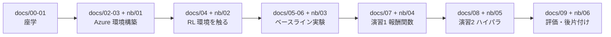

# Azure Machine Learning で学ぶ ロボット強化学習ハンズオン

**仮想空間上のロボット「ピックアンドプレイス」を題材に、Azure Machine Learning 上で強化学習の実験を再現可能な形で実行・比較する**ためのハンズオンテキストです。

| 項目 | 前提 |
|---|---|
| 職種 | データサイエンティスト／機械学習エンジニア |
| 機械学習の知識 | **あり**（教師あり学習・評価指標・過学習などは理解している） |
| 強化学習の知識 | **教養レベル。実装・実験は初挑戦** |
| Azure の知識 | **不問**（環境構築から手順化しています） |
| Python | 読み書きできる |

> **重要**: 強化学習が初めての読者を想定しているため、**「なぜそうするのか」を先に書き、手順はその後**という順序で全章を統一しています。手順だけ知りたい場合は、各節の「手順」小見出しに飛んでください。

---

## ⚠ 最初に読んでください（課金事故の防止）

> **Azure のコンピューティング リソースは、起動している間ずっと課金されます。**
>
> - ハンズオンが終わったら、**必ず [docs/09_評価・コスト・後片付け.md](docs/09_評価・コスト・後片付け.md) の「後片付け」を実施してください。**
> - コンピューティング クラスターは **`min_instances=0`** で作成します。これにより **ジョブが無い間はノード数が 0 になり、コンピューティングの課金が止まります**。
>   **ただし、コンピューティング以外（ストレージ、Container Registry などワークスペース付属リソース）の課金は続きます。**
>   完全に止めるにはリソースグループごと削除します（手順は 09 章）。実際の金額は **Microsoft Cost Management** で必ず確認してください。
> - 対話型ジョブで `sleep infinity` を使った場合、**手動でジョブをキャンセルしないと課金が続きます**。
>   → 出典: [ジョブのデバッグと進行状況の監視 - Microsoft Learn](https://learn.microsoft.com/azure/machine-learning/how-to-interactive-jobs?view=azureml-api-2)

---

## 1. このハンズオンで到達する状態

終わったときに、あなたは次のことが**できる**ようになっています。

1. Azure Machine Learning のワークスペース・コンピューティング・環境を**自分で作れる**
2. 強化学習の学習ジョブを **Azure ML の Job として投げられる**
3. パラメーター・メトリック・成果物（動画を含む）を **MLflow に記録できる**
4. **ベースライン実験と改善実験を、同じ指標で比較できる**
5. 報酬関数やハイパーパラメーターの変更が学習結果に与える影響を**説明できる**
6. 成功率だけでなく、**安定性・学習時間・コスト**を含めて評価できる
7. 未解決の課題と追加検証項目を**整理できる**

### このハンズオンで「やらないこと」

以下は **完了条件に含みません**。

- 学習済みモデルの完成、目標成功率の達成
- 実機ロボットとの接続
- 本番環境への展開

> **重要**: 強化学習は「回してみないと分からない」領域です。**「うまく学習しなかった」という結果も、条件と根拠が記録されていれば立派な成果**です。本テキストはその記録の仕方を重視します。

---

## 2. 学習の流れ



| # | ステップ | 読むテキスト | 動かす Notebook |
|---|---|---|---|
| 1 | 全体像と前提を知る | [docs/00_はじめに.md](docs/00_はじめに.md) | — |
| 2 | 強化学習の基礎を押さえる | [docs/01_強化学習の基礎.md](docs/01_強化学習の基礎.md) | — |
| 3 | Azure 環境を準備する（権限・クォータ） | [docs/02_Azure環境の準備.md](docs/02_Azure環境の準備.md) | — |
| 4 | Azure ML 環境を構築し、疎通確認する | [docs/03_AzureML環境構築.md](docs/03_AzureML環境構築.md) | [01_setup_azureml.ipynb](notebooks/01_setup_azureml.ipynb) |
| 5 | RL 環境を触って理解する | [docs/04_RL環境を触って理解する.md](docs/04_RL環境を触って理解する.md) | [02_explore_rl_env.ipynb](notebooks/02_explore_rl_env.ipynb) |
| 6 | 評価指標を決め、ベースライン実験を実行する | [docs/05_ベースライン実験.md](docs/05_ベースライン実験.md) | [03_baseline_job.ipynb](notebooks/03_baseline_job.ipynb) |
| 7 | ベースライン結果を読み解き、改善計画を立てる | [docs/06_結果の読み解き.md](docs/06_結果の読み解き.md) | — |
| 8 | 演習1: 報酬関数を改善する | [docs/07_演習1_報酬関数の改善.md](docs/07_演習1_報酬関数の改善.md) | [04_reward_experiments.ipynb](notebooks/04_reward_experiments.ipynb) |
| 9 | 演習2: ハイパーパラメーターを改善する（Sweep Job） | [docs/08_演習2_ハイパーパラメータ改善.md](docs/08_演習2_ハイパーパラメータ改善.md) | [05_sweep_hyperparameters.ipynb](notebooks/05_sweep_hyperparameters.ipynb) |
| 10 | 評価・コスト確認・後片付け | [docs/09_評価・コスト・後片付け.md](docs/09_評価・コスト・後片付け.md) | [06_compare_and_cleanup.ipynb](notebooks/06_compare_and_cleanup.ipynb) |
| — | 成果物の記入テンプレート | [docs/A4_ワークシート集.md](docs/A4_ワークシート集.md) | — |

各章は次の共通構造です。

1. **なぜそうするのか**（目的と背景）
2. **何をするのか**（手順）
3. **どうなれば成功か**（期待される出力）
4. **⚠ うまくいかないときは**（トラブルシューティング表）

---

## 3. 3段階の題材設定（**初挑戦者にとって最重要**）

`PandaPickAndPlace-v3` はデフォルトが**疎な報酬（sparse reward）**であり、**素の SAC ではほぼ学習しません**。いきなりこれを課題にすると「Azure の使い方」ではなく「RL が難しい」で時間を使い切ります。そこで**3段階**に分けます。

| 段階 | 環境 | アルゴリズム | 目的 | 主な章 |
|---|---|---|---|---|
| **Step A（動作確認）** | `PandaReach-v3` | SAC（HER なし） | ジョブが通る／MLflow に記録される／学習曲線が上がることを**確実に体験** | 03, 04 |
| **Step B（ベースライン）** | `PandaPickAndPlace-v3` | **SAC + HER**（比較用に HER なしも実行） | **疎な報酬の難しさ**と HER の効果を体験 | 05, 06 |
| **Step C（改善実験）** | 同上 | SAC + HER + 報酬・ハイパラ変更 | 演習1・演習2 | 07, 08 |

> **重要**: Step A を「捨て実験」にせず、**成果物「Azure 実験環境確認票」そのもの**として位置づけます。ここで環境が動くことを確認できていないと、以降の実験が全部止まります。

理由の詳細（なぜ Reach は HER なしでも学習できるのか）は [docs/00_はじめに.md](docs/00_はじめに.md) の 0.3 を参照してください。

---

## 4. 実行場所は 2 段構え（**ローカル → Azure ML Compute**）

本テキストは、**同じ学習スクリプト [src/train_rl.py](src/train_rl.py) を、次の 2 か所で実行できる**ことを設計要件にしています。

| 段階 | 実行場所 | 目的 | MLflow の記録先 |
|---|---|---|---|
| **段階 1** | **手元の PC / Mac** | 環境を「目で見て」理解する。コードのバグを潰す。**GUI シミュレーターが使えるのはここだけ** | Azure ML ワークスペース（**追跡 URI を明示設定**） |
| **段階 2** | **Azure ML Compute（クラスター）** | 長時間学習・並列実験・Sweep | Azure ML ワークスペース（**自動設定**） |

### なぜ二段構えにするのか

1. **クラウドでは GUI が使えない。** panda-gym の GUI（`render_mode="human"`）は PyBullet の OpenGL ウィンドウを開くため、ヘッドレスな Azure ML Compute では使えません。**「ロボットが動く様子を実際に見る」体験は、ローカル実行でしか得られません。**
2. **クラウドのジョブは 1 回の試行錯誤が遅い。** イメージ構築・キュー待ち・ノード確保が挟まるため、`ImportError` 1 個の修正に十数分かかります。**まずローカルで通してから投げる**のが鉄則です。
3. **それでも記録は 1 か所に集約したい。** ローカル実行でも **MLflow の追跡先を Azure ML ワークスペースに向ける**ことで、ローカル実験とクラウド実験を**同じ実験ビューで比較**できます。

### 段階 1 で必要な設定（**Azure ML の外で動かす場合だけ必要**）

> **出典: Microsoft Learn** — [Azure Machine Learning 用に MLflow を構成する](https://learn.microsoft.com/azure/machine-learning/how-to-use-mlflow-configure-tracking?view=azureml-api-2)
> 同ページには次のとおり明記されています。
> - 「**Azure コンピューティング インフラストラクチャを使用する場合、追跡 URI を構成する必要はありません。自動的に設定されるようになっています。** 自動構成を持つ環境には、Azure Machine Learning ノートブック、Azure Machine Learning コンピューティング インスタンスでホストされている Jupyter Notebook、**Azure Machine Learning コンピューティング クラスターで実行されるジョブ**が含まれます」
> - 「**ただし、Azure Machine Learning の外部で作業する場合は、ワークスペースを指すように MLflow を構成する必要があります。影響を受ける環境には、ローカル コンピューター**、Azure Synapse Analytics、Azure Databricks が含まれます」

```bash
# 追跡 URI の取得（Azure CLI v2）
az ml workspace show --query mlflow_tracking_uri
```

```python
# 追跡 URI の取得（Python SDK v2）
mlflow_tracking_uri = ml_client.workspaces.get(ml_client.workspace_name).mlflow_tracking_uri
mlflow.set_tracking_uri(mlflow_tracking_uri)
```

> ⚠ **Private Link 有効のワークスペースでは追跡 URI の形式が異なります。**
> 公式ドキュメントは「この場合、追跡 URI を取得するには、Azure Machine Learning SDK for Python または Azure Machine Learning CLI v2 を使用する必要があります」と警告しています。
> **文字列を手で組み立てず、必ず SDK か CLI から取得してください。**（出典: 同上）

> ⚠ **認証の注意（ローカル実行でハマる筆頭）**
> `DefaultAzureCredential` は「環境変数 → マネージド ID → **Azure CLI** → Azure PowerShell → **対話型ブラウザー**」の順に試します。
> 公式ドキュメントは「**"対話型ブラウザー" 認証は資格情報の入力を求める際にコード実行をブロックします。このアプローチはトレーニング ジョブなどの無人環境での認証には適しません**」と警告しています。
> → **ローカルでは事前に `az login` を済ませておく**のが最も確実です。（出典: 同上）

### ⚠ ローカル実行の限界

ローカル実行では、Azure ML ジョブで得られる次の利点が**得られません**。

- **コードのスナップショット自動保存** —— ローカルは自分で Git コミットする必要がある
- **環境（Environment）のバージョン管理** —— ローカルのライブラリ版は保証されない
- Sweep・並列実行・対話型ジョブ

したがって **「比較に使う本番実験は必ず Azure ML の Job として実行する」** というルールを本テキストでは徹底します。
ローカル実行の run には **`run_location=local` タグ**を付けて区別します。

---

## 5. 技術選定とその理由

| レイヤ | 採用 | 理由 |
|---|---|---|
| 実験基盤 | **Azure Machine Learning（SDK v2 / CLI v2）** | Job・MLflow・Sweep が揃っている |
| 実験追跡 | **MLflow**（Azure ML ワークスペースが MLflow 互換） | **SDK v2 には v1 形式のロギング API が無く、MLflow の利用が公式推奨**（[出典](https://learn.microsoft.com/azure/machine-learning/how-to-log-view-metrics?view=azureml-api-2)） |
| RL 環境 | **panda-gym**（`PandaPickAndPlace-v3` ほか） | **題材「ピックアンドプレイス」と完全一致**。MIT |
| 物理エンジン | **PyBullet**（panda-gym の依存） | ヘッドレス（DIRECT モード）で動作。ライセンス zlib |
| API 規約 | **Gymnasium** | MIT。`reset` / `step` の現行標準 |
| RL アルゴリズム | **Stable-Baselines3**（SAC / TD3 / PPO + HER） | MIT。実装が読みやすく学習用途に適する |

### 【重要】Azure ML の「強化学習専用機能」について

> かつて SDK v1 に存在した Azure ML の RL 専用機能（`azureml-contrib-reinforcementlearning` / Ray on AML）は**非推奨**です。公式 API リファレンスに「RL deprecation」用の警告ユーティリティが記載されています。
> → 出典: [azureml.contrib.train.rl.utils（Microsoft Learn）](https://learn.microsoft.com/python/api/azureml-contrib-reinforcementlearning/azureml.contrib.train.rl.utils?view=azure-ml-py)

**したがって本テキストでは、専用機能ではなく「汎用の Azure ML Command Job / Sweep Job 上で OSS の RL ライブラリを動かす」構成を採ります。** これは現在も標準的にサポートされる方法です。

なお **Azure ML studio のコンピューティング クラスターのドキュメントには、用途として「training, batch inference or *reinforcement learning* workloads」と現在も明記されています。**
→ 出典: [Create an Azure Machine Learning compute cluster（Studio タブ）](https://learn.microsoft.com/azure/machine-learning/how-to-create-attach-compute-cluster?view=azureml-api-2#create)

**「RL 専用機能が無い＝Azure ML に RL のうまみが無い」わけではありません。** 汎用機能のうち強化学習の実験でこそ効くもの（対話型ジョブ、Sweep の平行座標プロット、シードを探索空間にする使い方、MLflow アーティファクトによる評価動画の保存など）は、[docs/00_はじめに.md](docs/00_はじめに.md) の 0.5 にまとめています。

### 【重要】描画（GUI）についての前提

panda-gym のソース `panda_gym/pybullet.py` では、`render_mode="human"` が PyBullet の **GUI**（OpenGL ウィンドウ）接続に直結します。一方 PyBullet の Quickstart Guide は DIRECT モードについて次のように記載しています。

> "DIRECT mode does allow rendering of images using the built-in software renderer through the 'getCameraImage' API. **This can be useful for running simulations in the cloud on servers without GPU.**"

→ 出典（**参考情報（サードパーティ）**）: [panda_gym/pybullet.py](https://raw.githubusercontent.com/qgallouedec/panda-gym/master/panda_gym/pybullet.py) ／ [PyBullet Quickstart Guide](https://raw.githubusercontent.com/bulletphysics/bullet3/master/docs/pybullet_quickstart_guide/PyBulletQuickstartGuide.md.html)

したがって本テキストでは次のように使い分けます。

| 実行場所 | 描画設定 |
|---|---|
| **ローカル**（環境を目で見るとき） | `render_mode="human"`（GUI）が使える。**ただし panda-gym はデバッグ パネルとマウスピッキングを無効化しています**（仕様） |
| **Azure ML Compute**（学習ジョブ） | **常に `render_mode="rgb_array"` ＋ `renderer="Tiny"`（＝ DIRECT）** |

詳細は [docs/04_RL環境を触って理解する.md](docs/04_RL環境を触って理解する.md) の 4.6 を参照してください。

> [!TIP]
> **深く理解するために**
>
> 本テキストには、**最短経路には含めないが理解を深めるための節**を用意しています。いずれも `> [!TIP] 深く理解するために` の注意書きから始まります。
>
> | 節 | 内容 |
> |---|---|
> | [docs/04](docs/04_RL環境を触って理解する.md) 4.6.3 | **GUI / 動画のカメラ アングルを変える**（`render_*` 引数、`place_visualizer()`） |
> | [docs/04](docs/04_RL環境を触って理解する.md) 4.6.4 | **ロボットを手で動かして行動ベクトルの意味を掴む** |
> | [docs/06](docs/06_結果の読み解き.md) 6.0.1 | **診断フロー** —「ログの何を見て、何を変えるか」の全体像 |
> | [docs/06](docs/06_結果の読み解き.md) 6.3.1 | **学習済みモデルをローカル GUI で再生する** |
> | [docs/07](docs/07_演習1_報酬関数の改善.md) 7.8 | **環境そのもののパラメータを変える**（エピソード長・成功しきい値・目標のばらつき） |
> | [docs/08](docs/08_演習2_ハイパーパラメータ改善.md) 8.9 | **学習量と並列環境数の扱い**（計算資源を増やす前に確認すること） |

---

## 6. ファイル構成

```
9.ReinforcementLearning/
├── README.md                       ← いまここ
├── docs/                            【読む】概念・判断基準・画面手順・トラブルシューティング
│   ├── 00_はじめに.md
│   ├── 01_強化学習の基礎.md
│   ├── 02_Azure環境の準備.md
│   ├── 03_AzureML環境構築.md
│   ├── 04_RL環境を触って理解する.md
│   ├── 05_ベースライン実験.md
│   ├── 06_結果の読み解き.md
│   ├── 07_演習1_報酬関数の改善.md
│   ├── 08_演習2_ハイパーパラメータ改善.md
│   ├── 09_評価・コスト・後片付け.md
│   ├── A1_トラブルシューティング総合索引.md   … 症状から逆引き
│   ├── A2_OSSライセンス一覧.md
│   ├── A3_出典一覧.md
│   └── A4_ワークシート集.md                … 成果物の記入テンプレート
├── notebooks/                       【動かす】実行可能セル
│   ├── 01_setup_azureml.ipynb
│   ├── 02_explore_rl_env.ipynb
│   ├── 03_baseline_job.ipynb
│   ├── 04_reward_experiments.ipynb
│   ├── 05_sweep_hyperparameters.ipynb
│   └── 06_compare_and_cleanup.ipynb
└── src/                             【ジョブが実行する】学習コード
    ├── train_rl.py                  … 学習の本体・MLflow 記録（原則変更しない）
    ├── rl_env_factory.py            … 環境生成と報酬ラッパー（演習1で変更する）
    ├── evaluate.py                  … 成功率の評価と動画収録
    ├── conda.yaml                   … Azure ML カスタム環境の定義
    ├── NOTICE.md                    … 第三者 OSS のライセンス表記
    └── smoke_test.py                … ※ notebooks/01 の実行時に自動生成されます
```

### `docs/` と `notebooks/` の使い分け

| | `docs/`（Markdown） | `notebooks/`（Jupyter） |
|---|---|---|
| 目的 | **理解する・判断する** | **動かす・記録する** |
| 内容 | 概念説明、判断基準、画面手順、トラブルシューティング、ワークシート | 実行可能セル、出力確認、MLflow 記録 |
| 初回学習時 | **こちらを主に読む** | 指示された箇所を実行する |
| 復習・自習時 | 参照用 | **こちらを主に動かす** |

---

## 7. 事前に必要なもの

| # | 必要なもの | 確認方法 |
|---|---|---|
| 1 | Azure サブスクリプション | [Azure Portal](https://portal.azure.com/) にサインインできる |
| 2 | リソースを作成できる権限 | [docs/02_Azure環境の準備.md](docs/02_Azure環境の準備.md) の 2.1 |
| 3 | CPU の vCPU クォータ（推奨: 8 vCPU 以上） | [docs/02_Azure環境の準備.md](docs/02_Azure環境の準備.md) の 2.3 |
| 4 | ブラウザー（Microsoft Edge / Chrome） | — |

> **GPU は不要です。その分、計算コストを大きく押さえられます。**
> 本ハンズオンの題材（panda-gym + PyBullet）は**物理シミュレーションが CPU 律速**で、GPU を追加しても学習全体の速度は大きくは上がりません。したがって **CPU クラスターで実施します**。

---

## 8. 使用する OSS とライセンス（要約）

本テキストが利用する強化学習関連パッケージは、**すべて商用利用可能な寛容型ライセンス**です。各リポジトリの LICENSE ファイルを直接参照して確認しています。

| パッケージ | 提供元 | ライセンス | 確認先 URL |
|---|---|---|---|
| **Gymnasium** | Farama Foundation | **MIT** | https://github.com/Farama-Foundation/Gymnasium/blob/main/LICENSE |
| **Stable-Baselines3** | DLR-RM | **MIT** | https://github.com/DLR-RM/stable-baselines3/blob/master/LICENSE |
| **panda-gym** | Quentin Gallouédec | **MIT** | https://github.com/qgallouedec/panda-gym/blob/master/LICENSE |
| **PyBullet / Bullet3** | Bullet Physics | **zlib**<br>※`Extras/` と `examples/ThirdPartyLibs` は除外と明記 | https://github.com/bulletphysics/bullet3/blob/master/LICENSE.txt |

**全文と注意点は [docs/A2_OSSライセンス一覧.md](docs/A2_OSSライセンス一覧.md) と [src/NOTICE.md](src/NOTICE.md) を参照してください。**

> **なぜ PyBullet ベース（panda-gym）を主軸にするのか**
> 追加のライセンスキーやバイナリ入手が不要で、**pip だけで完結**し、ヘッドレス環境（Azure ML Compute）で動かしやすいためです。
> MuJoCo ベースの Gymnasium-Robotics（`FetchPickAndPlace` など）も寛容型ライセンスですが、**MuJoCo が別途必要**になり依存が増えるため、**導入コストを下げる目的**で panda-gym を第一候補にしています。

> **免責**: 上記は各リポジトリの LICENSE ファイルの記載内容の要約であり、法的助言ではありません。**実際の利用可否は、ご所属の組織の OSS ポリシーおよび法務部門の判断に従ってください。**

---

## 9. 出典の扱いについて

本テキストは**捏造をしない**方針で作成しています。

- **Microsoft 公式情報**（Microsoft Learn / Microsoft の GitHub リポジトリ）は、該当ページの URL を都度併記します。
- **Microsoft 製と確認できない情報**は「**参考情報（サードパーティ）**」と明示して URL を示します。
- **価格・学習時間・成功率などの数値は断定しません。** 代わりに**確認方法**（Azure Pricing ページ、Cost Management、実測）を案内します。

出典の一覧は [docs/A3_出典一覧.md](docs/A3_出典一覧.md) にまとめています。

---

## 10. 困ったときは

1. その章の末尾にある **「⚠ うまくいかないときは」** の表を見る
2. それでも解決しない場合は [docs/A1_トラブルシューティング総合索引.md](docs/A1_トラブルシューティング総合索引.md) で**症状から逆引き**する
3. Azure 側の問題が疑われる場合は、Microsoft Learn のトラブルシューティング ページを参照する
   - [環境（Environment）のトラブルシューティング](https://learn.microsoft.com/azure/machine-learning/how-to-troubleshoot-environments?view=azureml-api-2)
   - [クォータと上限の管理](https://learn.microsoft.com/azure/machine-learning/how-to-manage-quotas?view=azureml-api-2)
