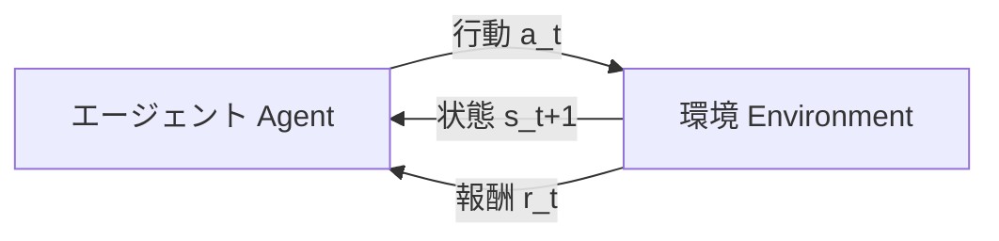

# 01. 強化学習の基礎 — 実験を始める前に

[← 00. はじめに](00_はじめに.md) ｜ [次へ: 02. Azure環境の準備 →](02_Azure環境の準備.md)

---

> **この章の目的**
> 強化学習の実装・実験が初めての方が、**「課題定義シート」を自力で書ける**状態になることです。
> 数式は最小限にし、**「実験結果を読むときに何を疑えばよいか」**に直結する概念に絞って説明します。

**この章はコードを実行しません。** 手を動かすのは [04_RL環境を触って理解する.md](04_RL環境を触って理解する.md) からです。

---

## 1.1 教師あり学習との決定的な違い

データサイエンティストにとって最も馴染みのある教師あり学習と比べます。

| | 教師あり学習 | 強化学習 |
|---|---|---|
| データ | **最初から用意されている** | **自分で行動して集める** |
| 正解 | 各サンプルに正解ラベルがある | 正解の行動は**教えてもらえない**。報酬という**間接的な評価**だけ |
| 評価のタイミング | 予測ごとに即座 | **行動のずっと後**（遅延報酬） |
| データの分布 | 学習中も基本的に変わらない | **方策が変わるとデータ分布も変わる**（非定常） |
| 失敗の扱い | 誤差として即座に修正 | 「なぜ失敗したか」は自明でない |

> **重要（最初に腹落ちさせてほしいこと）**
> 強化学習では、**「データを集める行為そのものが学習対象」**です。
> 方策（policy）が下手なうちは下手なデータしか集まりません。良いデータが集まらないと方策も改善しません。
> **この鶏と卵の関係が、強化学習が「うまくいかない」最大の理由**です。

この性質から、次のことが直接導かれます。

- **学習が進まない原因が「アルゴリズム」とは限らない。** 環境設計・報酬設計・探索の問題であることのほうが多い
- **同じ設定でも結果が大きくばらつく。** 初期の乱数で「たまたま成功を引いたか」が学習全体を左右する
- **1回の実験結果で結論を出してはいけない**

---

## 1.2 強化学習の構成要素（MDP）

強化学習の問題は **マルコフ決定過程（MDP: Markov Decision Process）** として定式化されます。

> **「マルコフ」とは何か（先にこれを押さえてください）**
> **マルコフ性**とは、**「次に何が起きるかは、現在の状態と行動だけで決まり、過去の履歴には依存しない」** という仮定です。
> この仮定があるからこそ、方策を「状態 → 行動」という単純な関数 $\pi(a \mid s)$ で表せます（履歴を覚えておく必要がない）。
>
> → 逆に、**状態に必要な情報が含まれていないとマルコフ性が崩れ、学習が困難になります。**
> 実機ではカメラから対象物の位置を推定するため誤差やオクルージョンが入り、これが 1.3 で後述する Sim-to-Real ギャップの主因になります。



（この図は強化学習の標準的な枠組みです。参考情報（書籍）: Sutton &amp; Barto, *Reinforcement Learning: An Introduction*。本ハンズオンでは **エージェント = ロボットの制御方策（ニューラルネット）**、**環境 = PyBullet の物理シミュレーター** です。）

### 用語と実装の対応

| 記号 | 用語 | 意味 | 本ハンズオンでの実体 | コード上の変数 |
|---|---|---|---|---|
| $s_t$ | **状態 / 観測**（state / observation） | エージェントが見ている情報 | ロボットの手先位置・速度、グリッパー開度、対象物の位置・速度 | `observation` |
| $a_t$ | **行動**（action） | エージェントが選ぶ操作 | 手先の移動量 (dx, dy, dz) とグリッパー開閉 | `action` |
| $r_t$ | **報酬**（reward） | 行動の良し悪しの評価値 | 成功なら 0、失敗なら -1（疎な報酬の場合） | `reward` |
| $\gamma$ | **割引率**（discount factor） | 将来の報酬をどれだけ重視するか（0〜1） | 既定 0.99 | `gamma` |
| — | **エピソード**（episode） | 1回の試行（リセットから終了まで） | 最大 50 ステップ | — |
| — | **方策**（policy） | 状態から行動を決める関数 $\pi(a|s)$ | ニューラルネットワーク | `model.policy` |

### 目的関数

強化学習が最大化するのは、**割引累積報酬（リターン）の期待値**です。

$$
J(\pi) = \mathbb{E}_{\tau \sim \pi}\left[\sum_{t=0}^{T} \gamma^{t} r_t \right]
$$

ここで $\tau \sim \pi$ は、**「方策 $\pi$ に従って生成される軌跡（trajectory）$\tau = (s_0, a_0, s_1, a_1, \dots, s_T)$ 全体についての期待値」** という意味です。

**$\gamma$ の直感的な意味**

$\gamma$ は「どれだけ先の報酬まで考慮するか」を決めます。目安になるのが **実効地平線（effective horizon）$\approx \frac{1}{1-\gamma}$** です。

| $\gamma$ | $\frac{1}{1-\gamma}$（およそ何ステップ先まで見るか） | 傾向 |
|---|---|---|
| 0.9 | 約 10 ステップ | 学習は安定しやすいが、長い手順のタスクは解けない |
| 0.95 | 約 20 ステップ | 中間 |
| **0.99（既定）** | **約 100 ステップ** | 長期的な計画が可能。ただし学習は不安定になりやすい |

> **誤解しないでください**: 「$\gamma$ が小さい」は **あくまで相対的な話** です。$\gamma = 0.9$ でも $\gamma^{10} \approx 0.35$ なので、**10 ステップ先の報酬は無視されません**。「0.9 はダメな値」という意味ではありません。

> **重要**: ピックアンドプレイスは「つかむ → 運ぶ → 置く」という**複数ステップの手順**が必要で、**1 エピソードは最大 50 ステップ**です（1.3 参照）。
> つまり $\gamma = 0.9$（実効 10 ステップ）だと**エピソード全体を見通せません**。**$\gamma$ はハイパーパラメーター改善実験（[08 章](08_演習2_ハイパーパラメータ改善.md)）の主要な変更候補です。**

---

## 1.3 ピックアンドプレイスを強化学習の構成要素に分解する

これが「強化学習課題の構造化」の演習そのものです。

### 分解の観点

| 観点 | 問い | `PandaPickAndPlace-v3` での答え |
|---|---|---|
| **状態** | ロボットは何を観測できるか？ | `observation` には **ロボットの状態**（手先の位置・速度、グリッパー開度）と **対象物の状態**（位置・姿勢・速度・角速度）が入る。**目標位置は `observation` ではなく `desired_goal` に入る** |
| **行動** | ロボットは何を選べるか？ | 手先の移動量 (dx, dy, dz) と**グリッパーの開閉**（既定は「手先変位制御」） |
| **成功条件** | 何をもって成功とするか？ | **キューブの位置と目標位置の距離 &lt; 0.05 m**。**把持しているかどうかは判定しない**（後述 1.7 で重要） |
| **エピソード終了** | いつ試行を打ち切るか？ | 成功時（`terminated=True`）、または**最大 50 ステップ**に到達したとき |
| **報酬** | どう評価するか？ | 既定は**疎（sparse）**: 成功なら 0、それ以外は -1 |

> **検証済みの事実**（panda-gym のソースコードで確認。**確認対象: panda-gym v3 系（本ハンズオンは v3.0.7 を固定して使います。[03 章](03_AzureML環境構築.md) の `conda.yaml` 参照）**）
> - 観測は `observation` / `achieved_goal` / `desired_goal` の3つを持つ **辞書型（Dict）** です
> - `PandaPickAndPlace-v3` の `achieved_goal` は **キューブの位置**、`PandaReach-v3` の `achieved_goal` は **手先の位置** です
> - `step()` は `info["is_success"]` を返します（成功判定に使えます）
> - `terminated` は**成功したときに True** になります（`terminated = bool(task.is_success(...))`）
> - `PandaPickAndPlace-v3` の **`max_episode_steps` は 50** です（`Stack` のみ 100）
> - `distance_threshold` の既定値は **0.05（5 cm）** です
>
> 出典（参考情報・OSS 公式ソース）:
> [panda_gym/envs/core.py](https://github.com/qgallouedec/panda-gym/blob/master/panda_gym/envs/core.py) ／
> [panda_gym/envs/tasks/pick_and_place.py](https://github.com/qgallouedec/panda-gym/blob/master/panda_gym/envs/tasks/pick_and_place.py) ／
> [panda_gym/\_\_init\_\_.py](https://github.com/qgallouedec/panda-gym/blob/master/panda_gym/__init__.py)

### 分解するときの注意点

1. **「観測できるもの」と「知りたいもの」は違う**
   実機では対象物の正確な位置は**カメラ経由の推定値**です。シミュレーションでは真値が取れてしまうため、**Sim-to-Real のギャップの主要因**になります。
2. **行動空間の設計が難易度を決める**
   関節角度を直接制御するより、手先の変位を制御するほうが簡単です（panda-gym では `Joints` 付きの環境 ID で切り替えられます）。
3. **「失敗」を細かく分類する**
   「落とした」「衝突した」「時間切れ」は原因も対処も異なります。**最初から分けて記録する**と分析が楽になります。
   → **実装上の記録方法は [05 章](05_ベースライン実験.md) の 5.3「MLflow ログ設計」で扱います**（エピソード長と `is_success` の組み合わせで分類します）。

**→ ここまでを [A4_ワークシート集.md](A4_ワークシート集.md) の「課題定義シート」に記入してください。**

---

## 1.4 【最重要】疎な報酬（sparse reward）と密な報酬（dense reward）

**この節を理解していないと、ベースライン実験の結果を読み違えます。**

### 疎な報酬（sparse reward）

`PandaPickAndPlace-v3` の**既定**です。

| ステップ | 報酬 |
|---|---|
| 成功していない | **-1** |
| 成功した | **0** |

**何が起きるか**

ランダムに動くロボットが、偶然キューブをつかみ、偶然目標位置に運ぶ確率は**極めて低い**です。
つまりエージェントが集めるのは「すべてのステップで -1」というデータばかりになります。

$\gamma = 0.99$ のとき、このときのリターンはどの軌跡でもほぼ同じ値になります。

$$
\sum_{t=0}^{49} 0.99^{t} \times (-1) \approx -39.5
$$

> **ここが本質です**
> 問題は「値が低いこと」ではなく、**「どの軌跡を選んでもリターンがほとんど変わらない」こと**です。
> 値に差がなければ、**「どの行動が良かったのか」を学習する手がかりが存在しません**。
> これが学習曲線が**平坦なまま動かない（プラトー）**主因です。

> ⚠ **重要**
> **素の SAC / TD3 を `PandaPickAndPlace-v3` にそのまま適用しても、現実的な時間の範囲では学習が進みません。**
> （理論上は、長時間回せば偶然の成功が蓄積されて学習が始まる可能性はありますが、実用的ではありません。）
> これは実装ミスでもハイパーパラメーターの問題でもなく、**問題設定そのものの難しさ**です。
> ベースライン実験では、**この「学習しない」状態を意図的に体験します。**

### 密な報酬（dense reward）

panda-gym には `PandaPickAndPlaceDense-v3` という**密な報酬版**が用意されています。

| 報酬 | 例 |
|---|---|
| 距離に応じた連続値 | 目標に近いほど報酬が高い（負の距離など） |

**何が起きるか**

「近づけば報酬が増える」という手がかりがあるので、**学習は圧倒的に速くなります。**

> ⚠ **ただし、密な報酬には副作用があります。**
> 「近づく」ことばかり学習して、**「つかむ」を学習しない**ことがあります。
> これが次節（1.7）で説明する **報酬ハッキング** の典型例です。

### 比較まとめ

| | 疎な報酬 | 密な報酬 |
|---|---|---|
| 報酬設計の手間 | **小さい**（成功判定だけ書けばよい） | **大きい**（何をどれだけ評価するか設計が要る） |
| 学習の難しさ | **非常に難しい** | 比較的易しい |
| 意図しない挙動 | 起きにくい | **起きやすい**（報酬ハッキング） |
| 実務での使いやすさ | 「成功の定義」だけで済むので現場と合意しやすい | 現場の暗黙知を報酬に翻訳する必要がある |

**→ この比較は演習1（[07 章](07_演習1_報酬関数の改善.md)）で実際に実験します。**

---

## 1.5 疎な報酬への処方箋 — Goal-conditioned RL と HER

### Goal-conditioned RL（目標条件付き強化学習）

`PandaPickAndPlace-v3` の観測は3つに分かれています。

| キー | 意味 |
|---|---|
| `observation` | ロボットと対象物の状態 |
| `achieved_goal` | **実際に達成した位置**（＝いまキューブがある場所） |
| `desired_goal` | **達成したかった位置**（＝目標） |

つまり方策は「状態 $s$」ではなく「**状態 $s$ と目標 $g$**」の両方を見て行動を決めます。

$$
\pi(a \mid s, g)
$$

これを **Goal-conditioned RL** と呼びます。

### HER（Hindsight Experience Replay）

**HER は「失敗を、別のゴールにとっての成功として読み替える」手法**です。

> **直感的な説明**
> 目標 A にボールを投げて外し、B に当たったとします。
> 「A を狙う課題」としては**失敗**ですが、**「B を狙う課題」としては完璧な成功**です。
> ならば、その経験を「B を狙っていたことにして」学習に使えばよい —— これが HER です。

これにより、**疎な報酬でも「成功した経験」を人工的に大量に作り出せます。**

| | HER なし | HER あり |
|---|---|---|
| 成功サンプル | ほぼ 0 件 | **失敗エピソードからも生成できる** |
| 学習の可否 | まず学習しない | **学習しうる** |

> **出典（参考情報・サードパーティ）**
> - 原論文: Andrychowicz et al., "Hindsight Experience Replay", https://arxiv.org/abs/1707.01495
> - Stable-Baselines3 の HER ドキュメント: https://stable-baselines3.readthedocs.io/en/master/modules/her.html

### HER を使うための「環境側の条件」（実装で必ず引っかかる箇所）

Stable-Baselines3 の公式ドキュメントには、HER を使う環境の条件が明記されています。

1. **辞書型の観測空間**で、`observation` / `achieved_goal` / `desired_goal` の3キーを持つこと
2. **ベクトル化された `compute_reward()` を持つこと**

> **「ベクトル化された」とは（誤解しやすい用語）**
> ここで言う「ベクトル化」は、**`SubprocVecEnv` などの「ベクトル化環境（VecEnv）」とは別の話**です。
> **「（achieved_goal, desired_goal）のペアを N 個まとめて NumPy 配列で渡したときに、N 個分の報酬を一括で返せる」** という意味です。
> HER は 1 つの実経験から複数の仮想経験を一気に作るので、この一括計算が必要になります。

`panda-gym` はこの両方を満たします。

- 観測は `spaces.Dict({observation, achieved_goal, desired_goal})`
- `RobotTaskEnv.__init__` の中で `self.compute_reward = self.task.compute_reward` として公開されており、中身は `-np.array(d > threshold, dtype=np.float32)` のような **NumPy 配列演算**です（→ 配列を渡せば配列で返ります）

> ⚠ **さらに重要な制約（ハマりポイント）**
> **HER で学習したモデルを読み込むときは、必ず環境を一緒に渡す必要があります。**
>
> **なぜか**: HER はリプレイバッファからサンプルするたびに、**ゴールを差し替えて報酬を「その場で再計算」します**。
> その再計算に `env.compute_reward()` を使うため、**報酬関数の実体はモデル側ではなく環境側にあります**。
> だから `save()` は環境なしでもできますが、**`load()` には環境が要ります**。
>
> ```python
> # NG: 環境なしでは読み込めない
> # model = SAC.load("model.zip")
>
> # OK: env をキーワード引数で同時に渡す
> model = SAC.load("model.zip", env=env)
> ```
>
> （学習済み方策を推論だけに使いたい場合は、SB3 公式ドキュメントが**方策（policy）だけを保存する**ことを推奨しています。）
> 出典（参考情報・OSS 公式ドキュメント）: https://stable-baselines3.readthedocs.io/en/master/modules/her.html

---

## 1.6 アルゴリズムの選び方（直感レベル）

強化学習アルゴリズムは大きく2種類に分かれます。

| | **オンポリシー**（on-policy） | **オフポリシー**（off-policy） |
|---|---|---|
| 学習に使うデータ | **いま使っている方策**で集めたデータのみ | **過去に集めたデータも再利用**（Replay Buffer） |
| データ効率 | 悪い（毎回捨てる） | **良い** |
| 安定性 | 比較的安定 | ハイパーパラメーターに敏感 |
| 代表例 | **PPO** | **SAC / TD3 / DDPG / DQN** |
| **HER が使えるか** | ❌ 使えない | ✅ **使える** |

> **重要**: **HER は Replay Buffer の仕組みなので、オフポリシー手法でしか使えません。**
> 本ハンズオンは疎な報酬の克服が主題なので、**SAC（Soft Actor-Critic）+ HER** を主軸にします。

### 本ハンズオンで使うアルゴリズム

| アルゴリズム | 特徴 | 本テキストでの位置づけ |
|---|---|---|
| **SAC** | 連続値行動向けのオフポリシー手法。**エントロピー正則化により探索を自動調整する**ため、ハイパーパラメーターに比較的頑健 | **主軸**（Step A / B / C すべて） |
| TD3 | SAC と同系統。決定的方策 | 任意課題（比較用） |
| PPO | オンポリシー。実装がシンプルで安定 | 任意課題（HER が使えないことの確認用） |

> **参考情報（サードパーティ）**: Stable-Baselines3 のアルゴリズム一覧
> https://stable-baselines3.readthedocs.io/en/master/guide/algos.html

---

## 1.7 【最重要警告】報酬ハッキング（reward hacking）

> ⚠⚠ **報酬が上がること ≠ 望ましい動作をしていること**
>
> **これは本テキストで最も重要な警告です。** 実験結果を見るとき、必ず思い出してください。

### 何が起きるのか

エージェントは**あなたが設計した報酬関数を最大化する**のであって、**あなたが望んだ動作を学習するわけではありません。**
報酬関数に「抜け道」があれば、エージェントは必ずそれを見つけます。

### ピックアンドプレイスで実際に起こりうる例

**まず、この環境の「成功判定」の仕様を正確に押さえてください。**

> **検証済みの重要な事実**（`panda_gym/envs/tasks/pick_and_place.py` で確認）
> 1. `is_success` は **キューブと目標の距離が 0.05 m 未満かどうかだけ**を見ています。
>    **「把持しているか」は一切判定しません。**
> 2. 目標位置は、**約 30% の確率でテーブル上（z 方向のノイズを 0 にする）、約 70% の確率で空中** にサンプルされます
>    （`if self.np_random.random() < 0.3: noise[2] = 0.0`）。

この2つから、**非常に教育的な帰結**が導かれます。

> ⚠ **キューブを「つかまずに押して転がす」だけでも、目標がテーブル上（約 30%）なら環境は「成功」と判定します。**
> つまり、**成功率が 30% 付近で頭打ちになっているモデルは、「押しているだけで、持ち上げを学習していない」可能性が高い** ということです。
> **これはバグではなく、報酬・成功判定の設計が生む典型的な報酬ハッキングです。**

| 与えた報酬・設計 | エージェントが見つける抜け道 | 環境の `is_success` の判定 | 人間から見た評価 |
|---|---|---|---|
| 既定の疎な報酬（距離だけで判定） | **つかまずにキューブを押して転がす** | 目標がテーブル上なら**成功と判定** | **不十分**（把持を学習していない。成功率は約 30% で頭打ち） |
| 「キューブと目標の距離が近いほど高報酬」を追加 | 同上（押す行動が**さらに強化される**） | 同上 | **悪化する可能性あり** |
| 「手先とキューブの距離が近いほど高報酬」を追加 | **キューブの真上で手先を振動させ続ける** | 失敗（キューブは動かない） | **報酬は高いのに成功率は 0%**（最も分かりやすい兵候） |
| 「エピソードが長いほどペナルティ」を追加 | **何もせずに時間切れを待つ**（動くと余計に損をする場合） | 失敗 | **何も達成しない** |
| 「衝突にペナルティ」を大きく追加 | **一切動かない** | 失敗 | 衝突ゼロで安全だが**無意味** |

> **重要**: この表の 1 行目は、**「環境の成功定義」と「現場が望む成功」がずれている**例です。
> 実務では、**報酬関数だけでなく「成功判定そのもの」を見直す必要がある**ということを意味します（例: 「持ち上げた高さ」を成功条件に加える）。
> これは演習1（[07 章](07_演習1_報酬関数の改善.md)）の重要な議論テーマです。

### どうやって検出するか（**実験のたびに必ず実施**）

| # | チェック方法 | 見るべきもの |
|---|---|---|
| 1 | **評価動画を必ず見る** | 「報酬は高いのに動作がおかしい」を一発で発見できる |
| 2 | **成功率と平均報酬を両方記録し、突き合わせる** | 報酬だけ上がって成功率が上がらない ＝ **強い疑い** |
| 3 | エピソード長の分布を見る | 極端に短い／長いエピソードが増えていないか |
| 4 | **成功率が約 30% で頭打ちしていないか見る** | 上述のとおり、**「押しているだけ」の強いサイン** |
| 5 | 行動の統計量を見る | 特定の行動値（例: グリッパー常時開放）に張り付いていないか |

> **重要**: **本ハンズオンでは、すべての実験で「成功率」と「平均報酬」の両方を MLflow に記録し、評価フェーズの動画を `eval_video.mp4` として MLflow アーティファクトに保存します。**
> - 実装: [05 章](05_ベースライン実験.md) の 5.3「MLflow ログ設計」
> - 見方: [06 章](06_結果の読み解き.md) の 6.3「報酬ハッキングの検出手順」
>
> これは飾りではなく、**報酬ハッキングを検出するための必須の仕組み**です。

---

## 1.8 なぜ強化学習の実験は「再現しない」のか

普通の機械学習より、強化学習は結果がばらつきます。理由は3つです。

| # | 要因 | 説明 |
|---|---|---|
| 1 | **乱数の影響が増幅される** | 初期方策・環境の初期状態・探索ノイズがすべて乱数。**序盤に偶然成功を引けるかどうか**が学習全体を左右する |
| 2 | **データ分布が学習中に変わる**（非定常） | 方策が変わると集まるデータも変わる。教師あり学習の「固定データセット」とは前提が違う |
| 3 | **並列実行やハードウェアで演算順序が変わる** | 浮動小数点演算の順序差が積み重なり、同じシードでもビット単位一致しない場合がある |

### 実務上の対策（本テキストで実践します）

1. **必ず乱数シードを記録する**（`log_param("seed", ...)`）
2. **同一設定を複数シードで反復実行する**（[08 章](08_演習2_ハイパーパラメータ改善.md) で Sweep Job を使って自動化）
3. **平均だけでなく、ばらつき（分散・最小・最大）も記録する**
4. **1本の Run で結論を出さない**

> **重要**: 本ハンズオンの実験原則にも「**成功率だけで結論を出さない**」「**平均値だけでなく、ばらつきと失敗例を確認する**」とあります。
> これは強化学習では**建前ではなく必須の作法**です。

---

## 1.9 用語集（日英対応）

| 日本語 | 英語 | 意味 |
|---|---|---|
| エージェント | agent | 行動を決める主体。学習の対象 |
| 環境 | environment | エージェントが働きかける対象。ここでは物理シミュレーター |
| 状態 / 観測 | state / observation | エージェントが受け取る情報 |
| 行動 | action | エージェントが出力する操作 |
| 報酬 | reward | 行動の評価値 |
| 方策 | policy | 状態から行動を決める関数。$\pi$ |
| エピソード | episode | リセットから終了までの1回の試行 |
| ステップ | step | エピソード内の1回の行動 |
| リターン | return | エピソード内の割引累積報酬 |
| 割引率 | discount factor | 将来の報酬の重み。$\gamma$ |
| 探索と活用 | exploration / exploitation | 新しい行動を試すか、既知の良い行動を使うか |
| オンポリシー | on-policy | 現在の方策のデータのみで学習 |
| オフポリシー | off-policy | 過去のデータも再利用して学習 |
| リプレイバッファ | replay buffer | 過去の経験を貯めておく記憶領域 |
| 疎な報酬 | sparse reward | 成功時のみ報酬が変化する設計 |
| 密な報酬 | dense reward | 進捗に応じて連続的に報酬が変化する設計 |
| 報酬シェーピング | reward shaping | 学習を助けるために報酬を追加設計すること |
| **報酬ハッキング** | **reward hacking** | **報酬は上がるが望ましくない動作を学習してしまう現象** |
| 目標条件付き強化学習 | goal-conditioned RL | 目標 $g$ も入力に取る方策を学習する枠組み |
| HER | Hindsight Experience Replay | 失敗経験を別ゴールの成功として再ラベルする手法 |
| Sim-to-Real | Sim-to-Real | シミュレーションで学習した方策を実機に移すこと／その差 |
| 収束 | convergence | 学習が安定して変化しなくなること |
| タイムステップ | timestep | 学習全体で消費した環境ステップ数（`total_timesteps`） |

---

## ⚠ うまくいかないときは（Step 01）

この章は座学のため実行エラーは起きませんが、**理解のつまずき**への対処を挙げます。

| # | つまずき | 主な原因 | 確認手順 | 対処 |
|---|---|---|---|---|
| 1 | 「報酬」と「成功」の違いが分からない | 疎な報酬の設計を未理解 | 1.4 を再読 | **報酬は学習信号、成功は評価指標**。**この2つは必ず別々に記録する**と覚える |
| 2 | HER が何をしているか腑に落ちない | 「ゴールの読み替え」がイメージできない | 1.5 の「ボール投げ」の例を再読 | [04 章](04_RL環境を触って理解する.md) で `achieved_goal` / `desired_goal` を実際に `print` すると腑に落ちます |
| 3 | なぜ SAC なのか分からない | オンポリシー／オフポリシーの区別が未整理 | 1.6 の表を確認 | **HER はオフポリシー手法でしか使えない**。疎な報酬を扱う本ハンズオンでは SAC が自然な選択 |
| 4 | $\gamma$ をどう決めればよいか分からない | 目安が不明 | 1.2 を確認 | **まず既定値（0.99）で回し、[08 章](08_演習2_ハイパーパラメータ改善.md) で変更実験する。** 最初から最適値を狙わない |
| 5 | 「実験がばらつくのは自分の設定ミスでは」と不安になる | RL の性質を未理解 | 1.8 を再読 | **ばらつくのが正常**。だから複数シードで反復する。設定ミスとの切り分けは [06 章](06_結果の読み解き.md) で扱います |

**参考（出典）**

- Stable-Baselines3 HER ドキュメント（参考情報・サードパーティ）: https://stable-baselines3.readthedocs.io/en/master/modules/her.html
- HER 原論文（参考情報・サードパーティ）: https://arxiv.org/abs/1707.01495
- panda-gym ソースコード（参考情報・サードパーティ）: https://github.com/qgallouedec/panda-gym

---

[← 00. はじめに](00_はじめに.md) ｜ [次へ: 02. Azure環境の準備 →](02_Azure環境の準備.md)
