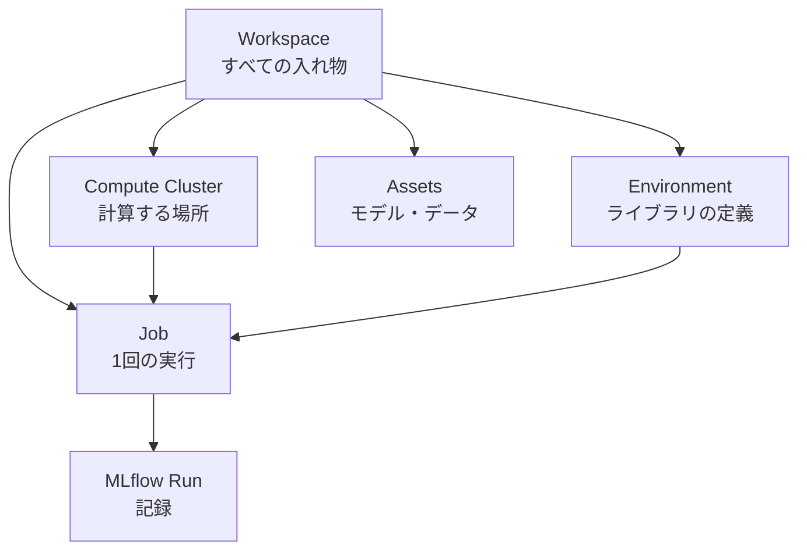

# 03. Azure Machine Learning 環境構築

[← 02. Azure 環境の準備](02_Azure環境の準備.md) ｜ [次へ: 04. RL 環境を触って理解する →](04_RL環境を触って理解する.md)

---

> **この章の目的**
> Azure ML のワークスペース・コンピューティング・環境を作り、**「ジョブが動いて MLflow に記録される」ことを自分の目で確認する**ことです。
> **ここが動かないと以降の演習がすべて止まります。** 時間をかけてでも確実に通してください。

**対応する notebook**: [notebooks/01_setup_azureml.ipynb](../notebooks/01_setup_azureml.ipynb)

---

## 3.1 Azure ML の全体像（まず地図を持つ）

初めて触ると用語が多くて混乱します。**本ハンズオンで使うものだけ**に絞って整理します。



| 用語 | 一言でいうと | 本ハンズオンでの実体 |
|---|---|---|
| **Workspace** | すべての入れ物 | 1つ作ります |
| **Compute Cluster** | 計算する場所（自動でスケールする） | CPU クラスターを1つ |
| **Compute Instance** | 開発用の1台（Jupyter が動く） | 参加者ごとに1台（推奨） |
| **Environment** | 「どのライブラリを使うか」の定義 | `src/conda.yaml` から作ります |
| **Job** | 1回の実行（コード＋環境＋計算資源） | 学習を投げるたびに1つ |
| **MLflow Run** | Job の記録（パラメーター・メトリック・成果物） | Job と1対1で対応 |

> **重要**: Azure ML の最大の価値は、**「Job を投げると、コードのスナップショット・環境・ログ・メトリック・成果物が自動でセットで残る」**ことです。
> 強化学習では報酬関数を頻繁に書き換えるため、**この自動記録が無いと数時間で実験の管理が破綻します。**
>
> **出典: Microsoft Learn** — [How Azure Machine Learning works: resources and assets](https://learn.microsoft.com/azure/machine-learning/concept-azure-machine-learning-v2?view=azureml-api-2)
> 「ワークスペースは、ログ・メトリック・出力、および**スクリプトのスナップショット**を含む、すべてのジョブの履歴を保持します」と記載されています。

---

## 3.2 ワークスペースを作る

### 3 つの方法があります

| 方法 | 向いている場面 |
|---|---|
| **A. Azure ML studio / Azure Portal（GUI）** | **初めての人。本テキストの推奨** |
| B. Azure CLI (v2) | 自動化したい |
| C. Python SDK v2 | Notebook から一気通貫でやりたい |

> **出典: Microsoft Learn** — [Manage Azure Machine Learning workspaces](https://learn.microsoft.com/azure/machine-learning/how-to-manage-workspace?view=azureml-api-2)

### 手順（方法 A: Azure Portal）

1. [Azure Portal](https://portal.azure.com/) にサインイン
2. 左上の **［＋ リソースの作成］**
3. 検索バーで **「Machine Learning」** を検索 → **［Machine Learning］** を選択 → **［作成］**
4. 次を入力する

| 項目 | 入力例 | 備考 |
|---|---|---|
| サブスクリプション | （2.1 で確認したもの） | |
| リソース グループ | `rg-rl-workshop-<yourname>` | 新規作成でよい |
| ワークスペース名 | `mlw-rl-workshop-<yourname>` | リソース グループ内で一意 |
| リージョン | （2.2 で決めたもの） | **クォータのあるリージョン** |
| ストレージ アカウント | 既定（新規作成） | |
| Key Vault | 既定（新規作成） | |
| Application Insights | 既定（新規作成） | |
| Container Registry | 既定（新規作成） | **カスタム環境のイメージ構築に必要** |

5. **［タグ］** タブで 2.6 で決めたタグを入力（`project` / `owner` / `delete-after`）
6. **［確認および作成］** → **［作成］**

### 期待される結果

- デプロイが完了し、**リソース グループ内に 5 種類のリソース**（Machine Learning workspace / ストレージ アカウント / Key Vault / Application Insights / Container Registry）が並ぶ

> **なぜ 5 つも作られるのか**
> Azure ML は「実験の記録」を担保するために、外部リソースを使います。
> - **ストレージ**: 成果物（モデル・動画・ログ）の保管先
> - **Key Vault**: 接続文字列などの**資格情報の保管先**（コードに秘密情報を書かないため）
> - **Container Registry**: カスタム環境の Docker イメージ置き場
> - **Application Insights**: 監視
>
> **出典: Microsoft Learn** — [Data encryption with Azure Machine Learning](https://learn.microsoft.com/azure/machine-learning/concept-data-encryption?view=azureml-api-2)

---

## 3.3 コンピューティング インスタンスを作る（開発用の1台）

### なぜ必要か

**参加者の PC 環境の差異を排除する**ためです（[02 章](02_Azure環境の準備.md) の 2.4 参照）。
Python・Azure ML SDK・Jupyter がすべて導入済みの状態ですぐ始められます。

### 手順

1. [Azure ML studio](https://ml.azure.com) を開き、作成したワークスペースを選択
2. 左メニュー **［コンピューティング］** → **［コンピューティング インスタンス］** タブ → **［＋ 新規］**
3. 次を入力する

| 項目 | 入力例 |
|---|---|
| コンピューティング名 | `ci-<yourname>`（**リージョン内で一意**） |
| 仮想マシンの種類 | **CPU** |
| 仮想マシンのサイズ | `Standard_DS3_v2`（4 vCPU / 14 GiB）程度 |

4. **［スケジュール］** で **アイドル シャットダウン**を有効にする（例: 60 分）

> ⚠ **最重要（課金事故の防止）**
> **アイドル シャットダウンを必ず設定してください。**
> コンピューティング インスタンスは**既定では起動しっぱなしで課金が続きます。**
>
> **出典: Microsoft Learn** — [Azure ML のアーキテクチャ ベスト プラクティス（Well-Architected Framework）](https://learn.microsoft.com/azure/well-architected/service-guides/azure-machine-learning)
> 「コンピューティング インスタンスのアイドル シャットダウンを有効にする、または使用時間が分かっている場合は開始・停止をスケジュールする」ことが推奨されています。

> ⚠ **クォータの注意**: コンピューティング インスタンスは**停止してもクォータを解放しません。**
> クラスターと合算して 2.3 で確認した枠に収まるようにしてください。

### 期待される結果

- 状態が **「実行中」** になり、右側に **［Jupyter］ ［JupyterLab］ ［VS Code (Web)］ ［ターミナル］** のリンクが表示される

---

## 3.4 コンピューティング クラスターを作る（学習を回す場所）

### なぜ「インスタンス」と「クラスター」を分けるのか

| | コンピューティング インスタンス | コンピューティング クラスター |
|---|---|---|
| 役割 | **開発用の作業机**（Notebook を書く） | **学習ジョブの実行場所** |
| 台数 | 1台固定 | **0〜N 台に自動スケール** |
| 課金 | 起動中ずっと | **ジョブがある間だけ** |

> **重要**: **クラスターを `min_instances=0` で作ると、ジョブが無い間はノード数が 0 になり、コンピューティングの課金が止まります。**
> 強化学習は「投げて待つ」時間が長いので、この効果が非常に大きくなります。

### パラメーターの意味（**必ず理解してから作ってください**）

| パラメーター | 意味 | 推奨値 |
|---|---|---|
| `size` | VM のサイズ | `Standard_DS3_v2`（CPU 4 コア） |
| `min_instances` | **常時確保するノード数** | **`0`**（課金抑制の要） |
| `max_instances` | 最大ノード数（＝**並列実行できるジョブ数の上限**） | `4`（クォータと相談） |
| `idle_time_before_scale_down` | **アイドル何秒でノードを解放するか** | `120`（2分） |

> **出典: Microsoft Learn** — [Create an Azure Machine Learning compute cluster](https://learn.microsoft.com/azure/machine-learning/how-to-create-attach-compute-cluster?view=azureml-api-2)
> なお同ページの studio 手順には、コンピューティング クラスターの用途として
> 「training, batch inference or **reinforcement learning** workloads」と明記されています。

### 手順

**[notebooks/01_setup_azureml.ipynb](../notebooks/01_setup_azureml.ipynb) のセル「4. コンピューティング クラスターの作成」を実行してください。**

studio の GUI から作る場合は、左メニュー **［コンピューティング］** → **［コンピューティング クラスター］** → **［＋ 新規］** です。

### ⚙ 補足: クラスターを作らない選択肢（サーバーレス コンピューティング）

Azure ML には、**クラスターを作らずにジョブを投げる**方法もあります。

```python
# compute を指定しなければサーバーレス コンピューティングが使われる
job = command(
    code="./src",
    command="python train_rl.py",
    environment="rl-panda-gym-env@latest",
    # compute="cpu-cluster",   # ← 指定しない
    resources={"instance_type": "Standard_DS3_v2", "instance_count": 1},
)
```

> **出典: Microsoft Learn** — [Model training on serverless compute](https://learn.microsoft.com/azure/machine-learning/how-to-use-serverless-compute?view=azureml-api-2)
> 「command / sweep / AutoML ジョブでコンピューティング先を指定しない場合、既定でサーバーレス コンピューティングが使われます」と記載されています。
>
> さらに **`queue_settings.job_tier` を `Spot` にすると低優先度（Spot）の計算資源**を使えます（既定は `Standard`）。
>
> ⚠ **本ハンズオンでは Spot を既定にしません。** Spot は**中断される可能性がある**ため、実験が飛ぶリスクがあるためです。
> 継続検証でコストを下げたい場合の選択肢として [09 章](09_評価・コスト・後片付け.md) で扱います。

---

## 3.5 カスタム環境（Environment）を作る

### なぜ必要か

Azure ML の既定環境（キュレーション環境）には **panda-gym も Stable-Baselines3 も入っていません。**
そこで **「ベース Docker イメージ ＋ conda 定義」** で独自の環境を作ります。

> **出典: Microsoft Learn** — [Manage Azure Machine Learning environments with the CLI and SDK (v2)](https://learn.microsoft.com/azure/machine-learning/how-to-manage-environments-v2?view=azureml-api-2)
> 同ページには次のとおり明記されています（原文の要旨）。
> 「**既定では Azure Machine Learning は、指定された依存関係で Conda 環境を構築し、ベースイメージにインストールされている Python ライブラリではなく、その環境でジョブを実行します**」
> また [環境のトラブルシューティング](https://learn.microsoft.com/azure/machine-learning/how-to-troubleshoot-environments?view=azureml-api-2) には
> 「**ベースイメージに存在する Python パッケージは、分離された conda 環境からは利用できません**」と記載されています。
>
> ⚠ **つまり、ジョブで使いたい Python パッケージは、ベースイメージに入っていても `conda.yaml` に明示的に書く必要があります。**
> （OS レベルのパッケージや CUDA などはベースイメージ側のものが使われます。影響するのは「Python パッケージ」だけです。）

### 使用する conda 定義

[src/conda.yaml](../src/conda.yaml) を使います。**特に重要なのは次の1行です。**

```yaml
- "numpy<2"   # panda-gym の必須制約
```

> ⚠ **最重要のバージョン制約**
> **panda-gym の `setup.py` は `install_requires` に `numpy<2` を指定しています。**
> numpy 2.x を入れると panda-gym が動作しません。**必ず `numpy<2` に固定してください。**
>
> 出典（**参考情報（OSS 公式ソース）** ／ Microsoft 製ではありません）:
> https://github.com/qgallouedec/panda-gym/blob/master/setup.py

### 手順

**[notebooks/01_setup_azureml.ipynb](../notebooks/01_setup_azureml.ipynb) のセル「5. カスタム環境の作成」を実行してください。**

環境は **バージョン管理された資産**として登録されます。`rl-panda-gym-env:1`, `:2`, … と増えていくので、
**実験ごとに「どの環境バージョンで回したか」を MLflow に記録します。**

### 期待される結果

- studio の左メニュー **［環境］** → **［カスタム環境］** に `rl-panda-gym-env` が表示される
- 初回のイメージ構築には**数分〜十数分**かかります（Container Registry でビルドされます）

---

## 3.6 【最重要】疎通確認ジョブを実行する

### なぜ必要か

**ここまでの構築がすべて正しいかを、1本のジョブで一気に検証します。**
このジョブが成功すれば、**残りの演習は「学習コードを差し替えるだけ」**になります。

### 何を確認するのか

| # | 確認項目 | 成功の判定 |
|---|---|---|
| 1 | Job が投入できる | studio の［ジョブ］に表示される |
| 2 | 環境が正しく構築される | ステータスが `Preparing` → `Running` に進む |
| 3 | **panda-gym が import できる** | ログに環境の観測空間が出力される |
| 4 | **MLflow にパラメーターが記録される** | ［メトリック］／［概要］に表示される |
| 5 | **MLflow にメトリックが記録される** | ［メトリック］にグラフが表示される |
| 6 | **MLflow に成果物が記録される** | ［出力とログ］に成果物が表示される |
| 7 | Job が `Completed` になる | ステータスが緑になる |

### MLflow の使い方（**ここだけ覚えれば OK**）

```python
import mlflow

# ジョブとして実行する場合、mlflow.start_run() は不要（自動で開始されます）
mlflow.log_param("seed", 0)                  # 実験条件（後から変えられない値）
mlflow.log_metric("success_rate", 0.42)      # 評価値（時系列で記録できる）
mlflow.log_metric("mean_reward", -12.3, step=1000)   # step を付けると学習曲線になる
mlflow.log_artifact("eval_video.mp4")        # ファイル（動画・画像・モデル）
```

> **出典: Microsoft Learn** — [Log metrics, parameters, and files with MLflow](https://learn.microsoft.com/azure/machine-learning/how-to-log-view-metrics?view=azureml-api-2)
> 「Azure Machine Learning でトレーニング ジョブを実行するとき、**実行は自動的に開始されるため `mlflow.start_run` を呼ぶ必要はありません**」と明記されています。

> ⚠ **初心者がハマる仕様**
> `mlflow.get_run()` や `run.data.metrics` は、**同じ名前のメトリックについて最後の値しか返しません。**
> 学習曲線のように全ステップの値が欲しい場合は **`MlflowClient.get_metric_history()`** を使ってください。
> → 出典: 同上

### ⚠ 手元の PC から実行する場合だけ必要な設定 — **追跡 URI**

上のコードは、**Azure ML のジョブの中やコンピューティング インスタンス上では、そのまま動きます。**
一方、**手元の PC で `python train_rl.py` を直接実行する場合は、記録先（追跡 URI）を明示しないと、手元の `mlruns/` フォルダーに保存されてしまい、studio には何も表示されません。**

```bash
# 追跡 URI の取得（Azure CLI v2）
az ml workspace show --query mlflow_tracking_uri
```

```python
# 追跡 URI の取得と設定（Python SDK v2）
mlflow_tracking_uri = ml_client.workspaces.get(ml_client.workspace_name).mlflow_tracking_uri
mlflow.set_tracking_uri(mlflow_tracking_uri)

mlflow.set_experiment("rl-baseline")          # クラウドの実験と同じビューに並べる
with mlflow.start_run():                      # ローカルでは start_run が必要（ジョブでは不要）
    mlflow.set_tag("run_location", "local")   # クラウドの run と見分けるため
    ...
```

> **出典: Microsoft Learn** — [Azure Machine Learning 用に MLflow を構成する](https://learn.microsoft.com/azure/machine-learning/how-to-use-mlflow-configure-tracking?view=azureml-api-2)
> 「**ただし、Azure Machine Learning の外部で作業する場合は、ワークスペースを指すように MLflow を構成する必要があります。影響を受ける環境には、ローカル コンピューター**…が含まれます」と明記されています。

> ⚠ **Private Link を有効にしたワークスペースでは、追跡 URI の形式が異なります。**
> 公式ドキュメントは「この場合、追跡 URI を取得するには、Azure Machine Learning SDK for Python または Azure Machine Learning CLI v2 を使用する必要があります」と警告しています。
> **URI の文字列を手で組み立てないでください。必ず SDK か CLI から取得します。**（出典: 同上）

> ⚠ **ローカル実行では、サインインのために処理が止まることがあります。**
> **`azureml-mlflow` プラグインは、既定でブラウザーを開いて対話認証を行います。**
> 公式ドキュメントは「**「対話型ブラウザー」認証は資格情報の入力を求める際にコード実行をブロックします。このアプローチはトレーニング ジョブなどの無人環境での認証には適しません**」と警告しています。（出典: 同上）

> ⚠ **よくある誤解**: Python の **`DefaultAzureCredential` は、既定では対話型ブラウザー認証を含みません。**
> 公式ドキュメントは「`InteractiveBrowserCredential` **is excluded by default** … set the `exclude_interactive_browser_credential` keyword parameter to **`False`**」と明記しています。
> [notebooks/01_setup_azureml.ipynb](../notebooks/01_setup_azureml.ipynb) の **「3. Azure へのサインインとワークスペースへの接続」** では、この引数を明示的に指定することで **ターミナルでの `az login` を不要にしています。**
> **`az login` は任意です。** 済ませておけば、その資格情報がチェーンの中で使われ、ブラウザーは開きません。
>
> **出典: Microsoft Learn** — [Credential chains in the Azure Identity library for Python](https://learn.microsoft.com/azure/developer/python/sdk/authentication/credential-chains#defaultazurecredential-overview)

> **重要**: **ローカル run は「下見」です。**
> コードのスナップショットと環境バージョンがワークスペースに残らないため、**比較・報告に使う実験は必ずジョブとして実行してください。**
> だからこそ `run_location=local` タグを付けて、**後から見分けられるようにします。**

### 手順

**[notebooks/01_setup_azureml.ipynb](../notebooks/01_setup_azureml.ipynb) のセル「6. 疎通確認ジョブ」を実行してください。**

---

## 3.7 studio 画面のどこを見るか

ジョブを投げたら、[Azure ML studio](https://ml.azure.com) の **［ジョブ］** から該当ジョブを開きます。

| タブ | 何が見えるか | 使いどころ |
|---|---|---|
| **概要** | ステータス、実行時間、パラメーター、タグ | まず最初に見る |
| **メトリック** | 記録した数値のグラフ | **学習曲線を見る** |
| **出力とログ** | 生成ファイルとログ | **失敗時に最初に見る場所** |
| **コード** | **実行時のコードのスナップショット** | 「どのコードで出た結果か」の確認 |
| **監視** | リソース使用状況 | CPU が使い切れているかの確認 |

### ⚠ 失敗したときに最初に見るファイル

**［出力とログ］→ `user_logs/std_log.txt`**

これがあなたの Python スクリプトの標準出力・標準エラーです。**トレースバックはここに出ます。**

| フォルダー | 中身 |
|---|---|
| `user_logs/` | **あなたのコードの出力**（まずここ） |
| `system_logs/` | Azure ML 側の処理ログ（環境構築の失敗などはこちら） |

> **出典: Microsoft Learn** — [Log metrics, parameters, and files with MLflow（診断ログの表示とダウンロード）](https://learn.microsoft.com/azure/machine-learning/how-to-log-view-metrics?view=azureml-api-2)

---

## 3.8 【推奨】対話型ジョブ — 実行中のジョブの中に入る

### なぜ強化学習で効くのか

強化学習は **「回してみないと分からない」** 領域です。
「学習が進まない」とき、ログだけを見て推測し、修正し、再投入 —— を繰り返すと**膨大な時間を浪費します。**

Azure ML の **対話型ジョブ** を使うと、**実行中のジョブのコンテナーの中に入って、その場で調べられます。**

| 接続方法 | できること |
|---|---|
| **JupyterLab** | ターミナルを開く、Notebook でコードを試す |
| **VS Code** | コードを編集する、**デバッガーをアタッチする** |
| **TensorBoard** | 実行中のメトリックを監視する |
| **SSH** | シェル操作 |

> **出典: Microsoft Learn** — [Debug jobs and monitor training progress](https://learn.microsoft.com/azure/machine-learning/how-to-interactive-jobs?view=azureml-api-2)

### 使い方（概要）

```python
from azure.ai.ml.entities import JupyterLabJobService, VsCodeJobService

job = command(
    code="./src",
    command="python train_rl.py --total-timesteps 20000 ; sleep 30m",   # ← 調査時間を確保
    environment="rl-panda-gym-env@latest",
    compute="cpu-cluster",
    services={
        "my_jupyterlab": JupyterLabJobService(),
        "my_vscode": VsCodeJobService(),
    },
)
```

実行中に、接続先 URL を取得します。

```python
ml_client.jobs.show_services("<ジョブ名>", node_index=0)
```

### ⚠ 使う前に必ず知っておくべき制約

| # | 制約 | 出典 |
|---|---|---|
| 1 | 対応コンピューティングは **Azure ML コンピューティング クラスター**と **Azure Arc 対応 Kubernetes クラスター** | 上記 Learn ページ |
| 2 | ジョブ環境に **`openssh-server`** と **`ipykernel ~=6.0`** が必要（キュレーション環境には既定で含まれる） | 同上 |
| 3 | **分散種別が PyTorch / TensorFlow / MPI 以外の場合は対話型アプリを有効化できない** | 同上 |
| 4 | アクセスできるのは **ジョブの所有者のみ**、かつ **Running 状態のときだけ** | 同上 |
| 5 | VS Code での接続は **Private Link 有効ワークスペースでは未サポート** | 同上 |
| 6 | **`sleep infinity` を使った場合、手動でジョブをキャンセルしないと課金が続く** | 同上 |

> ⚠⚠ **課金事故の典型例（絶対に真似しないでください）**
>
> ```python
> # ❌ 危険: ジョブが永遠に終わらず、ノードを占有したまま課金され続ける
> command="python train_rl.py ; sleep infinity"
> ```
>
> ```python
> # ⭕ 安全: 調査に必要な時間だけを明示する（終了すればノードは自動で解放される）
> command="python train_rl.py ; sleep 30m"
> ```
>
> やむを得ず `sleep infinity` を使った場合は、**作業後に必ずキャンセルしてください。**
>
> ```python
> ml_client.jobs.begin_cancel("<ジョブ名>")
> ```

> ⚠ **重要（本テキストの conda.yaml との関係）**
> [src/conda.yaml](../src/conda.yaml) には **`ipykernel~=6.0`** を含めています（JupyterLab / VS Code 用）。
> 一方 **`openssh-server` は OS のパッケージ（apt）であり、conda では入りません。**
> **SSH 接続を使いたい場合は、ベースイメージに `openssh-server` が含まれている必要があります。**
> 含まれていない場合は **JupyterLab / VS Code を使ってください**（本テキストはこちらを前提にしています）。

---

## ⚠ うまくいかないときは（Step 03）

| # | 症状 | 主な原因 | 確認手順 | 対処 |
|---|---|---|---|---|
| 1 | ワークスペース作成が `AuthorizationFailed` で失敗 | 権限不足 | Portal ［アクセス制御 (IAM)］ | [02 章](02_Azure環境の準備.md) の 2.1 に戻る |
| 2 | ワークスペース名が「既に使われています」 | 名前がリソース グループ内で重複 | 既存リソースを確認 | 名前に自分のエイリアスを付ける |
| 3 | `DefaultAzureCredential` が失敗する | サインインしていない／テナント違い | Notebook の `AUTH_MODE` の値。CLI を使っているなら `az account show` | **Notebook の `AUTH_MODE` を `"browser"` か `"device"` に変えて実行し直す**（[notebooks/01](../notebooks/01_setup_azureml.ipynb) の 3.）。`az login`（必要なら `--tenant`）でも構いません。コンピューティング インスタンス上なら通常は自動で認証されます |
| 4 | `MLClient` の作成で `ResourceNotFound` | サブスクリプション ID / RG 名 / WS 名 の誤り | studio 右上のワークスペース名をクリックすると3点セットが表示される | 値をコピーし直す |
| 5 | クラスターが**いつまでも 0 ノード** | **ジョブが無いだけ**（正常）／クォータ不足 | studio ［コンピューティング］→ 該当クラスター → ［ノード］ | ジョブ投入後も 0 のままならクォータを確認（[02 章](02_Azure環境の準備.md) 2.3） |
| 6 | **環境（イメージ）のビルドが失敗する** | conda / pip の依存解決に失敗 | studio ［環境］→ 該当バージョン →［ビルド ログ］ | ログの `ResolvePackageNotFound` / `ERROR: Cannot install ...` を確認。**まず `numpy<2` が効いているか**を疑う |
| 7 | ビルドは通るのにジョブで `ModuleNotFoundError: No module named 'panda_gym'` | **ベースイメージのパッケージを当てにしている**／conda 定義への記載漏れ | `user_logs/std_log.txt` | **必要なパッケージはすべて `conda.yaml` に書く**（3.5 の重要注記を参照） |
| 8 | `ImportError` で numpy 関連のエラー（`numpy.dtype size changed` など） | **numpy 2.x が入ってしまった** | ジョブ内で `pip list \| grep numpy` | `conda.yaml` の `"numpy<2"` を確認。**引用符を外すと YAML が `<` を誤解釈する場合があるため、必ず引用符を付ける** |
| 9 | ジョブが `Queued` のまま進まない | クォータ不足／リージョン容量不足／`max_instances` が 0 | studio ［クォータ］ | [02 章](02_Azure環境の準備.md) 2.3 に戻る。`max_instances` を確認 |
| 10 | ジョブが `Failed`。何を見ればよいか分からない | — | **［出力とログ］→ `user_logs/std_log.txt`** | トレースバックの**最終行**から読む。環境構築の失敗なら `system_logs/` を見る |
| 11 | メトリックが studio に出ない | `azureml-mlflow` が環境に無い／`log_metric` を呼んでいない | `conda.yaml` を確認、`std_log.txt` を確認 | `conda.yaml` に `mlflow` と `azureml-mlflow` の両方があることを確認 |
| 12 | メトリックの値が**1点しか出ない** | **`run.data.metrics` は最後の値だけを返す仕様** | — | `MlflowClient().get_metric_history(run_id, key)` を使う（3.6 参照） |
| 13 | 対話型ジョブの URL が取得できない | ジョブが Running でない／所有者でない／`services` を指定していない | `ml_client.jobs.show_services(...)` の出力 | **Running 中のみ**取得可能。3.8 の制約表を確認 |
| 14 | 対話型ジョブに接続できるが JupyterLab が起動しない | `ipykernel` が環境に無い | `conda.yaml` を確認 | `ipykernel~=6.0` を追加して環境を作り直す |
| 15 | SSH で接続できない | **ベースイメージに `openssh-server` が無い** | ジョブの `system_logs/interactive_capability` を確認 | **JupyterLab / VS Code を使う**（3.8 の重要注記を参照） |
| 16 | イメージのビルドがとても遅い | PyTorch など大きなパッケージのダウンロード | ビルド ログの進捗 | **初回のみ**です。2回目以降はキャッシュが効きます。急ぐ場合は CPU 専用の PyTorch ホイールを検討（[src/conda.yaml](../src/conda.yaml) のコメント参照） |
| 17 | `mlflow.set_tracking_uri(...)` で **`AttributeError: 'Workspace' object has no attribute 'mlflow_tracking_uri'`** | SDK のバージョン差 | `pip show azure-ai-ml` でバージョン確認 | Notebook にフォールバック実装済み。CLI でも取得できます: `az ml workspace show --query mlflow_tracking_uri` |
| 18 | `gym.make(..., renderer="Tiny")` で `TypeError` | panda-gym のバージョン差で `renderer` 引数が無い | `pip show panda-gym` | Notebook にフォールバック実装済み（`render_mode` のみで再試行）。`conda.yaml` の `panda-gym==3.0.7` 固定を確認 |
| 19 | `env.render()` が `None` を返す（`render_ok` が 0） | `render_mode` を指定していない | スクリプトの `gym.make` 呼び出し | **`render_mode="rgb_array"` を必ず指定する**。`"human"` は GUI が必要なので**ヘッドレスでは使えません** |
| 20 | ジョブが終わらない。ノードが占有されたまま | **`sleep infinity` を使った** | studio のジョブ一覧で Running のものを探す | `ml_client.jobs.begin_cancel("<ジョブ名>")` で即キャンセル（3.8 の警告参照） |
| 21 | **手元の PC で学習したのに studio に何も表示されない** | **追跡 URI を設定していない**（手元の `mlruns/` に保存された） | カレント ディレクトリに **`mlruns/` フォルダー**ができていないか | `mlflow.set_tracking_uri(...)` を実行してから再度実行する（3.6 参照） |
| 22 | ローカル実行で**ブラウザーが開く／処理が止まる** | **仕様です。** ① Notebook が `exclude_interactive_browser_credential=False` で対話サインインを有効にしている ② **`azureml-mlflow` プラグインは既定で対話認証を行う** | サインイン画面が別ウィンドウで開いていないか（背面に隠れていることがあります） | **サインインを完了させる。** ブラウザーが使えない環境なら `AUTH_MODE = "device"` にする。無人実行ならサービス プリンシパルの環境変数を設定する（[notebooks/01](../notebooks/01_setup_azureml.ipynb) の 7. 末尾） |
| 23 | ローカル実行の run に**コードや環境の情報が残っていない** | **仕様です。** スナップショットと環境バージョンはジョブ実行時にのみ保存される | — | **比較・報告に使う実験は必ず Job として実行する**（3.6 参照） |
| 24 | **ジョブ投入時に `Workspace <name> MSI doesn't have appropriate permissions on the storage account <sa>`** | ①ワークスペースのマネージド ID へのロール付与が未伝播<br>②**ストレージがネットワーク規則で遮断されている**（実測で確認した原因） | `az storage container list --account-name <sa> --auth-mode login`<br>→ `blocked by network rules` なら ② | ① `Storage Blob Data Contributor` を MSI に付与して数分待つ<br>② 下の枠を参照 |

> [!IMPORTANT]
> **組織のガバナンス設定でジョブが投入できないことがあります（実測で遭遇したケース）**
>
> Azure ML はコード スナップショットを既定データストア（Blob）へアップロードします。
> そのため、ストレージ アカウントが次の状態だと**クライアントからも Azure ML サービスからも到達できず、ジョブを投入できません。**
>
> ```powershell
> az storage account show --ids <storage-id> `
>   --query "{pna:publicNetworkAccess, sharedKey:allowSharedKeyAccess}" -o json
> ```
>
> | 値 | 意味 |
> |---|---|
> | `publicNetworkAccess: "Disabled"` | **プライベート エンドポイント経由でしかアクセスできない** |
> | `allowSharedKeyAccess: false` | 共有キーが無効。ワークスペースの既定（`accesskey` モード）と噛み合わない |
>
> **対処**
>
> 1. ワークスペースのデータストア認証を**マネージド ID** に切り替える
>    ```powershell
>    az ml workspace update -n <ws> -g <rg> --system-datastores-auth-mode identity
>    ```
> 2. `publicNetworkAccess` を `Enabled` に戻す（**Azure Policy で強制されている場合は変更できません**）
> 3. 変更できない場合は、**プライベート エンドポイント ＋ Azure ML のマネージド ネットワーク分離**の構成が必要です。
>    IT 管理者に相談してください。
>
> → 出典: [ジョブでのデータ アクセス - Microsoft Learn](https://learn.microsoft.com/azure/machine-learning/how-to-read-write-data-v2?view=azureml-api-2)

**参考（出典）**

- [環境のトラブルシューティング - Microsoft Learn](https://learn.microsoft.com/azure/machine-learning/how-to-troubleshoot-environments?view=azureml-api-2)
- [環境の管理 (v2) - Microsoft Learn](https://learn.microsoft.com/azure/machine-learning/how-to-manage-environments-v2?view=azureml-api-2)
- [ジョブのデバッグと進行状況の監視 - Microsoft Learn](https://learn.microsoft.com/azure/machine-learning/how-to-interactive-jobs?view=azureml-api-2)
- [MLflow でのログ記録 - Microsoft Learn](https://learn.microsoft.com/azure/machine-learning/how-to-log-view-metrics?view=azureml-api-2)

---

## ✅ この章のチェックリスト（Azure 実験環境確認票 その2）

- [ ] ワークスペースを作成した（＋関連リソース 5 種類を確認した）
- [ ] コンピューティング インスタンスを作成し、**アイドル シャットダウンを設定した**
- [ ] コンピューティング クラスターを **`min_instances=0`** で作成した
- [ ] カスタム環境 `rl-panda-gym-env` を作成し、**ビルドが成功した**
- [ ] 疎通確認ジョブが **`Completed`** になった
- [ ] MLflow に **パラメーター・メトリック・成果物**が記録されたことを studio で確認した
- [ ] `user_logs/std_log.txt` の場所を把握した
- [ ] （手元の PC から実行する場合）**MLflow の追跡 URI を取得・設定**し、studio に run が現れることを確認した
- [ ] 対話型ジョブの制約（3.8）を把握した

> **重要**: これが成果物 **「Azure 実験環境確認票」** です。
> **1つでも未達なら、以降の実験は必ず止まります。** 先に進まず解消してください。

---

[← 02. Azure 環境の準備](02_Azure環境の準備.md) ｜ [次へ: 04. RL 環境を触って理解する →](04_RL環境を触って理解する.md)
