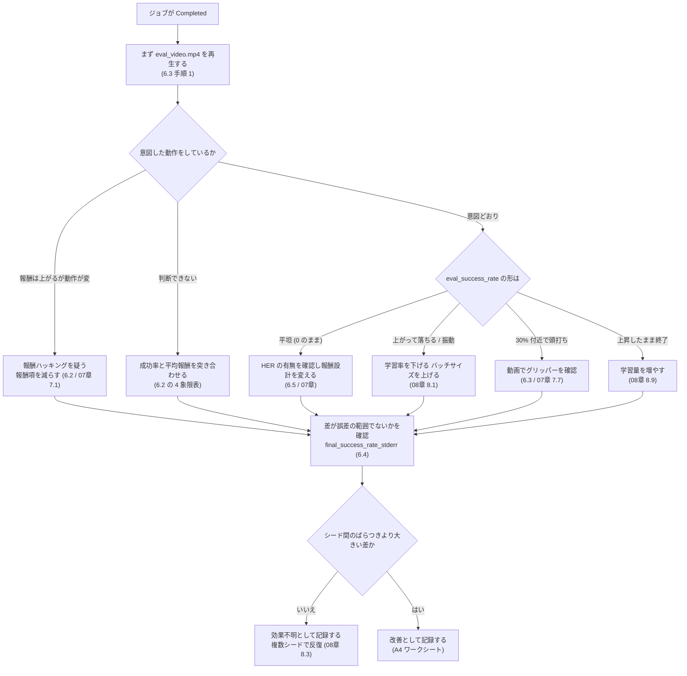

# 06. ベースライン結果の読み解き

[← 05. ベースライン実験](05_ベースライン実験.md) ｜ [次へ: 07. 演習1 報酬関数の改善 →](07_演習1_報酬関数の改善.md)

---

> **この章の目的**
> 結果を **「動いた／動かなかった」ではなく「条件と根拠」で語れるようにする**ことです。
> **この章にコードの実行はありません。** 前章で得た MLflow の記録を読み解く分析の章です。

---

## 6.0 大前提 — 「学習しなかった」は失敗ではありません

> ⚠ **最初に確認してください。**
> `PandaPickAndPlace-v3` ＋ 疎な報酬 ＋ 5万タイムステップ という条件では、
> **成功率がほとんど上がらない可能性が十分にあります。**
>
> **これは実験の失敗ではありません。**
> - 問題設定の難しさ（疎な報酬）を**データで示せた**
> - HER あり／なしの差を**自分の環境で測れた**
> - 記録と比較の仕組みが**動くことを確認できた**
>
> 本ハンズオンの完了条件にも、**学習済みモデルの完成や目標成功率の達成は含まれていません。**

---

## 6.0.1 診断フロー — 「ログの何を見て、何を変えるか」

> [!TIP]
> **深く理解するために**
>
> 6.1〜6.4 の内容を **1 枚の流れ図**にまとめたものです。**迷ったらここに戻ってきてください。**
> 各分岐の根拠は、それぞれの節に書かれています。



### 見るログ → 疑うこと → 変える対象

| 見るログ | 兆候 | 疑うこと | 変える対象 | 参照 |
|---|---|---|---|---|
| **`eval_video.mp4`** | 意図しない動作をしている | **報酬ハッキング** | 報酬項を減らす／重みを下げる | 6.3 ／ [07 章](07_演習1_報酬関数の改善.md) 7.1 |
| `eval_success_rate`（step 付き） | **平坦（0 のまま）** | 成功経験が集まっていない | HER の有無、報酬設計（`--reward-mode`） | 6.1 ／ [07 章](07_演習1_報酬関数の改善.md) |
| `eval_success_rate` | 上がってから落ちる／激しく振動 | 学習の不安定化 | `--learning-rate` を下げる／`--batch-size` を上げる | 6.1 ／ [08 章](08_演習2_ハイパーパラメータ改善.md) 8.1 |
| `eval_success_rate` | **上昇傾向のまま学習が終わった** | 学習量不足 | `--total-timesteps` を増やす | 6.1 ／ [08 章](08_演習2_ハイパーパラメータ改善.md) 8.9 |
| `final_success_rate` と `final_mean_reward` | 報酬↑・成功率→ | **報酬ハッキング** | 報酬設計 | 6.2 |
| `final_success_rate` | **0.30 付近で頭打ち** | 「押しているだけ」の可能性 | 報酬設計 or **成功判定そのもの** | 6.3 ／ [07 章](07_演習1_報酬関数の改善.md) 7.7 / 7.8 |
| `final_mean_episode_length` | 極端に短い | 早期に諦めている（時間ペナルティの副作用） | `--shaping-weight` を下げる | 6.3 ／ [07 章](07_演習1_報酬関数の改善.md) 7.6 |
| `final_mean_episode_length` | **50（上限）に張り付き** | そもそも到達していない | 報酬設計、学習量 | [05 章](05_ベースライン実験.md) 5.3 |
| `final_std_reward` / `final_success_rate_stderr` | 大きい | **運任せ／差が誤差の範囲** | 評価エピソード数を増やす、複数シード反復 | 6.4 ／ [08 章](08_演習2_ハイパーパラメータ改善.md) 8.3 |
| `train_minutes` と studio ［監視］の CPU 使用率 | 遅い・CPU が余っている | 並列不足 | `--n-envs`（**ベースラインとは別条件として扱う**） | [08 章](08_演習2_ハイパーパラメータ改善.md) 8.9 |
| `rollout_success_rate` と `eval_success_rate` | 値が一致しない | **探索ノイズの有無による差（正常）** | — | [05 章](05_ベースライン実験.md) 5.3 |

> [!WARNING]
> **この表の「変える対象」は、一度に 1 つだけ変えてください。**
> 複数を同時に変えると、どれが効いたのか永久に切り分けられなくなります（6.6）。

---

## 6.1 学習曲線の見方

MLflow の `eval_success_rate`（step 付き）と `rollout_ep_rew_mean` を見ます。

### パターン別の読み方

| 曲線の形 | 解釈 | 次にやること |
|---|---|---|
| **右肩上がり** | 学習が進んでいる | タイムステップを増やす価値あり |
| **完全に平坦（0 のまま）** | **成功経験がまったく集まっていない** | **HER の有無を確認**。報酬設計を見直す（[07 章](07_演習1_報酬関数の改善.md)） |
| 上がってから**落ちる** | 学習の不安定化 | 学習率を下げる。バッチサイズを上げる（[08 章](08_演習2_ハイパーパラメータ改善.md)） |
| **激しく振動する** | 探索過多／学習率が高い | 学習率・探索パラメーターを見直す |
| **序盤だけ上がって頭打ち** | 局所解、または**成功判定の抜け道**（6.3 参照） | **動画を見る** |

> **重要**: **1 本の曲線で判断しないでください。**
> 強化学習は乱数の影響が非常に大きいため、**同じ設定でも別のシードでは違う形になります**（[01 章](01_強化学習の基礎.md) 1.8）。

---

## 6.2 成功率と平均報酬が食い違うときに何を疑うか

**この節が本章で最も重要です。**

| 成功率 | 平均報酬 | 解釈 | 疑うべきこと |
|---|---|---|---|
| ↑ | ↑ | **健全**（両方改善） | — |
| → | ↑ | ⚠ **報酬ハッキングの強い疑い** | **動画を見る。** 報酬の抜け道を探している |
| ↑ | → | 報酬設計が成功をうまく表現できていない | 報酬と成功判定の対応を見直す |
| → | → | 学習が始まっていない | 疎な報酬の壁。HER・報酬設計・学習量 |
| ↓ | ↑ | ⚠⚠ **明確な報酬ハッキング** | **報酬関数を即座に見直す** |

> **重要**: **報酬は「学習のための信号」、成功率は「人間にとっての評価」です。**
> **この 2 つが乖離したときこそ、報酬設計に問題があります。**

---

## 6.3 報酬ハッキングの検出手順（**毎回必ず実施**）

### 手順

| # | やること | 判断基準 |
|---|---|---|
| 1 | **`eval_video.mp4` を再生する** | **「意図した動作をしているか」を目で見る。これが最強の検査** |
| 2 | `final_success_rate` と `final_mean_reward` を突き合わせる | 6.2 の表で判定 |
| 3 | **成功率が 30% 付近で頭打ちしていないか見る** | ⚠ **「押しているだけ」の可能性**（下記） |
| 4 | `final_mean_episode_length` を見る | 極端に短い＝早期終了で損失回避、上限 50 に張り付き＝到達していない |
| 5 | `final_std_reward` を見る | 大きい＝**運任せ**。安定していない |

### 【この課題に固有の重要な兆候】成功率 30% の頭打ち

> ⚠ **`PandaPickAndPlace-v3` では、目標位置が約 30% の確率でテーブル上、約 70% の確率で空中にサンプルされます。**
> また **`is_success` はキューブと目標の距離だけを見ており、把持しているかは判定しません。**
> （出典: [panda_gym/envs/tasks/pick_and_place.py](https://github.com/qgallouedec/panda-gym/blob/master/panda_gym/envs/tasks/pick_and_place.py) — 参考情報・OSS 公式ソース）
>
> したがって —
>
> **成功率が 30% 付近で止まっている場合、「キューブを押して転がしているだけで、持ち上げを学習していない」可能性があります。**
>
> ⚠ **ただしこれは「強いサイン」であって「証拠」ではありません。**
> 次のどれでも 30% 前後になりうるためです。
>
> | 可能性 | 判別方法 |
> |---|---|
> | (a) 押しているだけ（報酬ハッキング） | **動画でグリッパーが閉じているかを見る** |
> | (b) 空中の目標にも時々成功しているが不安定 | 動画で持ち上げを確認。`final_std_reward` が大きい |
> | (c) 単に学習が途中 | 学習曲線がまだ上昇傾向にある |
>
> **数値だけで断定せず、必ず `eval_video.mp4` を再生して判定してください。**
> これが「動画を必ず見る」ことを本テキストが繰り返す理由です。

### 検出したらどうするか

| 発見 | 改善実験での打ち手 |
|---|---|
| 押しているだけ | 「持ち上げ」を促す報酬を追加する／**成功判定に高さ条件を足すことを検討する** |
| 手先を振動させているだけ | 手先と対象物の距離への報酬を弱める／外す |
| 何もしない | ペナルティが強すぎる。重みを下げる |

---

## 6.3.1 動画で判断できないときは、ローカル GUI で再生する

> [!TIP]
> **深く理解するために**
>
> 本節は必須ではありません。ただし **6.3 の手順 1（動画を見る）で「押しているのか掴んでいるのか分からない」となったとき、これが最も確実な解決策**です。
> 動画は固定カメラ・固定フレームレートですが、**GUI なら自分の見たい角度から、止めながら観察できます**（[04 章](04_RL環境を触って理解する.md) 4.6.3）。

### 手順 1. 学習済みモデルをダウンロードする

`model.zip` は MLflow のアーティファクトとして Run に紐付いています。

```python
from mlflow.tracking import MlflowClient

client = MlflowClient()
client.download_artifacts(run_id="<Run ID>", path="model.zip", dst_path="./downloaded")
```

> **補足**: [notebooks/06_compare_and_cleanup.ipynb](../notebooks/06_compare_and_cleanup.ipynb) に、複数 Run の成果物をまとめてダウンロードするセルがあります。

### 手順 2. ローカルの GUI で再生する

```python
import gymnasium as gym
import panda_gym
from stable_baselines3 import SAC

# 見やすい角度に寄せる（04 章 4.6.3）
env = gym.make(
    "PandaPickAndPlace-v3",
    render_mode="human",
    render_distance=0.8,
    render_yaw=90,
    render_pitch=-15,
    render_target_position=[0.0, 0.0, 0.05],
)

# ⚠ HER を使ったモデルは env が必須（01 章 1.5）
model = SAC.load("./downloaded/model.zip", env=env)

obs, info = env.reset(seed=0)
for episode in range(5):
    done = False
    while not done:
        # 評価と同じ「決定的な行動」で再生する（探索ノイズを混ぜない）
        action, _ = model.predict(obs, deterministic=True)
        obs, reward, terminated, truncated, info = env.step(action)
        done = terminated or truncated
    print(f"episode {episode}: is_success={info['is_success']}")
    obs, info = env.reset()
env.close()
```

### 何を見るか

| 見るポイント | 判定 |
|---|---|
| **グリッパーが閉じているか** | 閉じずに前進しているなら **「押しているだけ」**（6.3 の可能性 (a)） |
| **キューブがテーブルから離れているか** | 離れていれば持ち上げを学習している（可能性 (b)） |
| 手先が同じ場所を往復していないか | 局所解／報酬ハッキングの疑い |
| 目標が空中のときの挙動 | 空中の目標（約 70%）で何をしているかが分かれば、成功率の上限が説明できる |

> [!WARNING]
> **ローカル GUI での再生は「観察」専用です。評価値としては使わないでください。**
>
> - `render_mode="human"` では **`render()` は `None` を返す**ため、動画も残せません（[04 章](04_RL環境を触って理解する.md) 4.6.1）
> - 数エピソードの目視は**統計的な根拠になりません**。報告に使う数値は必ず `final_success_rate`（100 エピソード評価）と `final_success_rate_stderr` を使ってください（6.4）
> - **`deterministic=True` を必ず指定してください。** 省略すると探索ノイズが混ざり、評価時（`eval_*` / `final_*`）と違う挙動になります

> [!IMPORTANT]
> **モデルは「学習時と同じ環境 ID」で読み込んでください。**
> 例えば `--reward-mode dense` で学習したモデルの実体は `PandaPickAndPlaceDense-v3` です（[07 章](07_演習1_報酬関数の改善.md) 7.2）。
> MLflow の **`actual_env_id`** パラメーターに、実際に使われた環境 ID が記録されています（[05 章](05_ベースライン実験.md) 5.3）。

---

## 6.4 ばらつきを評価する（平均だけで判断しない）

| 見る指標 | 意味 |
|---|---|
| `final_std_reward` | 報酬のばらつき。**大きいほど「たまたま」の要素が強い** |
| `final_min_reward` / `final_max_reward` | 最悪ケースと最良ケース |
| `final_success_rate_stderr` | 成功率の標準誤差 |

### 成功率は「幅」で語る

100 エピソードで成功率 0.30 だったとき、**「0.30」と断定してはいけません。**
標準誤差はおよそ次のとおりです。

$$
\mathrm{SE} = \sqrt{\frac{p(1-p)}{n}} = \sqrt{\frac{0.30 \times 0.70}{100}} \approx 0.046
$$

つまり **「0.30 ± 0.05 程度」**と語るのが正確です。

> **実装との対応**: この値は [src/evaluate.py](../src/evaluate.py) で
> `statistics.pstdev(successes) / sqrt(n)` として計算され、
> MLflow に **`final_success_rate_stderr`** として記録されています。
> 成功・失敗を 0/1 で表した列の母集団標準偏差は $\sqrt{p(1-p)}$ なので、**上の式と同じもの**です。
> つまり **手計算しなくても MLflow を見れば誤差が分かります。**

> **重要**: **成功率が 0.30 と 0.33 の 2 条件を比べて「改善した」と言ってはいけません。**
> この差は誤差の範囲です。**差が誤差より大きいかを必ず確認してください。**
> 判断に迷う場合は、**評価エピソード数を増やす**か、**複数シードで反復する**（[08 章](08_演習2_ハイパーパラメータ改善.md)）のが正攻法です。

---

## 6.5 HER の効果を確認する（対照実験の読み方）

[05 章](05_ベースライン実験.md) で **HER あり／なし**の 2 本を回しました。比較します。

| 比較項目 | 見るメトリック |
|---|---|
| 最終成功率 | `final_success_rate` |
| 学習曲線の立ち上がり | `eval_success_rate` の推移 |
| 学習中の報酬 | `rollout_ep_rew_mean` |
| 学習時間 | `train_minutes`（**HER は計算量が増えるため遅くなる場合がある**） |

### 記入例（ワークシートへ）

| 条件 | `final_success_rate` | `final_mean_reward` | `train_minutes` | 観察 |
|---|---|---|---|---|
| HER あり | | | | |
| HER なし | | | | |

> **重要**: **「HER ありのほうが良かった／変わらなかった」のどちらでも構いません。**
> **重要なのは、自分のデータで確認し、条件と一緒に記録したこと**です。
> 差が出なかった場合は「タイムステップが足りない」という仮説が立ちます（→ 改善実験の候補）。

---

## 6.6 「現象 → 原因仮説 → 追加実験」に落とし込む

成果物「ベースライン分析シート」「原因仮説一覧」に対応します。

### テンプレート（[A4_ワークシート集.md](A4_ワークシート集.md) の ④ に記入）

| 観測された現象 | 原因仮説 | 確認方法（実験） | 期待される結果 |
|---|---|---|---|
| 例: 成功率が 0 のまま | 疎な報酬で成功経験が集まらない | 報酬を dense に変えて再実行 | 成功率が 0 より大きくなる |
| 例: 報酬は上がるが成功率が上がらない | 報酬ハッキング | 動画確認 ＋ シェーピング重みを下げる | 動作が改善する／成功率が上がる |
| 例: シードを変えると結果が大きく違う | 学習が不安定 | 3 シードで反復 | ばらつきの大きさを定量化できる |

> **重要な作法（実験設計の原則）**
> - **一度に変更する要素は 1 つだけ**にする
> - **実行前に「期待する結果」を書く**（後付けの解釈を防ぐ）
> - 比較対象のベースライン Run を明記する

---

## 6.7 改善実験の計画をつくる

### 実験設計の原則

1. **ベースラインを固定してから変更する**
2. **一度に 1 要素だけ変える**
3. **変更理由と期待結果を事前に書く**
4. **同一の評価指標で比較する**（本テキストでは評価は常に sparse）
5. **再現に必要な条件を保存する**（seed・ライブラリ版・環境版）

### 改善実験の候補（優先順位を付けてください）

| 演習 | 変更する要素 | 対応する引数 |
|---|---|---|
| **演習1: 報酬関数** | 疎 → 密 | `--reward-mode dense` |
| 演習1 | 距離に応じた補助報酬 | `--reward-mode sparse_shaped --shaping-weight 0.1` |
| 演習1 | 時間ペナルティ | `--reward-mode sparse_time_penalty --shaping-weight 0.02` |
| **演習2: ハイパーパラメーター** | 学習率 | `--learning-rate` |
| 演習2 | 割引率 | `--gamma` |
| 演習2 | バッチサイズ | `--batch-size` |
| 演習2 | **乱数シード反復（再現性評価）** | `--seed`（Sweep の `Choice` で複数） |
| 演習2 | HER のゴール選択戦略 | `--goal-selection-strategy` |

### 計画シート（ワークシート ⑤ に記入）

| # | 実験名 | 変更点 | 変更理由 | 期待する結果 | 担当 | 優先度 |
|---|---|---|---|---|---|---|
| 1 | | | | | | |

---

## ⚠ うまくいかないときは（Step 06）

| # | 症状 | 主な原因 | 確認手順 | 対処 |
|---|---|---|---|---|
| 1 | 学習曲線がグラフに出ない | メトリックを step 付きで記録していない／評価が 1 回も走っていない | studio ［メトリック］。`--eval-freq` の値 | `--eval-freq` を `--total-timesteps` より小さくする |
| 2 | メトリックの値が 1 点しか取れない（API 経由） | **`run.data.metrics` は最後の値だけを返す仕様** | — | `MlflowClient().get_metric_history(run_id, key)` を使う（[03 章](03_AzureML環境構築.md) 3.6） |
| 3 | どの Run がベースラインか分からなくなった | 命名規則・タグの不備 | studio ［ジョブ］の表示名 | [05 章](05_ベースライン実験.md) 5.4 の命名規則を適用し直す |
| 4 | 2 条件の差が「改善」か判断できない | **誤差の範囲かを検証していない** | `final_success_rate_stderr` | 6.4 の式で誤差を見積もる。足りなければ評価エピソード数・シード数を増やす |
| 5 | 動画が真っ暗／短すぎる | `render_mode` 未指定／成功で早期終了 | `video_recorded` メトリック、エピソード長 | [04 章](04_RL環境を触って理解する.md) TS #5, #11 |
| 6 | 「学習しなかった」ので報告できないと感じる | 成果の定義の誤解 | 6.0 を再読 | **条件と根拠が記録されていれば立派な結果です。** 技術評価シート（[09 章](09_評価・コスト・後片付け.md)）に記入 |
| 7 | 成功率が 30% 付近で止まる | **「押しているだけ」の可能性** | **動画を再生する** | 6.3 を参照。演習1 のテーマにする |
| 8 | Run が多すぎて比較できない | 手作業で比較している | — | `mlflow.search_runs()` で DataFrame 化する（[09 章](09_評価・コスト・後片付け.md) 9.1） |
| 9 | **動画を見ても押しているのか掴んでいるのか分からない** | 固定カメラではグリッパーが見えにくい | 動画のカメラ位置 | **ローカル GUI で再生する（6.3.1）**。または `render_pitch` を水平寄りにして再収録（[04 章](04_RL環境を触って理解する.md) 4.6.3） |
| 10 | ローカル GUI で再生したら評価時と振る舞いが違う | **`deterministic=True` を指定していない** | `model.predict(...)` の引数 | `deterministic=True` を付ける（6.3.1） |
| 11 | ローカル GUI でモデルを読み込むとエラーになる | **HER 使用時に `env` を渡していない**／環境 ID が違う | MLflow の `actual_env_id` | `SAC.load(path, env=env)` とし、**学習時と同じ環境 ID** で作る（6.3.1） |

**参考（出典）**

- [MLflow による実験・Run の比較 - Microsoft Learn](https://learn.microsoft.com/azure/machine-learning/how-to-track-experiments-mlflow?view=azureml-api-2)
- [studio でのトレーニング結果の可視化 - Microsoft Learn](https://learn.microsoft.com/azure/machine-learning/how-to-visualize-jobs?view=azureml-api-2)
- panda-gym ソースコード（参考情報・OSS 公式ソース）: https://github.com/qgallouedec/panda-gym

---

## ✅ この章のチェックリスト

- [ ] 3 本のベースライン Run の学習曲線を確認した
- [ ] **`eval_video.mp4` を実際に再生した**
- [ ] 成功率と平均報酬を突き合わせ、報酬ハッキングの有無を判定した
- [ ] **成功率を「幅（誤差）」として理解した**
- [ ] HER あり／なしの比較表を埋めた
- [ ] 「現象 → 原因仮説 → 追加実験」を 3 件以上書き出した
- [ ] **改善実験の計画（優先順位付き）を作成した**
- [ ] （深く理解するために）**診断フロー（6.0.1）のどの分岐を通ったかを説明できる**
- [ ] （深く理解するために）**学習済みモデルをローカル GUI で再生し、グリッパーの開閉を確認した**（6.3.1）

---

[← 05. ベースライン実験](05_ベースライン実験.md) ｜ [次へ: 07. 演習1 報酬関数の改善 →](07_演習1_報酬関数の改善.md)
