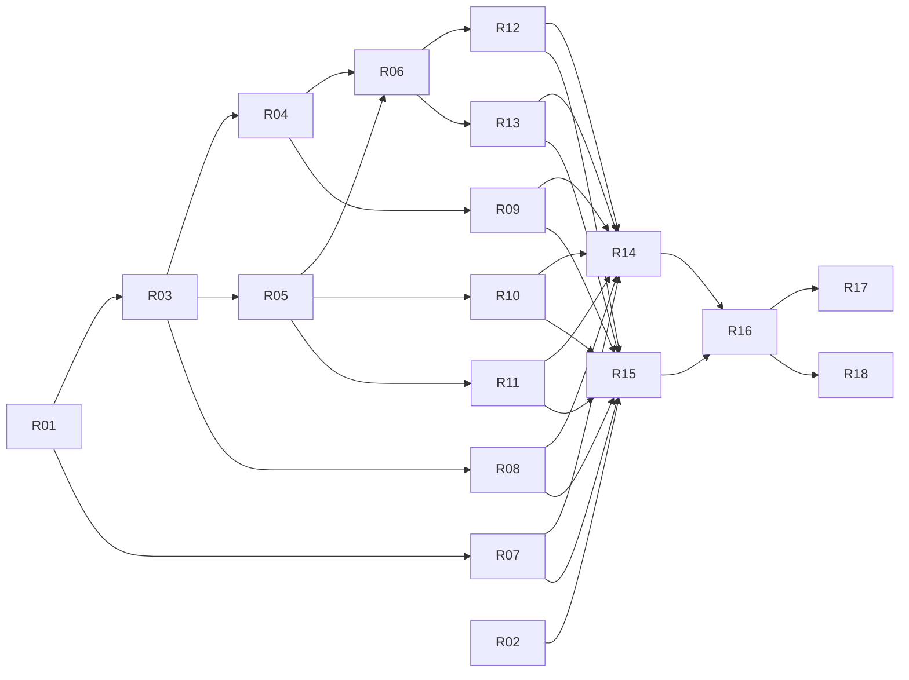

# 10.ImitationLearning 残作業 実行プラン

**作成日**: 2026-08-17
**対象**: [10.ImitationLearning](../10.ImitationLearning/) の未完成部分（ドキュメント 10 本 + Notebook 6 本 + README）

---

## 0. このファイルの位置づけ

会話上にしか存在しなかった実行プラン（v1 → v2 → v3）と、実機検証で得た**実測値**を、
このファイル 1 つで参照できる形にまとめたものです。
**以降の作業は、このファイルと下記「参照必須ファイル」だけを読めば再開できます。**

> [!IMPORTANT]
> **捏造は絶対に禁止です。** ドキュメントに書いてよい数値は、本ファイル §3 に列挙した実測値と、
> [調査レポート](../10.ImitationLearning/調査レポート_模倣学習.md) に出典付きで記載された値だけです。
> それ以外の数値・所要時間・金額を書いてはいけません。

---

## 1. 参照必須ファイル

### 1-1. 完成済みの成果物（これらと矛盾しないこと）

| ファイル | 役割 | 後続タスクでの使われ方 |
|---|---|---|
| [調査レポート_模倣学習.md](../10.ImitationLearning/調査レポート_模倣学習.md) | 全設計判断の根拠。**§4.4.2 に全実測値** | 全 docs の引用元 |
| [src/conda.yaml](../10.ImitationLearning/src/conda.yaml) | Azure ML ジョブ環境 | docs/03、notebooks/01 |
| [setup/environment-local.yml](../10.ImitationLearning/setup/environment-local.yml) | ローカル環境 | docs/02 |
| [setup/setup.ps1](../10.ImitationLearning/setup/setup.ps1) / [setup.sh](../10.ImitationLearning/setup/setup.sh) | セットアップ | docs/02 |
| [setup/verify_env.py](../10.ImitationLearning/setup/verify_env.py) | 環境検証 | docs/02 |
| [src/il_common.py](../10.ImitationLearning/src/il_common.py) | 共通ヘルパー | docs/04、docs/05 |
| [src/collect_demos.py](../10.ImitationLearning/src/collect_demos.py) | 専門家学習・デモ収集 | docs/04、notebooks/03 |
| [src/train_il.py](../10.ImitationLearning/src/train_il.py) | BC / DAgger / GAIL 学習 | docs/05〜08、notebooks/04〜06 |
| [src/NOTICE.md](../10.ImitationLearning/src/NOTICE.md) | 第三者 OSS の著作権表示 | docs/A2 |
| [docs/01_模倣学習の基礎.md](../10.ImitationLearning/docs/01_模倣学習の基礎.md) | 座学 | docs/00 の導線 |
| [docs/02_環境を準備する.md](../10.ImitationLearning/docs/02_環境を準備する.md) | ローカル環境構築 | docs/00 の導線 |
| [docs/A1_トラブルシューティング.md](../10.ImitationLearning/docs/A1_トラブルシューティング.md) | 実際に遭遇したエラーのみ | 各章から参照 |
| [docs/A2_OSSライセンス一覧.md](../10.ImitationLearning/docs/A2_OSSライセンス一覧.md) | ライセンス | docs/00 |
| [docs/A4_用語集.md](../10.ImitationLearning/docs/A4_用語集.md) | 用語集 | 全 docs から参照 |
| [.gitignore](../10.ImitationLearning/.gitignore) | mlruns / mlflow.db 等の除外 | docs/02 |

### 1-2. 様式を合わせる既存章（9 章）

| ファイル | 何を真似るか |
|---|---|
| [9.ReinforcementLearning/README.md](../9.ReinforcementLearning/README.md) | README の構成、課金警告の書き方、章と Notebook の対応表 |
| [9.ReinforcementLearning/docs/09_評価・コスト・後片付け.md](../9.ReinforcementLearning/docs/09_評価・コスト・後片付け.md) | 後片付け章の構成 |
| [9.ReinforcementLearning/docs/A3_出典一覧.md](../9.ReinforcementLearning/docs/A3_出典一覧.md) | 出典一覧の分類方法 |
| [9.ReinforcementLearning/notebooks/01_setup_azureml.ipynb](../9.ReinforcementLearning/notebooks/01_setup_azureml.ipynb) | `SUBSCRIPTION_ID = "<SUBSCRIPTION_ID>"` プレースホルダー方式 |

---

## 2. 確定済みの設計判断

### 2-1. 基本方針

| 項目 | 決定 | 根拠 |
|---|---|---|
| 題材環境 | **`seals:seals/CartPole-v0`**（固定ホライズン 500） | `imitation` の必須依存に含まれ追加導入ゼロ。GAIL/AIRL の評価が成立する |
| 読者 | **初級者ソフトウェアエンジニア**。ML / RL の知識は前提にしない | 依頼要件 |
| 実行場所 | ローカル → Azure ML Compute の二段構え | Microsoft Learn の推奨（学習スクリプトから `azureml.*` を排除し MLflow に統一） |
| 記録 | **MLflow のみ**（学習スクリプトに `azureml.*` を書かない） | 同上 |
| コンピューティング | コンピューティング クラスター（`min_instances=0`） | 9 章と操作を統一。課金停止を体験させる |
| Sweep 主要メトリック | **`normalized_return`** | `(eval - random) / (expert - random)` |
| Sweep 早期終了 | **使う**（`BanditPolicy`）。`epoch_eval_return_mean` を step 付きで記録済み | v2 で採用に変更 |
| 複数シード | 主要比較は **3 シード**（Notebook の for ループ） | 単一シード比較の禁止 |
| 正規化ベースライン | **一様ランダム方策** | 未学習 PPO は 377.65±187.03 と高く不安定（§3 実測） |
| デプロイ / 推論 | **範囲外**（理由を README に明記） | YAGNI |
| rliable / IQM | **不採用**（平均±標準偏差で代替。理由を docs に明記） | 依存追加を避ける |
| 資格情報 | 9 章と同じ **プレースホルダー方式** + 「書き換えた Notebook をコミットしない」注意 | リポジトリ内で方式を割らない |
| データ資産 | **`uri_folder`**（`demos.npz` / `expert_policy.zip` / `scores.json` を 1 フォルダー） | 常にセットで使う |

### 2-2. ⚠ 実測により変更した設計（v1 → v3 の重要差分）

| 項目 | v1（誤り） | **確定版** | 変更理由 |
|---|---|---|---|
| 05 章の主題 | 「デモ数を減らすと BC が破綻する」 | **「学習量不足を『データ不足』と誤診しない」** | 更新回数をそろえるとデモ 3 件でも劣化しない（§3-b） |
| 06 章の主題 | 「DAgger で BC を救う」 | **「DAgger を試し、差が出ないことを確認する」** | BC が飽和しており DAgger は上回らない（§3-c） |
| 07 章の主題 | 「GAIL で少数デモから学ぶ」 | **「GAIL を回し、失敗を観察する + 可変ホライズンの実演」** | 公式設定で 336.25 → 8.35（§3-d） |
| numpy | `numpy<2` が必須 | **numpy 2.2.6 で全工程が動作** | 実測（§3-f） |
| 正規化ベースライン | 未学習 PPO | **一様ランダム** | 未学習 PPO は高すぎ分散も大きい（§3-a） |

### 2-3. ⚠ 本作業の制約（お客様指示 C → B）

- **Azure ML 上でのジョブ実行検証は行いません。**
- したがって **Notebook と docs 03〜09 には「Azure 上では未検証」である旨を明記**します。
- 数値を書けるのは**ローカルで実測した §3 の値だけ**です。Azure ジョブの所要時間・金額は書きません。

---

## 3. 実測値（**docs に書いてよい数値はここにあるものだけ**）

**実測環境**: Windows 11 / Python 3.10.20 (conda-forge) / imitation 1.0.1 / stable-baselines3 2.2.1 /
gymnasium 0.29.1 / seals 0.2.1 / numpy 2.2.6 / torch 2.13.0+cpu
**評価条件**: `seals:seals/CartPole-v0`、`n_envs=8`、評価 20 エピソードの平均リターン

### (a) 基準値と専門家

| 方策 | 平均 | 標準偏差 |
|---|---|---|
| 一様ランダム | 36.10 | 26.09 |
| 未学習 PPO | 377.65 | 187.03 |
| 専門家 PPO（100,000 steps） | 461.75 | 48.40 |

### (b) BC のデモ数と勾配更新回数

**1 エポック固定（更新回数がデモ数に比例してしまう）**

| デモ数 | transitions | 更新回数 | 平均 |
|---|---|---|---|
| 50 | 25000 | 781 | 492.25 |
| 10 | 5000 | 156 | 137.15 |
| 3 | 1500 | 47 | 70.45 |

**更新回数を約 780 回にそろえた場合（3 シード）**

| デモ数 | エポック | 更新回数 | seed 0 | seed 1 | seed 2 |
|---|---|---|---|---|---|
| 50 | 1 | 781 | 483.50 | 439.50 | 483.10 |
| 10 | 5 | 780 | 499.05 | 478.05 | 493.00 |
| 3 | 17 | 782 | 499.55 | 493.00 | 483.80 |

> **結論: デモを 50 → 3 に減らしても劣化しない。上段の劣化は更新回数不足が原因。**

### (c) DAgger（デモ 3 件から開始 / 8,000 steps / 3 シード）

| seed 0 | seed 1 | seed 2 |
|---|---|---|
| 485.00 | 431.85 | 485.30 |

> BC（3 件・782 更新）の 499.55 / 493.00 / 483.80 を上回らない。

### (d) GAIL（公式チュートリアルと同一ハイパーパラメーター / 200,000 steps）

| 段階 | 平均 | 標準偏差 |
|---|---|---|
| 学習前 | 336.25 | 200.61 |
| 学習後 | **8.35** | 1.19 |

> 公式ドキュメントの掲載出力（102.6 → 49.76）と同じく悪化。**失敗を再現。**

### (e) エピソード長（ランダム行動・3 エピソード）と可変ホライズンのエラー

| 環境 | エピソード長 |
|---|---|
| `seals:seals/CartPole-v0` | 500, 500, 500（**固定**） |
| `CartPole-v1` | 17, 18, 24（**可変**） |

`CartPole-v1` で GAIL を実行すると **`ValueError`**:

```text
Episodes of different length detected: {8, 9, 10, ...}. Variable horizon environments are
discouraged -- termination conditions leak information about reward. See
https://imitation.readthedocs.io/en/latest/getting-started/variable-horizon.html for more
information. If you are SURE you want to run imitation on a variable horizon task, then
please pass in the flag: `allow_variable_horizon=True`.
```

> ⚠ エラー中の URL は実在しません。教材では `https://imitation.readthedocs.io/en/latest/main-concepts/variable_horizon.html` を案内します。

### (f) エンドツーエンド実行（`collect_demos.py` → `train_il.py --algo bc`）

| 項目 | 値 |
|---|---|
| 一様ランダム | 31.80 ± 12.29 |
| 専門家 PPO（100,000 steps） | 498.05 ± 6.58 |
| 収集軌跡数（`--n-episodes 50`） | 56 |
| BC（デモ 3 件 / 17 エポック） | 492.75 ± 16.02 |
| **`normalized_return`** | **0.989** |

> ⚠ (a) の専門家 461.75 と (f) の 498.05 が異なるのは、(a) では学習前に評価を挟んで乱数列が進んだためです。
> **「同じ設定でも実行手順が違うと結果が変わる」実例**として docs/05 で使えます。

### (g) 確定バージョン

`imitation 1.0.1` / `stable-baselines3 2.2.1` / `gymnasium 0.29.1` / `seals 0.2.1` /
`numpy 2.2.6` / `torch 2.13.0+cpu` / `mlflow 3.15.1` / `azure-ai-ml 1.34.1` /
`azure-identity 1.25.3` / `azureml-mlflow 1.60.0` / `pandas 2.3.3` / `matplotlib 3.10.9` / `ipykernel 7.3.0`

---

## 4. 完了済みタスク

| ID | 成果物 | 状態 |
|---|---|---|
| T01 | `src/conda.yaml`, `setup/environment-local.yml` | ✅ 実測固定 |
| T02 | 調査レポート §4.4.2 | ✅ go/no-go 判定を記録 |
| T04 | `src/il_common.py` | ✅ 動作検証済み |
| T05 | `src/NOTICE.md` | ✅ |
| T06 | `docs/A2_OSSライセンス一覧.md` | ✅ |
| T07 | `setup/verify_env.py` | ✅ 正常系・異常系とも検証 |
| T08 | `src/collect_demos.py` | ✅ 動作検証済み |
| T09 | `setup/setup.ps1` | ✅ 構文検証済み |
| T10 | `setup/setup.sh` | ✅ 構文検証済み（**実行は未検証**） |
| T11 | `src/train_il.py` | ✅ BC / DAgger 動作検証済み |
| T12 | `docs/A1_トラブルシューティング.md` | ✅ 実遭遇エラーのみ記載 |
| T13 | `docs/02_環境を準備する.md` | ✅ |
| T14 | `docs/A4_用語集.md` | ✅ |
| T15 | `docs/01_模倣学習の基礎.md` | ✅ |
| — | `.gitignore` | ✅（mlflow.db / mlruns 生成の実測を受けて追加） |

---

## 5. 残タスク一覧（**18 タスク / 新規 17 ファイル**）

> **「読むファイル」は Context に載せる上限です。これ以外は読まないでください。**

| ID | 成果物ファイル | 依存 | Wave | 読むファイル |
|---|---|---|---|---|
| **R01** | `notebooks/01_setup_azureml.ipynb` | — | 1 | 9 章 nb01、`src/conda.yaml` |
| **R02** | `notebooks/02_explore_env.ipynb` | — | 1 | `src/il_common.py`、本ファイル §3(e) |
| **R03** | `notebooks/03_collect_demos_job.ipynb` | R01 | 2 | R01、`src/collect_demos.py` |
| **R04** | `notebooks/04_bc_job.ipynb` | R03 | 3 | R03、`src/train_il.py`、本ファイル §3(b) |
| **R05** | `notebooks/05_dagger_gail_job.ipynb` | R03 | 3 | R03、`src/train_il.py`、本ファイル §3(c)(d)(e) |
| **R06** | `notebooks/06_sweep_compare_cleanup.ipynb` | R04, R05 | 4 | R04、9 章 nb05 / nb06 |
| **R07** | `docs/03_AzureML環境構築.md` | R01 | 5 | R01、`src/conda.yaml` |
| **R08** | `docs/04_専門家デモを作る.md` | R03 | 5 | R03、`src/collect_demos.py`、本ファイル §3(f) |
| **R09** | `docs/05_BCを動かす.md` | R04 | 5 | R04、`src/train_il.py`、本ファイル §3(b)(f) |
| **R10** | `docs/06_DAggerを試す.md` | R05 | 6 | R05、本ファイル §3(c) |
| **R11** | `docs/07_GAILと評価の落とし穴.md` | R05 | 6 | R05、本ファイル §3(d)(e)、調査レポート §4.1 |
| **R12** | `docs/08_Sweepで改善する.md` | R06 | 6 | R06、`src/train_il.py` |
| **R13** | `docs/09_評価・コスト・後片付け.md` | R06 | 6 | R06、9 章 docs/09 |
| **R14** | `docs/A3_出典一覧.md` | R07〜R13 | 7 | 全 docs、調査レポート §9 |
| **R15** | `docs/00_はじめに.md` | R07〜R13 | 7 | 全 docs |
| **R16** | `README.md` | R14, R15 | 8 | 全 docs、9 章 README |
| **R17** | リンク整合性チェック → 該当ファイル修正 | R16 | 9 | `README.md`、`docs/*` |
| **R18** | `調査レポート_模倣学習.md` の §8 を**完成した章構成に合わせて更新** | R16 | 9 | 調査レポート §8、`README.md` |



**並列実行できる組**: (R01, R02) / (R04, R05) / (R07, R08, R09) / (R10, R11, R12, R13) / (R14, R15) / (R17, R18)

> **Wave を Notebook 先行にしている理由**: docs には「このセルを実行します」という手順説明が入るため、
> **Notebook のセル構成が確定していないと docs を書き直すことになります。**
> 依存関係上は R07 をもっと早く着手できますが、律速さのため Wave 5 以降にまとめています。

---

## 6. 各ドキュメントの節構成

### 共通フォーマット（既存 docs と揃えること）

- 先頭と末尾に `[← 前の章](...) ｜ [次の章 →](...)` ナビゲーション
- 各節を **① なぜそうするのか → ② 何をするのか → ③ どうなれば成功か → ④ ⚠ うまくいかないときは**
- 用語の初出は [docs/A4_用語集.md](../10.ImitationLearning/docs/A4_用語集.md) へリンク
- **数値は §3 の実測値のみ。Azure 側の数値は書かない**

### R07 `docs/03_AzureML環境構築.md`

| 節 | 内容 | 出典 |
|---|---|---|
| 3.1 | Azure ML の構成要素（ワークスペース / コンピューティング / 環境 / ジョブ / MLflow） | [MS-Learn] concept-azure-machine-learning-v2 |
| 3.2 | ワークスペースの作成 | how-to-manage-workspace |
| 3.3 | コンピューティング クラスター（**`min_instances=0` で課金が止まる**） | how-to-create-attach-compute-cluster |
| 3.4 | カスタム環境（`src/conda.yaml`。**ベースイメージのパッケージは使われない**） | how-to-manage-environments-v2 |
| 3.5 | MLflow 追跡 URI（ローカルから使うときは明示設定が必要） | how-to-use-mlflow-configure-tracking |
| 3.6 | 疎通確認 | — |
| ⚠ | **本章の手順は Azure 上で未検証である旨を明記** | — |

### R08 `docs/04_専門家デモを作る.md`

| 節 | 内容 |
|---|---|
| 4.1 | なぜ「専門家」が必要か（模倣学習は手本が無いと始まらない） |
| 4.2 | 3 つの成果物と用途（`demos.npz` = BC/GAIL、`expert_policy.zip` = **DAgger が学習中に問い合わせる**、`scores.json` = 正規化の基準） |
| 4.3 | `collect_demos.py` の読み方（一様ランダム評価 → PPO 学習 → 評価 → 収集） |
| 4.4 | **⚠ 専門家がランダム以下だとエラーで停止する**設計と、その理由（正規化リターンが反転する） |
| 4.5 | Command Job として実行 |
| 4.6 | `uri_folder` データ資産として登録 |
| 4.7 | 期待される出力（§3(f) の値。`--n-episodes 50` で **56 本**収集される理由 = 8 並列環境のため下限を超える） |

### R09 `docs/05_BCを動かす.md`

| 節 | 内容 |
|---|---|
| 5.1 | BC は教師あり学習そのもの（観測 → 行動の分類） |
| 5.2 | 実行方法（`--algo bc`） |
| 5.3 | **実験: デモ数を 50 / 10 / 3 に変え、エポック数は 1 のまま** → §3(b) 上段の劣化を再現 |
| 5.4 | **⚠ ここで「データが足りない」と結論すると誤診**。更新回数 = transitions ÷ batch_size × epochs |
| 5.5 | **実験: 更新回数を約 780 にそろえる** → §3(b) 下段。**デモ 3 件でも 483〜499** |
| 5.6 | 3 シードで確認する理由 |
| 5.7 | `normalized_return` の意味（§3(f) の 0.989） |
| 5.8 | **⚠ 同じ設定でも実行手順が違うと結果が変わる**（§3 の注記: 461.75 vs 498.05） |

### R10 `docs/06_DAggerを試す.md`

| 節 | 内容 |
|---|---|
| 6.1 | BC の理論的な弱点（分布シフト）の復習 → [docs/01](../10.ImitationLearning/docs/01_模倣学習の基礎.md) |
| 6.2 | DAgger の仕組み（学習中の方策で環境を動かし、専門家に正解を問い合わせる） |
| 6.3 | **なぜ `expert_policy.zip` が必要か**（BC はデモだけ、DAgger は専門家本体が要る） |
| 6.4 | 実行方法（`--algo dagger`） |
| 6.5 | **結果: BC を上回らない**（§3(c)）。理由 = BC が既に専門家水準に飽和している |
| 6.6 | **⚠ 公開ベンチマークで DAgger が最高（IQM 1.004）なのは MuJoCo タスクでの話**。一般化してはいけない |
| 6.7 | 「効果が出なかった」も正当な結果である |

### R11 `docs/07_GAILと評価の落とし穴.md`

| 節 | 内容 |
|---|---|
| 7.1 | GAIL の考え方（識別器と方策の対戦） |
| 7.2 | **⚠ 実演: 素の `CartPole-v1` で GAIL を起動 → `ValueError`**（§3(e) の全文） |
| 7.3 | なぜ終了条件が報酬情報を漏らすのか。`seals` を使う理由 |
| 7.4 | **⚠ エラー中の URL は実在しない**。正しい URL を案内 |
| 7.5 | `seals` 上で GAIL を実行 → **336.25 → 8.35**（§3(d)） |
| 7.6 | **公式チュートリアルの掲載出力でも失敗している**（102.6 → 49.76）。出典を明記 |
| 7.7 | 「この環境・この設定・このシードで失敗した」であり「GAIL は使えない」ではない |
| 7.8 | AIRL は本テキストの範囲外（理由を明記） |

### R12 `docs/08_Sweepで改善する.md`

| 節 | 内容 |
|---|---|
| 8.1 | Sweep Job とは |
| 8.2 | **主要メトリックを `normalized_return` にする理由**（検証損失ではダメな理由 = 05 章の教訓） |
| 8.3 | 探索空間（`--epochs` × `--batch-size` = **更新回数を振ることになる**）、サンプリング、`BanditPolicy` |
| 8.4 | 早期終了が効くのは `epoch_eval_return_mean` を step 付きで記録しているから |
| 8.5 | **⚠ Sweep は毎回ゼロから学習し直す**（[MS-Learn] 引用）。デモ収集を Sweep の外に出している理由 |
| 8.6 | 結果の読み方 |

### R13 `docs/09_評価・コスト・後片付け.md`

| 節 | 内容 |
|---|---|
| 9.1 | `mlflow.search_runs` で全実験を比較 |
| 9.2 | 何を報告するか（成功率だけでなく、ばらつき・学習量・条件） |
| 9.3 | コストの確認（Microsoft Cost Management。**金額は書かない**） |
| 9.4 | **⚠ 後片付け（必須）**: クラスター削除 → リソースグループ削除。`min_instances=0` でも付属リソースの課金は続く |
| 9.5 | ローカルの後片付け（`conda env remove -n il-local`、`mlruns` / `mlflow.db`） |
| 9.6 | うまくいかなかった結果も成果である |

### R14 `docs/A3_出典一覧.md`

- 9 章 A3 と同じ 3 分類（Microsoft Learn / 学術論文 / OSS 公式）
- **参照日を明記**（2026-08-17）
- 調査レポート §9 の一覧から、**本テキストが実際に引用したものだけ**を抜粋

### R15 `docs/00_はじめに.md`

| 節 | 内容 |
|---|---|
| 0.1 | このハンズオンで到達する状態 |
| 0.2 | **やらないこと**（Azure 上での実行検証、デプロイ、GAIL の成功、実機ロボット） |
| 0.3 | **前提知識の下限**（Python が読める / コマンドラインが使える。ML と RL の知識は不要） |
| 0.4 | 学習の流れ（mermaid） |
| 0.5 | 章と Notebook の対応表 |
| 0.6 | 各章の共通構造 |
| 0.7 | ⚠ 課金警告 |

### R16 `README.md`

- 9 章 README と同じ構成
- **冒頭に課金警告**
- **「Azure 上では未検証」「macOS / Linux の setup script は未検証」を明記**
- 章と Notebook の対応表、setup の実行方法、ライセンス、範囲外（デプロイ）の明示

---

## 7. 各 Notebook のセル構成

**共通**: 冒頭は 9 章と同じ `SUBSCRIPTION_ID = "<SUBSCRIPTION_ID>"` プレースホルダー方式。
**出力セルは消してコミット**（ワークスペース識別子の混入と差分肥大を避けるため）。
**各 Notebook の先頭に「Azure 上では未検証」の注記を入れる。**

| Notebook | セル |
|---|---|
| **R01** `01_setup_azureml.ipynb` | ① 目的と未検証注記 ② `MLClient` 接続 ③ コンピューティング クラスター作成（`min_instances=0`） ④ カスタム環境作成（`src/conda.yaml`） ⑤ MLflow 追跡 URI 設定 ⑥ 最小 Command Job で疎通確認 ⑦ 次の手順 |
| **R02** `02_explore_env.ipynb` | ① 目的 ② `seals:seals/CartPole-v0` を生成 ③ `observation_space` / `action_space` 表示 ④ **3 エピソード回して長さが 500 固定であることを確認** ⑤ `CartPole-v1` と比較（可変） ⑥ 一様ランダムのリターンを測る ⑦ まとめ（**ローカルのみで完結。Azure 不要**） |
| **R03** `03_collect_demos_job.ipynb` | ① Command Job 定義（`collect_demos.py`） ② 送信・待機 ③ 出力確認 ④ **`uri_folder` データ資産として登録** ⑤ MLflow で `expert_mean` を確認 |
| **R04** `04_bc_job.ipynb` | ① BC ジョブ 1 本 ② **デモ数 (50/10/3) × エポック 1 固定**で投入 ③ **更新回数をそろえた条件 (1/5/17 エポック) × 3 シード**で投入 ④ `mlflow.search_runs` で集計 ⑤ 表とグラフ ⑥ 考察（誤診の回避） |
| **R05** `05_dagger_gail_job.ipynb` | ① DAgger ジョブ（3 シード） ② BC との比較表 ③ **可変ホライズンの実演**（`CartPole-v1` で GAIL → `ValueError` を観察） ④ GAIL ジョブ（`seals` 上） ⑤ 結果の解釈（失敗の記録） |
| **R06** `06_sweep_compare_cleanup.ipynb` | ① Sweep Job（primary metric `normalized_return`、`BanditPolicy`） ② 最良試行の確認 ③ 全実験の比較表 ④ コスト確認手順 ⑤ **後片付け**（クラスター削除・リソースグループ削除・ローカル環境削除） |

---

## 8. 禁止事項（毎タスクで確認すること）

### 8-1. 捏造の禁止

- **§3 に無い数値を書かない。** 所要時間・金額・成功率をでっち上げない。
- Azure 上で実行していないので、**Azure ジョブの出力例を創作しない**。
- 遭遇していないエラーを `docs/A1` に追加しない。

### 8-2. オーバーエンジニアリングの禁止

- 指示にない汎用化・抽象化・将来予測による拡張点を追加しない
- 未使用の設定オプション・フラグ・抽象レイヤーを導入しない
- 単発用途に Strategy / Factory 等を持ち込まない
- 過剰なログ出力・予防的な例外処理を足さない
- 既存の最小実装で足りる箇所に依存を増やさない
- **新しいファイルを増やさない**（本プランに列挙した 17 ファイル以外は作らない）

### 8-3. 整合性

- 既存 docs（01 / 02 / A1 / A2 / A4）と用語・表記を揃える
- 9 章と章立て・ナビゲーション様式を揃える
- `src/*.py` の実際の引数名と docs の記述を一致させる

---

## 9. 各タスク完了時の敵対的レビュー観点

タスクごとに、下記 5 軸で自分の成果物を批判的に点検し、**Critical は必ず修正**すること。

| 軸 | 具体的な確認項目 |
|---|---|
| **目的適合性** | 初級者が読んで実行できるか。前提知識を勝手に増やしていないか。依頼要件（Windows/Mac/Linux、初級者向け）を満たすか |
| **内容の妥当性** | 因果関係の主張に実測の裏付けがあるか。**交絡因子を排除したか**（05 章の更新回数のように） |
| **整合性** | 既存ファイルの記述・引数名・ファイル名と矛盾しないか。相対リンクが実在するか |
| **品質・運用性** | コピペで動くか。副産物（`mlruns` 等）の扱いを書いたか。未検証事項を明示したか |
| **根拠性** | 断定に出典があるか。未確認を確定表現で書いていないか。**§3 に無い数値を書いていないか** |

### 過去に実際に見つかった欠陥（同種の見落としを避ける）

| # | 欠陥 | 教訓 |
|---|---|---|
| 1 | BC の「デモ数依存」が勾配更新回数との交絡だった | **比較実験は 1 変数だけ動かす** |
| 2 | 専門家が弱いと `normalized_return` が -129.4 になった | **境界条件を実際に踏んでみる** |
| 3 | `gymnasium==0.29.1` が extra を落とし `pygame` が入らない | **extra 付き依存は extra まで書く** |
| 4 | 単一利用の関数を共通モジュールに置いた | **利用箇所が 1 つなら共通化しない** |
| 5 | 同名メトリックを step 付き / なしで二重記録した | **MLflow のメトリック名は用途ごとに分ける** |
| 6 | ローカル実行が cwd に `mlflow.db` / `mlruns/` を作った | **実行後にリポジトリの差分を確認する** |
| 7 | ベンチマーク数値（MuJoCo）を classic control に一般化しかけた | **数値には必ず適用範囲を書く** |

---

## 10. 再開手順

1. 本ファイル §1 の「参照必須ファイル」を確認する
2. §5 の残タスク表から、依存が満たされている最小の Wave を選ぶ
3. そのタスクの「読むファイル」だけを Context に載せる
4. §6 / §7 の節構成・セル構成どおりに作成する
5. §8 の禁止事項を確認する
6. §9 の 5 軸で敵対的レビューを行い、Critical を修正する
7. 次のタスクへ

---

## 11. 本ファイル自体の扱い

- 本ファイルは **作業用のメモ**であり、チュートリアル本体（`10.ImitationLearning/`）の成果物ではありません。
- リポジトリにコミットするかどうかは**お客様の判断**です。不要な場合は `work/` を削除するか
  リポジトリルートの `.gitignore` に追加してください。
- 残タスクがすべて完了したら、本ファイルの役割は終わります。
